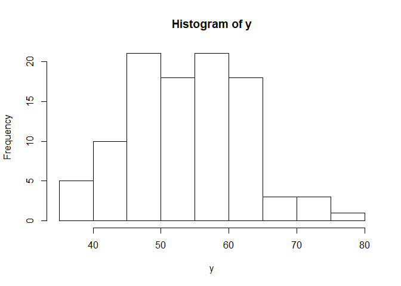
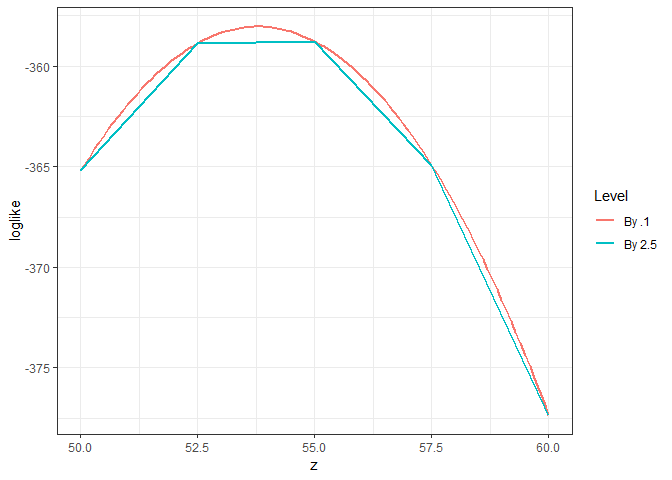
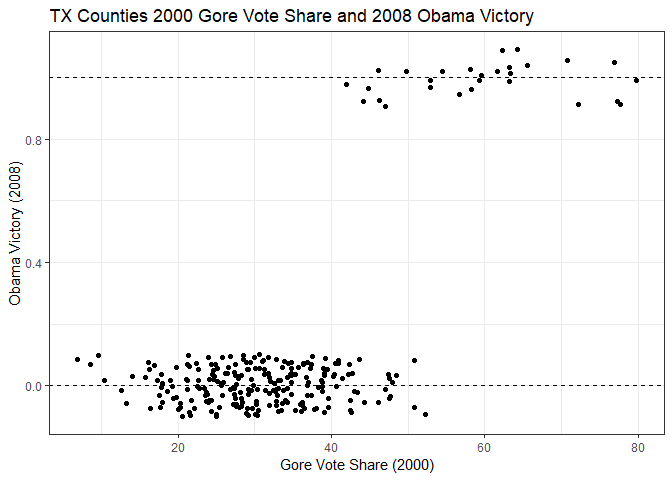
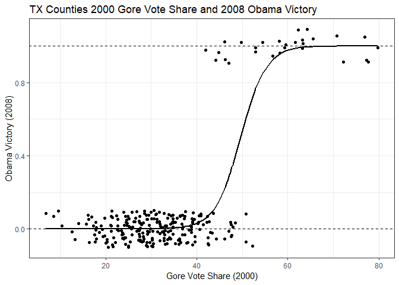
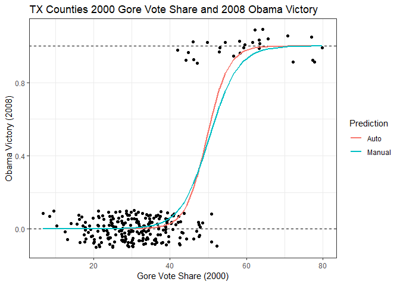

POL212 TA Session
================
Gento Kato
February 27, 2019

``` r
## Clear Workspace
rm(list = ls())

## Set Working Directory to the File location
## (If using RStudio, can be set automatically)
setwd(dirname(rstudioapi::getActiveDocumentContext()$path))
getwd()
```

    ## [1] "C:/GoogleDrive/Lectures/2019_04to06_UCD/POL213_TA/POL213_TA_resource"

``` r
## Required packages
library(readr) # Reading csv file
library(ggplot2) # Plotting
library(faraway) # for ilogit function
```

Coarse Grid Search
==================

Think about the voter turnout of counties within a state, follows a normal distribution with mean 53.2 and standard deviation 8

``` r
set.seed(780)
y <- rnorm(100, mean = 53.2, sd = 8)
hist(y)
```



Assuming that standard deviation is 10, conduct a coarse grid search of theta parameter.

``` r
z1 <- seq(50,60, by = 2.5)
loglike1 <- sapply(z1, function(z) log(prod((1/sqrt(2*100*pi))*exp(-((y-z)^2/(2*100))))))

z2 <- seq(50,60, by = .1)
loglike2 <- sapply(z2, function(z) log(prod((1/sqrt(2*100*pi))*exp(-((y-z)^2/(2*100))))))

# Make it a data.frame
searchdata <- data.frame(z = c(z1,z2),
                         loglike = c(loglike1, loglike2),
                         Level = c(rep("By 2.5",length(z1)),
                                 rep("By .1", length(z2))))

# Export plot
ggplot(searchdata, aes(x=z, y=loglike, color=Level)) + 
  geom_line(size=1) + theme_bw()
```



``` r
# Find Max
z1[which.max(loglike1)] 
```

    ## [1] 55

``` r
z2[which.max(loglike2)] # More fine grained 
```

    ## [1] 53.8

Fitting Logit
=============

The following data contains county level presidential election results 2000-2016. (Check codebook at <https://github.com/gentok/POL213_TA_Resource/blob/master/data/County%2BPresidential%2BReturns%2B2000-2016.md>)

``` r
d <- read_csv("https://raw.githubusercontent.com/gentok/POL213_TA_Resource/master/data/countypres_2000-2016.csv")
```

    ## Parsed with column specification:
    ## cols(
    ##   year = col_integer(),
    ##   state = col_character(),
    ##   state_po = col_character(),
    ##   county = col_character(),
    ##   FIPS = col_integer(),
    ##   office = col_character(),
    ##   candidate = col_character(),
    ##   party = col_character(),
    ##   candidatevotes = col_integer(),
    ##   totalvotes = col_integer(),
    ##   version = col_integer()
    ## )

``` r
d <- na.omit(d)
```

Let's subset the data and extract county-level votes for Gore (2000), Bush (2000), Obama (2008), and McCain (2008) in Texas.

``` r
# Gore Vote Share in TX
TX_gore <- d[d$year==2000 & d$party == "democrat" & d$state_po == "TX",]
# Bush Vote Share in TX
TX_bush <- d[d$year==2000 & d$party == "republican" & d$state_po == "TX",]
# Obama Vote Share in TX
TX_obama <- d[d$year==2008 & d$party == "democrat" & d$state_po == "TX",]
# McCain Vote Share in TX
TX_mccain <- d[d$year==2008 & d$party == "republican" & d$state_po == "TX",]
# Check if county rows match
all(TX_obama$FIPS == TX_mccain$FIPS)
```

    ## [1] TRUE

``` r
all(TX_obama$FIPS == TX_bush$FIPS)
```

    ## [1] TRUE

``` r
all(TX_obama$FIPS == TX_gore$FIPS)
```

    ## [1] TRUE

Calculate 2008 Obama win-lose and 2000 Gore Vote Share

``` r
# Create Data
TX_data <- data.frame(FIPS = TX_bush$FIPS)

# Gore Vote Share
TX_data$goreshare <- TX_gore$candidatevotes/(TX_gore$candidatevotes + 
                                        TX_bush$candidatevotes) * 100
# Obama Win-Lose in County
TX_data$obamawin <- (TX_obama$candidatevotes >= TX_mccain$candidatevotes) * 1
```

Estimate Logistic Regression predicting Obama win-lose by Gore vote share.

``` r
# Plot Obama win-lose by Gore Vote Share
p <- ggplot(TX_data, aes(x=goreshare,y=obamawin)) + 
  geom_jitter(height=0.1) + # Jittered points
  geom_hline(aes(yintercept=1), linetype=2) + # Horizontal dashed line @ 1
  geom_hline(aes(yintercept=0), linetype=2) + # Horizontal dashed line @ 0
  xlab("Gore Vote Share (2000)") + 
  ylab("Obama Victory (2008)") + 
  ggtitle("TX Counties 2000 Gore Vote Share and 2008 Obama Victory") +
  theme_bw()
p
```



``` r
# Estimate Logistic regression
logit.TX_obamawin <- glm(obamawin ~ goreshare, TX_data, family = binomial)
summary(logit.TX_obamawin)
```

    ## 
    ## Call:
    ## glm(formula = obamawin ~ goreshare, family = binomial, data = TX_data)
    ## 
    ## Deviance Residuals: 
    ##      Min        1Q    Median        3Q       Max  
    ## -1.59085  -0.09826  -0.03393  -0.00881   2.37681  
    ## 
    ## Coefficients:
    ##              Estimate Std. Error z value Pr(>|z|)    
    ## (Intercept) -17.89819    3.59583  -4.977 6.44e-07 ***
    ## goreshare     0.36081    0.07651   4.716 2.41e-06 ***
    ## ---
    ## Signif. codes:  0 '***' 0.001 '**' 0.01 '*' 0.05 '.' 0.1 ' ' 1
    ## 
    ## (Dispersion parameter for binomial family taken to be 1)
    ## 
    ##     Null deviance: 176.281  on 253  degrees of freedom
    ## Residual deviance:  41.618  on 252  degrees of freedom
    ## AIC: 45.618
    ## 
    ## Number of Fisher Scoring iterations: 8

``` r
# Log-likelihood of the estimates
logLik(logit.TX_obamawin)
```

    ## 'log Lik.' -20.80918 (df=2)

``` r
# Calculate Logit prediction
prediction <- ilogit(-17.8919 + 0.36081*TX_data$goreshare)
# OR
prediction <- predict(logit.TX_obamawin, type="response")

# Add prediction to the plot
p + geom_line(aes(y=prediction), size=1)
```



Manually Fitting Logit
======================

Prepare Variables & functions
-----------------------------

``` r
# DV  
y <- cbind(TX_data$obamawin)
# IV
x <- cbind(TX_data$goreshare)
# Constant
cons <- rep(1, length(x[,1]))
# Matrix of Constant and IV(s)
xmat<-cbind(cons, x)

# Function to calculate Log Likelihood
llk.logit <- function(param,y,x) {
  # prepare constant
  cons <- rep(1, length(x[,1]))
  # matrix of constant and IV(s)
  x <- cbind(cons, x)
  # assigned beta parameters
  b <- param[1 : ncol(x)]
  # calculate fitted values 
  xb<-x%*%b
  # calculate log-likelihood
  sum(y*log(1 + exp(-xb)) + (1-y)*log(1 + exp(xb)))
}

# Set starting values taken from OLS.
ols.result <- lm(y~x); ols.result
```

    ## 
    ## Call:
    ## lm(formula = y ~ x)
    ## 
    ## Coefficients:
    ## (Intercept)            x  
    ##    -0.48227      0.01768

``` r
stval <- ols.result$coeff
```

First iteration
---------------

``` r
# Optimize by log-likelihood
logit.result <- optim(stval, llk.logit, method="BFGS", 
                      control=list(maxit=0, trace=1), hessian=TRUE, y=y, x=x)

# Printing Optimization results #
# beta paramter estimates
parm_est <- logit.result$par; parm_est 
```

    ## (Intercept)           x 
    ## -0.48226639  0.01767522

``` r
# variance covariance matrix
var_cov <- solve(logit.result$hessian); var_cov
```

    ##              (Intercept)             x
    ## (Intercept)  0.130804583 -0.0034583735
    ## x           -0.003458373  0.0001041678

``` r
# Standard error of beta estimates
std_err <- sqrt(diag(var_cov)); std_err
```

    ## (Intercept)           x 
    ##  0.36166916  0.01020626

``` r
# Log-likelihood
log_like <- -logit.result$value; log_like
```

    ## [1] -176.0126

``` r
# Deviance
dev <- -2*(log_like - 0); dev
```

    ## [1] 352.0252

``` r
# Find new starting value
beta <- cbind(parm_est) # Store paramete estiamtes
plgtb <- 1/(1 + exp(-xmat%*%beta)) 
# score vector
score.vector <- t(xmat)%*%(y - plgtb); score.vector
```

    ##       parm_est
    ## cons  -105.843
    ##      -2993.912

``` r
# direction vector
direction.vector <- var_cov%*%score.vector; direction.vector
```

    ##                parm_est
    ## (Intercept) -3.49069077
    ## x            0.05417553

``` r
# updated starting value
update <- cbind(stval) + direction.vector; update
```

    ##                   stval
    ## (Intercept) -3.97295716
    ## x            0.07185075

Second iteration
----------------

``` r
# Optimize by log-likelihood
logit.result <- optim(update, llk.logit, method="BFGS", 
                      control=list(maxit=0, trace=1), hessian=TRUE, y=y, x=x)

# Printing Optimization results #
# beta paramter estimates
parm_est <- logit.result$par; parm_est 
```

    ##                   stval
    ## (Intercept) -3.97295716
    ## x            0.07185075

``` r
# variance covariance matrix
var_cov <- solve(logit.result$hessian); var_cov
```

    ##              [,1]          [,2]
    ## [1,]  0.286700820 -0.0067955146
    ## [2,] -0.006795515  0.0001791048

``` r
# Standard error of beta estimates
std_err <- sqrt(diag(var_cov)); std_err
```

    ## [1] 0.5354445 0.0133830

``` r
# Log-likelihood
log_like <- -logit.result$value; log_like
```

    ## [1] -57.34766

``` r
# Deviance
dev <- -2*(log_like - 0); dev
```

    ## [1] 114.6953

``` r
# Find new starting value
beta <- cbind(parm_est) # Store paramete estiamtes
plgtb <- 1/(1 + exp(-xmat%*%beta)) 
# score vector
score.vector <- t(xmat)%*%(y - plgtb); score.vector
```

    ##           stval
    ## cons  -23.60246
    ##      -562.53390

``` r
# direction vector
direction.vector <- var_cov%*%score.vector; direction.vector
```

    ##            stval
    ## [1,] -2.94413702
    ## [2,]  0.05963834

``` r
# updated starting value
update <- cbind(update) + direction.vector; update
```

    ##                  stval
    ## (Intercept) -6.9170942
    ## x            0.1314891

Third iteration
---------------

``` r
# Optimize by log-likelihood
logit.result <- optim(update, llk.logit, method="BFGS", 
                      control=list(maxit=0, trace=1), hessian=TRUE, y=y, x=x)

# Printing Optimization results #
# beta paramter estimates
parm_est <- logit.result$par; parm_est 
```

    ##                  stval
    ## (Intercept) -6.9170942
    ## x            0.1314891

``` r
# variance covariance matrix
var_cov <- solve(logit.result$hessian); var_cov
```

    ##             [,1]          [,2]
    ## [1,]  0.76343913 -0.0171157210
    ## [2,] -0.01711572  0.0004112217

``` r
# Standard error of beta estimates
std_err <- sqrt(diag(var_cov)); std_err
```

    ## [1] 0.8737500 0.0202786

``` r
# Log-likelihood
log_like <- -logit.result$value; log_like
```

    ## [1] -34.51776

``` r
# Deviance
dev <- -2*(log_like - 0); dev
```

    ## [1] 69.03552

``` r
# Find new starting value
beta <- cbind(parm_est) # Store paramete estiamtes
plgtb <- 1/(1 + exp(-xmat%*%beta)) 
# score vector
score.vector <- t(xmat)%*%(y - plgtb); score.vector
```

    ##           stval
    ## cons   -8.44227
    ##      -190.09565

``` r
# direction vector
direction.vector <- var_cov%*%score.vector; direction.vector
```

    ##            stval
    ## [1,] -3.19153532
    ## [2,]  0.06632409

``` r
# updated starting value
update <- cbind(update) + direction.vector; update
```

    ##                   stval
    ## (Intercept) -10.1086295
    ## x             0.1978132

Fourth iteration
----------------

``` r
# Optimize by log-likelihood
logit.result <- optim(update, llk.logit, method="BFGS", 
                      control=list(maxit=0, trace=1), hessian=TRUE, y=y, x=x)

# Printing Optimization results #
# beta paramter estimates
parm_est <- logit.result$par; parm_est 
```

    ##                   stval
    ## (Intercept) -10.1086295
    ## x             0.1978132

``` r
# variance covariance matrix
var_cov <- solve(logit.result$hessian); var_cov
```

    ##             [,1]         [,2]
    ## [1,]  2.03563428 -0.044260128
    ## [2,] -0.04426013  0.001002926

``` r
# Standard error of beta estimates
std_err <- sqrt(diag(var_cov)); std_err
```

    ## [1] 1.426757 0.031669

``` r
# Log-likelihood
log_like <- -logit.result$value; log_like
```

    ## [1] -25.3888

``` r
# Deviance
dev <- -2*(log_like - 0); dev
```

    ## [1] 50.77759

``` r
# Find new starting value
beta <- cbind(parm_est) # Store paramete estiamtes
plgtb <- 1/(1 + exp(-xmat%*%beta)) 
# score vector
score.vector <- t(xmat)%*%(y - plgtb); score.vector
```

    ##           stval
    ## cons  -3.085691
    ##      -67.003799

``` r
# direction vector
direction.vector <- var_cov%*%score.vector; direction.vector
```

    ##            stval
    ## [1,] -3.31574124
    ## [2,]  0.06937323

``` r
# updated starting value
update <- cbind(update) + direction.vector; update
```

    ##                   stval
    ## (Intercept) -13.4243707
    ## x             0.2671864

Fifth iteration
---------------

``` r
# Optimize by log-likelihood
logit.result <- optim(update, llk.logit, method="BFGS", 
                      control=list(maxit=0, trace=1), hessian=TRUE, y=y, x=x)

# Printing Optimization results #
# beta paramter estimates
parm_est <- logit.result$par; parm_est 
```

    ##                   stval
    ## (Intercept) -13.4243707
    ## x             0.2671864

``` r
# variance covariance matrix
var_cov <- solve(logit.result$hessian); var_cov
```

    ##            [,1]        [,2]
    ## [1,]  4.8897988 -0.10460130
    ## [2,] -0.1046013  0.00229326

``` r
# Standard error of beta estimates
std_err <- sqrt(diag(var_cov)); std_err
```

    ## [1] 2.211289 0.047888

``` r
# Log-likelihood
log_like <- -logit.result$value; log_like
```

    ## [1] -21.90023

``` r
# Deviance
dev <- -2*(log_like - 0); dev
```

    ## [1] 43.80046

``` r
# Find new starting value
beta <- cbind(parm_est) # Store paramete estiamtes
plgtb <- 1/(1 + exp(-xmat%*%beta)) 
# score vector
score.vector <- t(xmat)%*%(y - plgtb); score.vector
```

    ##           stval
    ## cons  -1.056987
    ##      -22.679856

``` r
# direction vector
direction.vector <- var_cov%*%score.vector; direction.vector
```

    ##            stval
    ## [1,] -2.79610904
    ## [2,]  0.05855136

``` r
# updated starting value
update <- cbind(update) + direction.vector; update
```

    ##                   stval
    ## (Intercept) -16.2204798
    ## x             0.3257378

Compare manual and automatic results
------------------------------------

``` r
# Fit Prediction
prediction_manual <- ilogit(parm_est[1] + parm_est[2]*x)

# Compare predictions
p + geom_line(aes(y=prediction, color="Auto"), size=1) + 
  geom_line(aes(y=prediction_manual, color="Manual"), size=1) + 
  scale_color_discrete(name="Prediction")
```



Workshop question
=================

Fit logistic regression that predicts Trump victory by 2008 McCain vote share and 2012 Romney vote share (i.e., two IVs) in California. Optimize by both automatic and manual methods and compare results.
