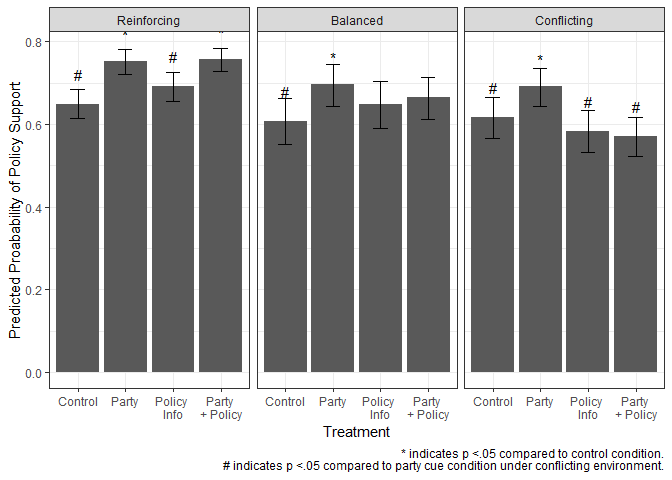
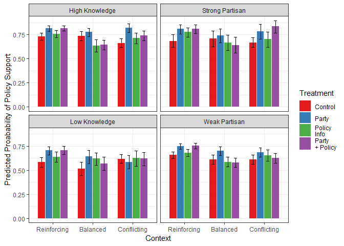
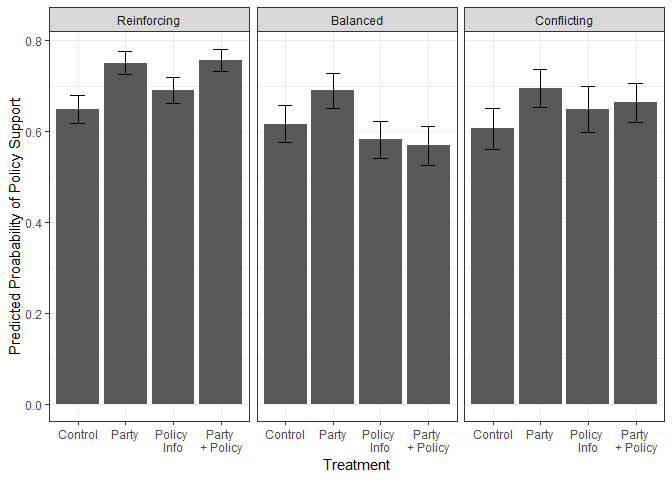

POL213 TA Session
================
Gento Kato
April 18, 2019

``` r
## Clear Workspace
rm(list = ls())

## Set Working Directory to the File location
## (If using RStudio, can be set automatically)
setwd(dirname(rstudioapi::getActiveDocumentContext()$path))
getwd()
```

    ## [1] "C:/GoogleDrive/Lectures/2019_04to06_UCD/POL213_TA/POL213_TA_resource"

``` r
## Required packages
library(ggplot2) # Plotting
library(faraway) # for ilogit function
library(ggrepel) # For Convenient Text Label
library(readstata13) # Read stata type data
```

Let's Replicate Boudreau and MacKenzie 2014!
============================================

Check their paper [HERE](https://onlinelibrary.wiley.com/doi/full/10.1111/ajps.12054).

Their Replication Data are [HERE](https://dataverse.harvard.edu/dataset.xhtml?persistentId=doi:10.7910/DVN/CNNXPB).

``` r
# install.packages("dataverse") # Only Once
library(dataverse)
serverset <- "dataverse.harvard.edu"

(meta <- get_dataset("doi:10.7910/DVN/CNNXPB", server=serverset))

# Get Codebook
writeBin(get_file("boudreau_mackenzie_codebook_ajps.pdf","doi:10.7910/DVN/CNNXPB",
                  server=serverset), "boudreau_mackenzie_codebook_ajps.pdf")
# Get Data
writeBin(get_file("table2_fig1_fig2.tab","doi:10.7910/DVN/CNNXPB",
                  server=serverset), "table2_fig1_fig2.dta")
```

``` r
# Import Data
d <- read.dta13("table2_fig1_fig2.dta", convert.factors = FALSE)
# Variables
summary(d)
```

    ##      caseid          democrat        pty_strong       know_high     
    ##  Min.   :  17.0   Min.   :0.0000   Min.   :0.0000   Min.   :0.0000  
    ##  1st Qu.: 347.0   1st Qu.:0.0000   1st Qu.:0.0000   1st Qu.:0.0000  
    ##  Median : 661.0   Median :1.0000   Median :0.0000   Median :1.0000  
    ##  Mean   : 662.6   Mean   :0.5844   Mean   :0.2451   Mean   :0.6077  
    ##  3rd Qu.: 965.0   3rd Qu.:1.0000   3rd Qu.:0.0000   3rd Qu.:1.0000  
    ##  Max.   :1365.0   Max.   :1.0000   Max.   :1.0000   Max.   :1.0000  
    ##                                                                     
    ##       init          sup_init       bal_control         bal_party       
    ##  Min.   :19.00   Min.   :0.0000   Min.   :-1.00000   Min.   :-1.00000  
    ##  1st Qu.:20.00   1st Qu.:0.0000   1st Qu.: 0.00000   1st Qu.: 0.00000  
    ##  Median :23.00   Median :1.0000   Median : 0.00000   Median : 0.00000  
    ##  Mean   :22.93   Mean   :0.5148   Mean   :-0.01508   Mean   :-0.01492  
    ##  3rd Qu.:26.00   3rd Qu.:1.0000   3rd Qu.: 0.00000   3rd Qu.: 0.00000  
    ##  Max.   :27.00   Max.   :1.0000   Max.   : 1.00000   Max.   : 1.00000  
    ##                  NA's   :684                                           
    ##    bal_policy       bal_party_policy   rei_control       
    ##  Min.   :-1.00000   Min.   :-1.0000   Min.   :-1.000000  
    ##  1st Qu.: 0.00000   1st Qu.: 0.0000   1st Qu.: 0.000000  
    ##  Median : 0.00000   Median : 0.0000   Median : 0.000000  
    ##  Mean   :-0.01368   Mean   :-0.0157   Mean   :-0.001865  
    ##  3rd Qu.: 0.00000   3rd Qu.: 0.0000   3rd Qu.: 0.000000  
    ##  Max.   : 1.00000   Max.   : 1.0000   Max.   : 1.000000  
    ##                                                          
    ##    rei_party           rei_policy        rei_party_policy   
    ##  Min.   :-1.000000   Min.   :-1.000000   Min.   :-1.000000  
    ##  1st Qu.: 0.000000   1st Qu.: 0.000000   1st Qu.: 0.000000  
    ##  Median : 0.000000   Median : 0.000000   Median : 0.000000  
    ##  Mean   :-0.003419   Mean   :-0.002798   Mean   :-0.005595  
    ##  3rd Qu.: 0.000000   3rd Qu.: 0.000000   3rd Qu.: 0.000000  
    ##  Max.   : 1.000000   Max.   : 1.000000   Max.   : 1.000000  
    ##                                                             
    ##   con_control         con_party          con_policy      
    ##  Min.   :-1.00000   Min.   :-1.00000   Min.   :-1.00000  
    ##  1st Qu.: 0.00000   1st Qu.: 0.00000   1st Qu.: 0.00000  
    ##  Median : 0.00000   Median : 0.00000   Median : 0.00000  
    ##  Mean   :-0.03202   Mean   :-0.03326   Mean   :-0.03015  
    ##  3rd Qu.: 0.00000   3rd Qu.: 0.00000   3rd Qu.: 0.00000  
    ##  Max.   : 1.00000   Max.   : 1.00000   Max.   : 1.00000  
    ##                                                          
    ##  con_party_policy  
    ##  Min.   :-1.00000  
    ##  1st Qu.: 0.00000  
    ##  Median : 0.00000  
    ##  Mean   :-0.03699  
    ##  3rd Qu.: 0.00000  
    ##  Max.   : 1.00000  
    ## 

Run Logistic Regression
=======================

``` r
# For Figure 1
logit.cueexp <- glm(sup_init ~ 0 + rei_party + rei_policy + rei_party_policy + rei_control +
                    con_party + con_policy + con_party_policy + con_control +
                    bal_party + bal_policy + bal_party_policy + bal_control, data=d, 
                    family=binomial("logit"))
summary(logit.cueexp)
```

    ## 
    ## Call:
    ## glm(formula = sup_init ~ 0 + rei_party + rei_policy + rei_party_policy + 
    ##     rei_control + con_party + con_policy + con_party_policy + 
    ##     con_control + bal_party + bal_policy + bal_party_policy + 
    ##     bal_control, family = binomial("logit"), data = d)
    ## 
    ## Deviance Residuals: 
    ##     Min       1Q   Median       3Q      Max  
    ## -1.6810  -0.9294   0.7469   0.9984   1.6810  
    ## 
    ## Coefficients:
    ##                  Estimate Std. Error z value Pr(>|z|)    
    ## rei_party         1.10876    0.08237  13.460  < 2e-16 ***
    ## rei_policy        0.80762    0.08460   9.546  < 2e-16 ***
    ## rei_party_policy  1.13397    0.07877  14.395  < 2e-16 ***
    ## rei_control       0.61497    0.07914   7.771 7.80e-15 ***
    ## con_party         0.80722    0.10978   7.353 1.93e-13 ***
    ## con_policy        0.33359    0.10733   3.108 0.001882 ** 
    ## con_party_policy  0.28344    0.09952   2.848 0.004401 ** 
    ## con_control       0.47523    0.10649   4.463 8.10e-06 ***
    ## bal_party         0.82734    0.12365   6.691 2.22e-11 ***
    ## bal_policy        0.61576    0.12801   4.810 1.51e-06 ***
    ## bal_party_policy  0.68401    0.11695   5.849 4.96e-09 ***
    ## bal_control       0.43685    0.11964   3.651 0.000261 ***
    ## ---
    ## Signif. codes:  0 '***' 0.001 '**' 0.01 '*' 0.05 '.' 0.1 ' ' 1
    ## 
    ## (Dispersion parameter for binomial family taken to be 1)
    ## 
    ##     Null deviance: 7971.2  on 5750  degrees of freedom
    ## Residual deviance: 7137.6  on 5738  degrees of freedom
    ##   (684 observations deleted due to missingness)
    ## AIC: 7161.6
    ## 
    ## Number of Fisher Scoring iterations: 4

``` r
# Focus on the difference in "conflicting environment"

# Predicted Probability

# (Control in Conflicting Environment / Preferred by Party)
(pi_ctl <- exp(0.47523) / (1 + exp(0.47523)))
```

    ## [1] 0.6166209

``` r
# (Party Cue Received in Conflicting Envionrment / Preferred by Party)
(pi_cue <- exp(0.80722) / (1 + exp(0.80722)))
```

    ## [1] 0.6915168

``` r
# (Party Cue & Opposint Info Received in Conflicting Envionrment / Preferred by Party)
(pi_both <- exp(0.28344) / (1 + exp(0.28344)))
```

    ## [1] 0.5703894

``` r
# Comparing Odds Ratio

# Calculate Odds Ratio
(odds_ctl <- pi_ctl/(1-pi_ctl))
```

    ## [1] 1.608384

``` r
(odds_cue <- pi_ctl/(1-pi_cue))
```

    ## [1] 1.99888

``` r
(odds_both <- pi_ctl/(1-pi_both))
```

    ## [1] 1.435302

``` r
# Control vs. Cue Reception
odds_ctl / odds_cue
```

    ## [1] 0.8046427

``` r
# Cue + Info vs. Cue Reception
odds_both / odds_cue
```

    ## [1] 0.718053

``` r
# COntrol vs. Cue + Info
odds_ctl / odds_both
```

    ## [1] 1.120589

``` r
# Wald statistic and confidence intervals

# Coefficient Table
(cftab <- summary(logit.cueexp)$coefficients)
```

    ##                   Estimate Std. Error   z value     Pr(>|z|)
    ## rei_party        1.1087647 0.08237433 13.460074 2.686456e-41
    ## rei_policy       0.8076244 0.08460493  9.545831 1.350204e-21
    ## rei_party_policy 1.1339734 0.07877436 14.395210 5.545633e-47
    ## rei_control      0.6149659 0.07913812  7.770792 7.799666e-15
    ## con_party        0.8072196 0.10977612  7.353327 1.933339e-13
    ## con_policy       0.3335918 0.10732708  3.108179 1.882440e-03
    ## con_party_policy 0.2834358 0.09952405  2.847912 4.400703e-03
    ## con_control      0.4752347 0.10649335  4.462576 8.098009e-06
    ## bal_party        0.8273432 0.12365050  6.690982 2.216786e-11
    ## bal_policy       0.6157605 0.12800555  4.810420 1.506132e-06
    ## bal_party_policy 0.6840147 0.11695324  5.848617 4.956772e-09
    ## bal_control      0.4368514 0.11963958  3.651395 2.608193e-04

``` r
# Z Score
(z_ctl <- (cftab[8,1] - 0) / cftab[8,2])
```

    ## [1] 4.462576

``` r
(z_cue <- (cftab[5,1] - 0) / cftab[5,2])
```

    ## [1] 7.353327

``` r
(z_both <- (cftab[7,1] - 0) / cftab[7,2])
```

    ## [1] 2.847912

``` r
# Confidence Interval
(ci_ctl <- c(cftab[8,1]-1.96*cftab[8,2],cftab[8,1]+1.96*cftab[8,2]))
```

    ## [1] 0.2665077 0.6839616

``` r
(ci_cue <- c(cftab[5,1]-1.96*cftab[5,2],cftab[5,1]+1.96*cftab[5,2]))
```

    ## [1] 0.5920584 1.0223808

``` r
(ci_both <- c(cftab[7,1]-1.96*cftab[7,2],cftab[7,1]+1.96*cftab[7,2]))
```

    ## [1] 0.08836864 0.47850292

``` r
# or Just
(citab <- confint(logit.cueexp))
```

    ## Waiting for profiling to be done...

    ##                       2.5 %    97.5 %
    ## rei_party        0.94941190 1.2725044
    ## rei_policy       0.64346186 0.9753073
    ## rei_party_policy 0.98153776 1.2904951
    ## rei_control      0.46097573 0.7713522
    ## con_party        0.59480704 1.0255587
    ## con_policy       0.12426005 0.5453677
    ## con_party_policy 0.08911084 0.4795508
    ## con_control      0.26801587 0.6858497
    ## bal_party        0.58852428 1.0738513
    ## bal_policy       0.36767526 0.8701283
    ## bal_party_policy 0.45742117 0.9163917
    ## bal_control      0.20406438 0.6735910

``` r
# Statistical Significance from Control
library(multcomp)

names(coef(logit.cueexp))
```

    ##  [1] "rei_party"        "rei_policy"       "rei_party_policy"
    ##  [4] "rei_control"      "con_party"        "con_policy"      
    ##  [7] "con_party_policy" "con_control"      "bal_party"       
    ## [10] "bal_policy"       "bal_party_policy" "bal_control"

``` r
# Linear Combination (Compare With Control Group)
compare <- c("rei_party - rei_control = 0",
             "rei_policy - rei_control = 0",
             "rei_party_policy - rei_control = 0",
             "con_party - con_control = 0",
             "con_policy - con_control = 0",
             "con_party_policy - con_control = 0",
             "bal_party - bal_control = 0",
             "bal_policy - bal_control = 0",
             "bal_party_policy - bal_control = 0")
# Function to test linear combination hypotheses and store p-value
complh <- function(k) as.numeric(summary(glht(logit.cueexp, linfct = k))$test$pvalues)[1]
pvals <- sapply(compare, complh)
(pvals <- c(pvals[1:3],NA,pvals[4:6],NA,pvals[7:9],NA))
```

    ##        rei_party - rei_control = 0       rei_policy - rei_control = 0 
    ##                       1.540149e-05                       9.630766e-02 
    ## rei_party_policy - rei_control = 0                                    
    ##                       3.350833e-06                                 NA 
    ##        con_party - con_control = 0       con_policy - con_control = 0 
    ##                       2.995825e-02                       3.488498e-01 
    ## con_party_policy - con_control = 0                                    
    ##                       1.882219e-01                                 NA 
    ##        bal_party - bal_control = 0       bal_policy - bal_control = 0 
    ##                       2.323371e-02                       3.072052e-01 
    ## bal_party_policy - bal_control = 0                                    
    ##                       1.395946e-01                                 NA

``` r
# Difference from Party Cue Group 
compare2 <- c("rei_policy - rei_party = 0",
             "rei_party_policy - rei_party = 0",
             "rei_control - rei_party = 0",
             "con_policy - con_party = 0",
             "con_party_policy - con_party = 0",
             "con_control - con_party = 0",
             "bal_policy - bal_party = 0",
             "bal_party_policy - bal_party = 0",
             "bal_control - bal_party = 0"
             )
# Function to test linear combination hypotheses and store p-value
pvals2 <- sapply(compare2, complh)
(pvals2 <- c(NA,pvals2[1:3],NA,pvals2[4:6],NA,pvals2[7:9]))
```

    ##                                        rei_policy - rei_party = 0 
    ##                               NA                     1.076462e-02 
    ## rei_party_policy - rei_party = 0      rei_control - rei_party = 0 
    ##                     8.249582e-01                     1.540149e-05 
    ##                                        con_policy - con_party = 0 
    ##                               NA                     2.035365e-03 
    ## con_party_policy - con_party = 0      con_control - con_party = 0 
    ##                     4.079293e-04                     2.995825e-02 
    ##                                        bal_policy - bal_party = 0 
    ##                               NA                     2.345033e-01 
    ## bal_party_policy - bal_party = 0      bal_control - bal_party = 0 
    ##                     3.997174e-01                     2.323371e-02

``` r
# Replicate Figure 1 in the paper
# Assuming that all other conditions are 0, 
# predicted probabilities are just the inverse logit of estimates

(cfcitab <- as.data.frame(cbind(as.numeric(cftab[,1]),citab)))
```

    ##                         V1      2.5 %    97.5 %
    ## rei_party        1.1087647 0.94941190 1.2725044
    ## rei_policy       0.8076244 0.64346186 0.9753073
    ## rei_party_policy 1.1339734 0.98153776 1.2904951
    ## rei_control      0.6149659 0.46097573 0.7713522
    ## con_party        0.8072196 0.59480704 1.0255587
    ## con_policy       0.3335918 0.12426005 0.5453677
    ## con_party_policy 0.2834358 0.08911084 0.4795508
    ## con_control      0.4752347 0.26801587 0.6858497
    ## bal_party        0.8273432 0.58852428 1.0738513
    ## bal_policy       0.6157605 0.36767526 0.8701283
    ## bal_party_policy 0.6840147 0.45742117 0.9163917
    ## bal_control      0.4368514 0.20406438 0.6735910

``` r
colnames(cfcitab) <- c("est","lb","ub")
cfcitab$est <- ilogit(cfcitab$est)
cfcitab$lb <- ilogit(cfcitab$lb)
cfcitab$ub <- ilogit(cfcitab$ub)
# Add Environment Identifier
cfcitab$env <- factor(rep(c("Reinforcing","Conflicting","Balanced"),each=4),
                      levels=c("Reinforcing","Balanced","Conflicting"))
# Add Treatment Identifier
cfcitab$trt <- factor(rep(c("Party","Policy \nInfo","Party \n+ Policy","Control"),3),
                      levels=c("Control","Party","Policy \nInfo","Party \n+ Policy")) 
# Statistical Significance (compared to control)
cfcitab$pval <- pvals
cfcitab$p5 <- ifelse(pvals<0.05,"*",NA)
# Compared to party cue
cfcitab$pvalx <- pvals2
cfcitab$p5x <- ifelse(pvals2<0.05,"#",NA)

# Plot
ggplot(cfcitab, aes(x=trt,y=est)) + 
  geom_bar(stat="identity") + 
  geom_errorbar(aes(ymin=lb,ymax=ub), width=0.3) + 
  geom_text(aes(label=p5), vjust=-1.75) + 
  geom_text(aes(label=p5x), vjust=-2) + 
  facet_grid(.~env) + xlab("Treatment") + 
  ylab("Predicted Proabability of Policy Support") + 
  labs(caption="* indicates p <.05 compared to control condition.\n # indicates p <.05 compared to party cue condition under conflicting environment.") +
  theme_bw()
```

    ## Warning: Removed 8 rows containing missing values (geom_text).

    ## Warning: Removed 6 rows containing missing values (geom_text).



``` r
# Likelihood ratio test

logit.null <- glm(sup_init ~ 1, d, family=binomial("logit"))
summary(logit.null)
```

    ## 
    ## Call:
    ## glm(formula = sup_init ~ 1, family = binomial("logit"), data = d)
    ## 
    ## Deviance Residuals: 
    ##    Min      1Q  Median      3Q     Max  
    ## -1.203  -1.203   1.152   1.152   1.152  
    ## 
    ## Coefficients:
    ##             Estimate Std. Error z value Pr(>|z|)  
    ## (Intercept)  0.05915    0.02639   2.242    0.025 *
    ## ---
    ## Signif. codes:  0 '***' 0.001 '**' 0.01 '*' 0.05 '.' 0.1 ' ' 1
    ## 
    ## (Dispersion parameter for binomial family taken to be 1)
    ## 
    ##     Null deviance: 7966.2  on 5749  degrees of freedom
    ## Residual deviance: 7966.2  on 5749  degrees of freedom
    ##   (684 observations deleted due to missingness)
    ## AIC: 7968.2
    ## 
    ## Number of Fisher Scoring iterations: 3

``` r
(ll1 <- logLik(logit.cueexp))
```

    ## 'log Lik.' -3568.824 (df=12)

``` r
(ll0 <- logLik(logit.null))
```

    ## 'log Lik.' -3983.083 (df=1)

``` r
(g_statusquo <- 2*(ll1[[1]] - ll0[[1]]))
```

    ## [1] 828.5168

``` r
# Or, use the lrtest function to conduct this test
library(lmtest)
lrtest(logit.cueexp, logit.null)
```

    ## Likelihood ratio test
    ## 
    ## Model 1: sup_init ~ 0 + rei_party + rei_policy + rei_party_policy + rei_control + 
    ##     con_party + con_policy + con_party_policy + con_control + 
    ##     bal_party + bal_policy + bal_party_policy + bal_control
    ## Model 2: sup_init ~ 1
    ##   #Df  LogLik  Df  Chisq Pr(>Chisq)    
    ## 1  12 -3568.8                          
    ## 2   1 -3983.1 -11 828.52  < 2.2e-16 ***
    ## ---
    ## Signif. codes:  0 '***' 0.001 '**' 0.01 '*' 0.05 '.' 0.1 ' ' 1

Workshop (Choose Either One of Them)
====================================

-   In the same dataset, <code>know\_high</code> is the indicator for knowledge level (1=high, 0=low) and <code>pty\_strong</code> is the indicator for partisanship strength (1=high, 0=low). Construct the logistic regression model with interaction and replicate figure 2 in Boudreau and MacKenzie 2014.

-   Run probit with the same model as above. Any difference?

Replicate Figure 2
------------------

``` r
# Shortcutting the process (the custom package under development by me...)
#install.packages("devtools")
# Here is how you install somebodyelse's custom R package (not in CRAN).
# devtools::install_github("gentok/estvis") 
library(estvis)

# Knowledge Moderation Model
logit.cueexp.kn <- glm(sup_init ~ 0 + rei_party*know_high + rei_policy*know_high + rei_party_policy*know_high + rei_control*know_high +
                      con_party*know_high + con_policy*know_high + con_party_policy*know_high + con_control*know_high +
                      bal_party*know_high + bal_policy*know_high + bal_party_policy*know_high + bal_control, 
                    data=d, 
                    family=binomial("logit"))
# Partisanship Moderation Model
logit.cueexp.ps <- glm(sup_init ~ 0 + rei_party*pty_strong + rei_policy*pty_strong + rei_party_policy*pty_strong + rei_control*pty_strong +
                         con_party*pty_strong + con_policy*pty_strong + con_party_policy*pty_strong + con_control*pty_strong +
                         bal_party*pty_strong + bal_policy*pty_strong + bal_party_policy*pty_strong + bal_control, 
                       data=d, 
                       family=binomial("logit"))

# Prediction Profile
newprof <- data.frame(rei_party = median(d$rei_party),
                      rei_policy = median(d$rei_policy), 
                      rei_party_policy = median(d$rei_party_policy),
                      rei_control = median(d$rei_control),
                      bal_party = median(d$bal_party),
                      bal_policy = median(d$bal_policy), 
                      bal_party_policy = median(d$bal_party_policy),
                      bal_control = median(d$bal_control),
                      con_party = median(d$con_party),
                      con_policy = median(d$con_policy), 
                      con_party_policy = median(d$con_party_policy),
                      con_control = median(d$con_control),
                      know_high = rep(c(1,0), each=12),
                      pty_strong = rep(c(1,0), each=12))
# Add conditions
for(i in 1:12) newprof[,i][c(i,i+12)] <- 1

# Make Prediction
pred.kn <- simu_pred(logit.cueexp.kn, newprof)$predsum
pred.ps <- simu_pred(logit.cueexp.ps, newprof)$predsum
pred.int <- rbind(pred.kn, pred.ps)
pred.int$cat <- rep(c("High Knowledge","Low Knowledge",
                      "Strong Partisan","Weak Partisan"),each=12)
pred.int$cat <- factor(pred.int$cat, levels=c("High Knowledge","Strong Partisan",
                                              "Low Knowledge","Weak Partisan"))
# Add Environment Identifier
pred.int$env <- factor(rep(rep(c("Reinforcing","Conflicting","Balanced"),each=4),2),
                      levels=c("Reinforcing","Balanced","Conflicting"))
# Add Treatment Identifier
pred.int$trt <- factor(rep(c("Party","Policy \nInfo","Party \n+ Policy","Control"),6),
                      levels=c("Control","Party","Policy \nInfo","Party \n+ Policy")) 

ggplot(pred.int, aes(x=env, y=Mean, fill=trt)) + 
  geom_bar(stat="identity", width=0.7, position=position_dodge(width=0.75)) +
  geom_errorbar(aes(ymin=lowerCI,ymax=upperCI), width=0.3, 
                position=position_dodge(width=0.75)) + 
  facet_wrap(.~cat) + xlab("Context") + 
  scale_fill_brewer(name="Treatment", type="qual", palette=6) +
  ylab("Predicted Proabability of Policy Support") + 
  theme_bw()
```



-   Run probit

``` r
probit.cueexp <- glm(sup_init ~ 0 + rei_party + rei_policy + rei_party_policy + rei_control +
                       con_party + con_policy + con_party_policy + con_control +
                       bal_party + bal_policy + bal_party_policy + bal_control, data=d, 
                     family=binomial("probit"))
summary(probit.cueexp)
```

    ## 
    ## Call:
    ## glm(formula = sup_init ~ 0 + rei_party + rei_policy + rei_party_policy + 
    ##     rei_control + con_party + con_policy + con_party_policy + 
    ##     con_control + bal_party + bal_policy + bal_party_policy + 
    ##     bal_control, family = binomial("probit"), data = d)
    ## 
    ## Deviance Residuals: 
    ##     Min       1Q   Median       3Q      Max  
    ## -1.6810  -0.9294   0.7469   0.9984   1.6810  
    ## 
    ## Coefficients:
    ##                  Estimate Std. Error z value Pr(>|z|)    
    ## rei_party         0.68048    0.04855  14.015  < 2e-16 ***
    ## rei_policy        0.50040    0.05127   9.761  < 2e-16 ***
    ## rei_party_policy  0.69532    0.04631  15.014  < 2e-16 ***
    ## rei_control       0.38282    0.04862   7.874 3.44e-15 ***
    ## con_party         0.50015    0.06652   7.519 5.53e-14 ***
    ## con_policy        0.20863    0.06686   3.120 0.001806 ** 
    ## con_party_policy  0.17736    0.06210   2.856 0.004289 ** 
    ## con_control       0.29662    0.06594   4.498 6.85e-06 ***
    ## bal_party         0.51234    0.07481   6.849 7.44e-12 ***
    ## bal_policy        0.38331    0.07864   4.874 1.09e-06 ***
    ## bal_party_policy  0.42514    0.07152   5.944 2.78e-09 ***
    ## bal_control       0.27283    0.07422   3.676 0.000237 ***
    ## ---
    ## Signif. codes:  0 '***' 0.001 '**' 0.01 '*' 0.05 '.' 0.1 ' ' 1
    ## 
    ## (Dispersion parameter for binomial family taken to be 1)
    ## 
    ##     Null deviance: 7971.2  on 5750  degrees of freedom
    ## Residual deviance: 7137.6  on 5738  degrees of freedom
    ##   (684 observations deleted due to missingness)
    ## AIC: 7161.6
    ## 
    ## Number of Fisher Scoring iterations: 4

``` r
pred.probit <- simu_pred(probit.cueexp, newprof[1:12,])$predsum
# Add Environment Identifier
pred.probit$env <- factor(rep(rep(c("Reinforcing","Conflicting","Balanced"),each=4),1),
                       levels=c("Reinforcing","Balanced","Conflicting"))
# Add Treatment Identifier
pred.probit$trt <- factor(rep(c("Party","Policy \nInfo","Party \n+ Policy","Control"),3),
                       levels=c("Control","Party","Policy \nInfo","Party \n+ Policy")) 

# Plot
ggplot(pred.probit, aes(x=trt, y=Mean)) +
  geom_bar(stat = "identity") + 
  geom_errorbar(aes(ymin=lowerCI,ymax=upperCI), width=0.3) + 
  facet_grid(. ~ env) + xlab("Treatment") + 
  ylab("Predicted Proabability of Policy Support") + 
  theme_bw()
```


