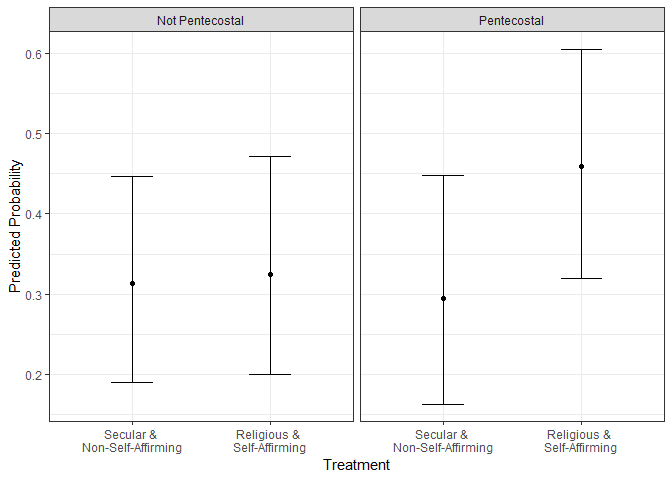
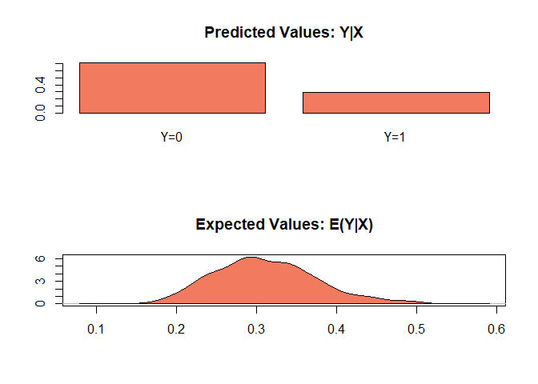
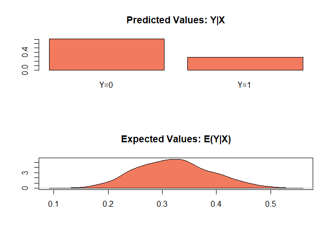
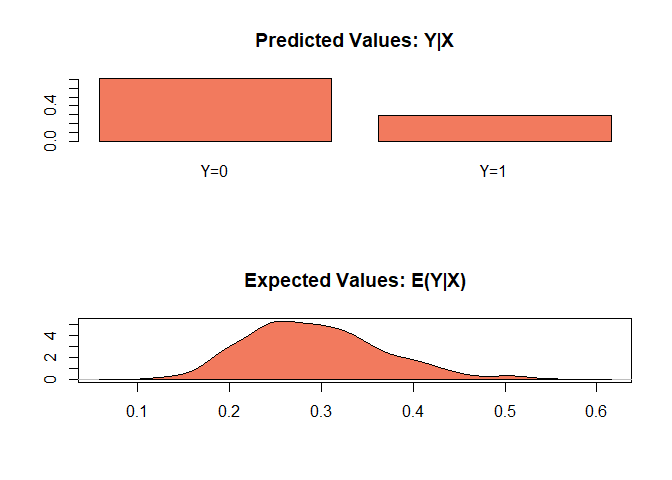
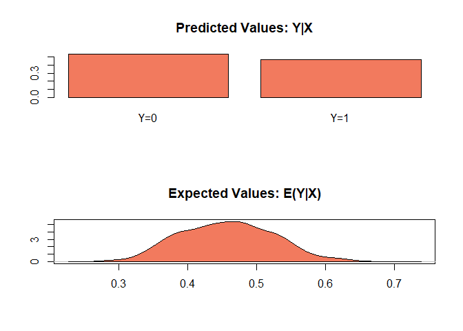

POL213 TA Session
================
Gento Kato
April 25, 2019

``` r
## Clear Workspace
rm(list = ls())

## Set Working Directory to the File location
## (If using RStudio, can be set automatically)
setwd(dirname(rstudioapi::getActiveDocumentContext()$path))
getwd()
```

    ## [1] "C:/GoogleDrive/Lectures/2019_04to06_UCD/POL213_TA/POL213_TA_resource"

``` r
## Required packages
library(readr) # Reading csv file
library(ggplot2) # Plotting
library(faraway) # for ilogit function
library(pscl) # For pseudo R squared (pR2)
library(DAMisc) # For pre function
library(readstata13) # For importing data
library(MASS) # For mvrnorm
library(Zelig) # zelig function
```

Study of Religious Message and Participation in Kenya
=====================================================

Check the paper [HERE](https://www.journals.uchicago.edu/doi/full/10.1086/682717).

Their Replication Data are [HERE](https://dataverse.harvard.edu/dataset.xhtml?persistentId=doi:10.7910/DVN/7KSNCE).

``` r
# install.packages("dataverse") # Only Once
library(dataverse)
serverset <- "dataverse.harvard.edu"

(meta <- get_dataset("doi:10.7910/DVN/7KSNCE", server=serverset))

# Get Stata Do File
writeBin(get_file("McClendonRiedl_religionasstimulant.do","doi:10.7910/DVN/7KSNCE",
                  server=serverset), "McClendonRiedl_religionasstimulant.do")
# Get Data
writeBin(get_file("religionasstimulant.tab","doi:10.7910/DVN/7KSNCE",
                  server=serverset), "religionasstimulant.dta")
```

``` r
# Import Data
d <- read.dta13("religionasstimulant.dta", convert.factors = FALSE)
# Variables
summary(d)
```

    ##    session              table         subjects         sessionnumber  
    ##  Length:438         Min.   :1.000   Length:438         Min.   : 0.00  
    ##  Class :character   1st Qu.:1.000   Class :character   1st Qu.: 6.00  
    ##  Mode  :character   Median :1.000   Mode  :character   Median :12.00  
    ##                     Mean   :1.041                      Mean   :12.81  
    ##                     3rd Qu.:1.000                      3rd Qu.:19.00  
    ##                     Max.   :2.000                      Max.   :27.00  
    ##                                                                       
    ##     subject        busaranumber     treatment       decision1    
    ##  Min.   : 1.000   Min.   : 1.00   Min.   :1.000   Min.   :1.000  
    ##  1st Qu.: 4.000   1st Qu.: 6.00   1st Qu.:2.000   1st Qu.:1.000  
    ##  Median : 8.000   Median :10.00   Median :3.000   Median :2.000  
    ##  Mean   : 8.596   Mean   :10.42   Mean   :2.546   Mean   :1.594  
    ##  3rd Qu.:12.000   3rd Qu.:15.00   3rd Qu.:4.000   3rd Qu.:2.000  
    ##  Max.   :18.000   Max.   :20.00   Max.   :4.000   Max.   :2.000  
    ##                                                                  
    ##    decision2     financialassistance healthassistance
    ##  Min.   :1.000   Min.   :1.000       Min.   :1.00    
    ##  1st Qu.:1.000   1st Qu.:2.000       1st Qu.:7.00    
    ##  Median :1.000   Median :6.000       Median :7.00    
    ##  Mean   :1.434   Mean   :4.863       Mean   :6.29    
    ##  3rd Qu.:2.000   3rd Qu.:8.000       3rd Qu.:7.00    
    ##  Max.   :2.000   Max.   :8.000       Max.   :8.00    
    ##                                                      
    ##  disagreementassistance   primaryedu    foodassistance 
    ##  Min.   :1.000          Min.   :1.000   Min.   :1.000  
    ##  1st Qu.:3.000          1st Qu.:2.000   1st Qu.:2.000  
    ##  Median :3.000          Median :3.000   Median :3.000  
    ##  Mean   :4.393          Mean   :2.507   Mean   :2.614  
    ##  3rd Qu.:5.000          3rd Qu.:3.000   3rd Qu.:3.000  
    ##  Max.   :8.000          Max.   :3.000   Max.   :3.000  
    ##                                                        
    ##  vulnerableassistance loanstosmallbusin flashympreelect corruptionreelect
    ##  Min.   :1.000        Min.   :1.000     Min.   :1.000   Min.   :1.000    
    ##  1st Qu.:3.000        1st Qu.:2.000     1st Qu.:1.000   1st Qu.:1.000    
    ##  Median :3.000        Median :3.000     Median :2.000   Median :1.000    
    ##  Mean   :2.651        Mean   :2.511     Mean   :1.763   Mean   :1.345    
    ##  3rd Qu.:3.000        3rd Qu.:3.000     3rd Qu.:2.000   3rd Qu.:2.000    
    ##  Max.   :3.000        Max.   :3.000     Max.   :3.000   Max.   :3.000    
    ##                                                                          
    ##   inequalityok   indivresponsibility lifeisundermycontrol hardworkrewarded
    ##  Min.   :1.000   Min.   :1.000       Min.   :1.000        Min.   :1.000   
    ##  1st Qu.:2.000   1st Qu.:1.000       1st Qu.:1.000        1st Qu.:1.000   
    ##  Median :2.000   Median :1.000       Median :1.000        Median :1.000   
    ##  Mean   :1.888   Mean   :1.404       Mean   :1.338        Mean   :1.148   
    ##  3rd Qu.:2.000   3rd Qu.:2.000       3rd Qu.:2.000        3rd Qu.:1.000   
    ##  Max.   :2.000   Max.   :2.000       Max.   :2.000        Max.   :2.000   
    ##                                                                           
    ##  indivvothervgodguidance youthagendajoin youthagendasms 
    ##  Min.   :1.000           Min.   :1.000   Min.   :1.000  
    ##  1st Qu.:3.000           1st Qu.:1.000   1st Qu.:1.000  
    ##  Median :3.000           Median :1.000   Median :1.000  
    ##  Mean   :2.733           Mean   :1.055   Mean   :1.183  
    ##  3rd Qu.:3.000           3rd Qu.:1.000   3rd Qu.:1.000  
    ##  Max.   :3.000           Max.   :2.000   Max.   :2.000  
    ##                                                         
    ##  communityforumjoin    optimism      polinterest       religion    
    ##  Min.   :1.000      Min.   :1.000   Min.   :1.000   Min.   :1.000  
    ##  1st Qu.:1.000      1st Qu.:1.000   1st Qu.:2.000   1st Qu.:1.000  
    ##  Median :1.000      Median :1.000   Median :2.000   Median :2.000  
    ##  Mean   :1.137      Mean   :1.265   Mean   :2.002   Mean   :2.498  
    ##  3rd Qu.:1.000      3rd Qu.:1.000   3rd Qu.:2.000   3rd Qu.:3.000  
    ##  Max.   :2.000      Max.   :3.000   Max.   :3.000   Max.   :8.000  
    ##                                                                    
    ##     ownscar      ownsmotorcycle      ownstv       tookpamphlet   
    ##  Min.   :1.000   Min.   :1.000   Min.   :1.000   Min.   :0.0000  
    ##  1st Qu.:2.000   1st Qu.:2.000   1st Qu.:1.000   1st Qu.:1.0000  
    ##  Median :2.000   Median :2.000   Median :1.000   Median :1.0000  
    ##  Mean   :1.982   Mean   :1.968   Mean   :1.345   Mean   :0.8484  
    ##  3rd Qu.:2.000   3rd Qu.:2.000   3rd Qu.:2.000   3rd Qu.:1.0000  
    ##  Max.   :2.000   Max.   :2.000   Max.   :2.000   Max.   :1.0000  
    ##                                                  NA's   :29      
    ##     smspref          sentsms        education        marital     
    ##  Min.   :0.0000   Min.   :0.000   Min.   : 1.00   Min.   :1.000  
    ##  1st Qu.:0.0000   1st Qu.:0.000   1st Qu.:10.00   1st Qu.:1.000  
    ##  Median :0.0000   Median :0.000   Median :12.00   Median :2.000  
    ##  Mean   :0.4639   Mean   :0.359   Mean   :12.13   Mean   :1.696  
    ##  3rd Qu.:1.0000   3rd Qu.:1.000   3rd Qu.:14.00   3rd Qu.:2.000  
    ##  Max.   :1.0000   Max.   :1.000   Max.   :24.00   Max.   :3.000  
    ##  NA's   :9        NA's   :48                                     
    ##     children         surveyid      enrollmentdate     kiberalocation  
    ##  Min.   : 0.000   Min.   :102602   Length:438         Min.   : 1.000  
    ##  1st Qu.: 1.000   1st Qu.:139559   Class :character   1st Qu.: 2.000  
    ##  Median : 2.000   Median :189306   Mode  :character   Median : 6.000  
    ##  Mean   : 2.064   Mean   :199308                      Mean   : 5.752  
    ##  3rd Qu.: 3.000   3rd Qu.:246457                      3rd Qu.: 9.000  
    ##  Max.   :13.000   Max.   :394605                      Max.   :11.000  
    ##                   NA's   :4                           NA's   :136     
    ##   nrblocation      birthyear        gender        occupation   
    ##  Min.   : 65.0   Min.   :1938   Min.   :1.000   Min.   : 2.00  
    ##  1st Qu.:651.0   1st Qu.:1974   1st Qu.:1.000   1st Qu.:25.00  
    ##  Median :652.0   Median :1983   Median :2.000   Median :28.00  
    ##  Mean   :626.1   Mean   :1980   Mean   :1.569   Mean   :24.83  
    ##  3rd Qu.:654.0   3rd Qu.:1989   3rd Qu.:2.000   3rd Qu.:28.00  
    ##  Max.   :657.0   Max.   :1994   Max.   :2.000   Max.   :30.00  
    ##  NA's   :306     NA's   :4      NA's   :4       NA's   :77     
    ##  occupation_spec     incomestream    selfemployed   nativelanguage  
    ##  Length:438         Min.   :1.000   Min.   :1.000   Min.   : 1.000  
    ##  Class :character   1st Qu.:1.000   1st Qu.:1.000   1st Qu.: 2.000  
    ##  Mode  :character   Median :1.000   Median :2.000   Median : 3.000  
    ##                     Mean   :1.285   Mean   :1.593   Mean   : 3.309  
    ##                     3rd Qu.:2.000   3rd Qu.:2.000   3rd Qu.: 4.000  
    ##                     Max.   :2.000   Max.   :2.000   Max.   :22.000  
    ##                     NA's   :266     NA's   :266     NA's   :4       
    ##  nativelanguage_spec    invites   subjectpool1    beforeattend   
    ##  Length:438          Min.   :0   Min.   :1.000   Min.   :-1.000  
    ##  Class :character    1st Qu.:0   1st Qu.:1.000   1st Qu.: 1.000  
    ##  Mode  :character    Median :0   Median :1.000   Median : 1.000  
    ##                      Mean   :0   Mean   :1.305   Mean   : 1.664  
    ##                      3rd Qu.:0   3rd Qu.:2.000   3rd Qu.: 2.000  
    ##                      Max.   :0   Max.   :2.000   Max.   : 7.000  
    ##                      NA's   :5   NA's   :5                       
    ##   dictatorkept  dictatorgave dictatorreceived dictatorpayoff
    ##  Min.   :  0   Min.   :  0   Min.   :  0      Min.   :  0   
    ##  1st Qu.: 60   1st Qu.:  0   1st Qu.:  0      1st Qu.: 80   
    ##  Median : 90   Median : 10   Median : 10      Median :100   
    ##  Mean   : 82   Mean   : 18   Mean   : 18      Mean   :100   
    ##  3rd Qu.:100   3rd Qu.: 40   3rd Qu.: 40      3rd Qu.:120   
    ##  Max.   :100   Max.   :100   Max.   :100      Max.   :200   
    ## 

Recoding of Variables
=====================

``` r
#*VARIABLE CODING FOR PARTICIPATION PAPER

# Religious, Non-Selfaffirming Treatment
d$rsi = 0
d$rsi[d$treatment==1] = 1

# Secular, Non-Selfaffirming Treatment 
d$ssi = 0
d$ssi[d$treatment==2] = 1

# Religious, Selfaffirming (Prosperity) Treatment
d$rpm = 0
d$rpm[d$treatment==3] = 1

# Secular, Selfaffirming (Prosperity) Treatment
d$spm = 0
d$spm[d$treatment==4] = 1

# Religious Treatment Summary (Religious=1, Secular=0)
d$religioustreatment = 0
d$religioustreatment[d$rsi==1 | d$rpm==1] = 1

# Self-affirming Treatment Summary (Self-affirming=1, Not=0)
d$prosperitytreatment = 0
d$prosperitytreatment[d$rpm==1 | d$spm==1] = 1

# Age
d$age = 2014 - d$birthyear

# Christian =1 or Not =0 
d$christian = 1
d$christian[d$religion %in% c(5,6,7,8)] = 0
summary(d$christian)
```

    ##    Min. 1st Qu.  Median    Mean 3rd Qu.    Max. 
    ##  0.0000  1.0000  1.0000  0.9155  1.0000  1.0000

``` r
# Obtained Seconday Education = 1, Not = 0
d$secondaryed = 0
d$secondaryed[d$education > 10] = 1

# Owning Car, Television, or Motorcycle (Have = 1, Not = 0)
d$car = ifelse(d$ownscar==1,1,0)
d$television = ifelse(d$ownstv==1,1,0)
d$motorcycle = ifelse(d$ownsmotorcycle==1,1,0)

# Female = 1, Male = 0
d$female = ifelse(d$gender==2,1,0)

# Denomination (Belong to the denomination = 1, Not = 0)
d$catholic <- ifelse(d$religion==2,1,0)
d$pentecostal <- ifelse(d$religion==1,1,0)
d$tradchristian <- ifelse(d$religion %in% c(2,3),1,0)
#**above includes mainline protestant and catholic
d$pentecostal2 <- ifelse(d$religion %in% c(1,4),1,0)
#** above includes pentecostal and the category "other" (likely charismatic or renewalist)

# Marital Status (Currently Married)
d$married <- ifelse(d$marital==2,1,0)
# Marital Status (Ever Married)
d$evermarried <- ifelse(d$marital %in% c(2,3),1,0)

# Native Language (Speak that language=1, Not=0)
d$kalenjin = ifelse(d$nativelanguage==12,1,0)
d$luhya = ifelse(d$nativelanguage==3,1,0)
d$kamba = ifelse(d$nativelanguage==5,1,0)
d$kisii = ifelse(d$nativelanguage==4,1,0)
d$kikuyu = ifelse(d$nativelanguage==1,1,0)
d$luo = ifelse(d$nativelanguage==2,1,0)
d$other = ifelse(d$nativelanguage%in%c(22,6,7,14,8),1,0)

# Kept Amount % in Dictator Game
table(d$dictatorkept)
```

    ## 
    ##   0  20  45  50  60  70  75  78  80  90  91  94  95  97  98  99 100 
    ##   2   1   1  99  13  12   3   1  68  20   1   1   7   1   4   3 201

``` r
# DV1: Sending SMS Message (1=Yes, 0=No)
table(d$sentsms)
```

    ## 
    ##   0   1 
    ## 250 140

``` r
# DV2: Took Pamphlet (1=Yes, 0=No)
table(d$tookpamphlet)
```

    ## 
    ##   0   1 
    ##  62 347

``` r
# DV3: Intention to Joing Youth Group or Community Forum
d$joingroup=0
d$joingroup[d$youthagendajoin==1 & d$communityforumjoin==1] = 1
table(d$joingroup)
```

    ## 
    ##   0   1 
    ##  69 369

``` r
# Number of Previous Experiment Participation
d$beforeattend[d$beforeattend<0] <- NA
table(d$beforeattend)
```

    ## 
    ##   0   1   2   3   4   5   6   7 
    ##  60 165 116  74   8   6   7   1

``` r
# Drop Those Who Attended Too Many Times Previously
d <- d[d$beforeattend %in% c(0,1,2,3),]
```

Run Logistic Regression
=======================

1. Run Logit Model using glm function
-------------------------------------

DV is Sending SMS, Treatments are religious message and self-affirming message Think about how you can capture all treatments

-   Cecular, Non-Self-Affirming as Reference Category

``` r
m1 <- glm(sentsms ~ spm + rsi + rpm, data = d, family=binomial("logit"))
summary(m1)
```

    ## 
    ## Call:
    ## glm(formula = sentsms ~ spm + rsi + rpm, family = binomial("logit"), 
    ##     data = d)
    ## 
    ## Deviance Residuals: 
    ##     Min       1Q   Median       3Q      Max  
    ## -0.9964  -0.9331  -0.8446   1.3699   1.5518  
    ## 
    ## Coefficients:
    ##             Estimate Std. Error z value Pr(>|z|)    
    ## (Intercept) -0.84730    0.23002  -3.684  0.00023 ***
    ## spm          0.24116    0.30958   0.779  0.43598    
    ## rsi          0.04879    0.32652   0.149  0.88122    
    ## rpm          0.40547    0.31392   1.292  0.19649    
    ## ---
    ## Signif. codes:  0 '***' 0.001 '**' 0.01 '*' 0.05 '.' 0.1 ' ' 1
    ## 
    ## (Dispersion parameter for binomial family taken to be 1)
    ## 
    ##     Null deviance: 475.46  on 370  degrees of freedom
    ## Residual deviance: 473.33  on 367  degrees of freedom
    ##   (44 observations deleted due to missingness)
    ## AIC: 481.33
    ## 
    ## Number of Fisher Scoring iterations: 4

-   Another way of doing the same thing (You see that coefficients are identical)

``` r
m1x <- glm(sentsms ~ prosperitytreatment*religioustreatment, 
          data = d, family=binomial("logit"))
summary(m1x)
```

    ## 
    ## Call:
    ## glm(formula = sentsms ~ prosperitytreatment * religioustreatment, 
    ##     family = binomial("logit"), data = d)
    ## 
    ## Deviance Residuals: 
    ##     Min       1Q   Median       3Q      Max  
    ## -0.9964  -0.9331  -0.8446   1.3699   1.5518  
    ## 
    ## Coefficients:
    ##                                        Estimate Std. Error z value
    ## (Intercept)                            -0.84730    0.23002  -3.684
    ## prosperitytreatment                     0.24116    0.30958   0.779
    ## religioustreatment                      0.04879    0.32652   0.149
    ## prosperitytreatment:religioustreatment  0.11551    0.44179   0.261
    ##                                        Pr(>|z|)    
    ## (Intercept)                             0.00023 ***
    ## prosperitytreatment                     0.43598    
    ## religioustreatment                      0.88122    
    ## prosperitytreatment:religioustreatment  0.79373    
    ## ---
    ## Signif. codes:  0 '***' 0.001 '**' 0.01 '*' 0.05 '.' 0.1 ' ' 1
    ## 
    ## (Dispersion parameter for binomial family taken to be 1)
    ## 
    ##     Null deviance: 475.46  on 370  degrees of freedom
    ## Residual deviance: 473.33  on 367  degrees of freedom
    ##   (44 observations deleted due to missingness)
    ## AIC: 481.33
    ## 
    ## Number of Fisher Scoring iterations: 4

2. Calculate Odds Ratio for Treatment Variables.
------------------------------------------------

### 2.1 Generate Odds Ratio

-   Following codes produce identical results

``` r
exp(m1$coefficients) # OR
```

    ## (Intercept)         spm         rsi         rpm 
    ##   0.4285714   1.2727273   1.0500000   1.5000000

``` r
exp(summary(m1)$coefficients[,1]) # OR
```

    ## (Intercept)         spm         rsi         rpm 
    ##   0.4285714   1.2727273   1.0500000   1.5000000

``` r
exp(coef(summary(m1))[,1])
```

    ## (Intercept)         spm         rsi         rpm 
    ##   0.4285714   1.2727273   1.0500000   1.5000000

### 2.2. Generate Odds Ratio with Confidence Intervals

-   From Scott's Code

``` r
logit.or <- function(model) {
  logit.coeffs <- coef(summary(model))
  odds.ratio <- exp(logit.coeffs[ ,1])
  lci <- exp(logit.coeffs[ ,1] - 1.96 * logit.coeffs[ ,2])
  uci <- exp(logit.coeffs[ ,1] + 1.96 * logit.coeffs[ ,2])
  logit.or <- cbind(odds.ratio, lci, uci)
  logit.or
}

logit.or(m1)
```

    ##             odds.ratio       lci       uci
    ## (Intercept)  0.4285714 0.2730390 0.6727004
    ## spm          1.2727273 0.6937711 2.3348259
    ## rsi          1.0500000 0.5536713 1.9912537
    ## rpm          1.5000000 0.8107338 2.7752634

-   Alternatively...

``` r
m1cf <- as.data.frame(summary(m1)$coefficients)
names(m1cf) <-c("est","se","z","p")

data.frame(odds.ratio=exp(m1cf$est),
           lci = exp(m1cf$est - pnorm(0.975) * m1cf$se),
           uci = exp(m1cf$est + pnorm(0.975) * m1cf$se),
           row.names = row.names(m1cf))
```

    ##             odds.ratio       lci      uci
    ## (Intercept)  0.4285714 0.3536610 0.519349
    ## spm          1.2727273 0.9827459 1.648274
    ## rsi          1.0500000 0.7993761 1.379201
    ## rpm          1.5000000 1.1540460 1.949662

### 2.3. Interpret the meaning!

-   Make Numbers Easier to interpret

``` r
(exp(coef(m1))-1) * 100
```

    ## (Intercept)         spm         rsi         rpm 
    ##   -57.14286    27.27273     5.00000    50.00000

Those who heard secular & self-affirming message are 35% (1.35 times) more likely; those who heard religious & non-self-affirming message are 5% (1.05 times) more likely; those who heard religious & self-affirming message are 50% (1.5 times) more likely than those who heard secular & non-self-affirming message to send SMS.
\#\# 3. Export Pseudo R Square

### 3.1. Use pR2 Function

``` r
round(pR2(m1),4) # all very low
```

    ##       llh   llhNull        G2  McFadden      r2ML      r2CU 
    ## -236.6650 -237.7312    2.1323    0.0045    0.0057    0.0079

### 3.2. McKelvey-Zavonia pseudo-R2 (manually)

``` r
yhat.m1 <- predict(m1, type="response")
round(mckR2.m1 <- var(yhat.m1) / (var(yhat.m1) + (pi^2/3)),5)
```

    ## [1] 0.00039

4. Obtain Classification Table
------------------------------

-   Check value...

``` r
summary(yhat.m1) # No Value Over .39
```

    ##    Min. 1st Qu.  Median    Mean 3rd Qu.    Max. 
    ##  0.3000  0.3103  0.3529  0.3396  0.3529  0.3913

``` r
pred.m1 <- (yhat.m1 > .35)*1 # Let's Make .35 a split point
```

-   Deal with missing value

``` r
dx <- na.omit(d[,all.vars(m1$formula)])
classtab <- data.frame(response = dx$sentsms, predicted = pred.m1)
```

-   Alternatively... (Not using new data)

``` r
classtab <- data.frame(response = m1$model$sentsms, predicted = pred.m1)
```

-   Result

``` r
xtabs(~ predicted + response, data = classtab)
```

    ##          response
    ## predicted   0   1
    ##         0 123  54
    ##         1 122  72

5. Proportional Reduction in Error (PRE)
----------------------------------------

``` r
pre(m1, sim=TRUE, R=1000)
```

    ## mod1:  sentsms ~ spm + rsi + rpm 
    ## mod2:  sentsms ~ 1 
    ## 
    ## Analytical Results
    ##  PMC =  0.660 
    ##  PCP =  0.660 
    ##  PRE =  0.000 
    ## ePMC =  0.551 
    ## ePCP =  0.554 
    ## ePRE =  0.006 
    ## 
    ## Simulated Results
    ##      median lower  upper
    ##  PRE 0.000  -0.159 0.000
    ## ePRE 0.004  -0.043 0.051

The reduction in error is effectively zero. \#\# 6. Generate ROC Curve

-   Generalize Scott's Code

``` r
roc.curve=function(s,m,print=FALSE){
  # Predicted Probabilities
  Ps=(predict(m, type="response")>s)*1
  # False Positive
  FP=sum((Ps==1)*(m$model[,1]==0))/sum(m$model[,1]==0)
  # True Positive
  TP=sum((Ps==1)*(m$model[,1]==1))/sum(m$model[,1]==1)
  # Print Table
  if(print==TRUE){
    print(table(Observed=m$model[,1],Predicted=Ps))
  }
  vect=c(FP,TP)
  names(vect)=c("FPR","TPR")
  return(vect)
}
```

-   Test Function

``` r
threshold = 0.35
roc.curve(threshold,m1,print=TRUE)
```

    ##         Predicted
    ## Observed   0   1
    ##        0 123 122
    ##        1  54  72

    ##       FPR       TPR 
    ## 0.4979592 0.5714286

-   Make roc.curve function applicable to vector of threshold

``` r
ROC.curve=Vectorize(roc.curve, "s")
```

-   Plot ROC curve

``` r
M.ROC=ROC.curve(seq(0,1,by=.01),m1)
plot(M.ROC[1,], M.ROC[2,], col="grey", lwd=2, type="l", xlab="1 - Specificity" ,ylab="Sensitivity")
# Add 45 degrees line
abline(0, 1, col="black", lty=2)
```


-   Use ggplot2

``` r
# Create Data
rocdt <- data.frame(probs = seq(0, 1, by=.01))
roc <- ROC.curve(rocdt$probs, m1)
rocdt$fpr <- roc["FPR",]
rocdt$tpr <- roc["TPR",]

# Plot
ggplot(rocdt, aes(x=fpr,y=tpr)) + 
  geom_line(aes(y=fpr),linetype=2) + 
  geom_line() + 
  xlab("1 - Specificity") + ylab("Sensitivity") +
  theme_bw()
```


Assess Moderation of Treatment
==============================

1. Choose One of Demographic/Attitudinal Variables and Interact with Treatment
------------------------------------------------------------------------------

``` r
m2 <- glm(sentsms ~ spm*pentecostal2 + rsi*pentecostal2 + rpm*pentecostal2, 
          data = d, family=binomial("logit"))
summary(m2)
```

    ## 
    ## Call:
    ## glm(formula = sentsms ~ spm * pentecostal2 + rsi * pentecostal2 + 
    ##     rpm * pentecostal2, family = binomial("logit"), data = d)
    ## 
    ## Deviance Residuals: 
    ##     Min       1Q   Median       3Q      Max  
    ## -1.1073  -0.8904  -0.8576   1.4042   1.5928  
    ## 
    ## Coefficients:
    ##                  Estimate Std. Error z value Pr(>|z|)   
    ## (Intercept)      -0.81093    0.30046  -2.699  0.00696 **
    ## spm               0.29214    0.39254   0.744  0.45674   
    ## pentecostal2     -0.08701    0.46714  -0.186  0.85224   
    ## rsi               0.09038    0.41576   0.217  0.82790   
    ## rpm               0.04879    0.44163   0.110  0.91203   
    ## spm:pentecostal2 -0.17435    0.64390  -0.271  0.78656   
    ## pentecostal2:rsi -0.13071    0.67483  -0.194  0.84641   
    ## pentecostal2:rpm  0.68210    0.63789   1.069  0.28493   
    ## ---
    ## Signif. codes:  0 '***' 0.001 '**' 0.01 '*' 0.05 '.' 0.1 ' ' 1
    ## 
    ## (Dispersion parameter for binomial family taken to be 1)
    ## 
    ##     Null deviance: 475.46  on 370  degrees of freedom
    ## Residual deviance: 470.84  on 363  degrees of freedom
    ##   (44 observations deleted due to missingness)
    ## AIC: 486.84
    ## 
    ## Number of Fisher Scoring iterations: 4

2. Calculate Adjusted McFadden R2 and compare it with the first model
---------------------------------------------------------------------

-   Check that dimention of m1 and m2 are the same.

``` r
dim(m1$model)==dim(m2$model)
```

    ## [1]  TRUE FALSE

-   Run NULL Model

``` r
m0 <- glm(sentsms ~ 1, data= m1$model, family = binomial(link="logit"))
summary(m0)
```

    ## 
    ## Call:
    ## glm(formula = sentsms ~ 1, family = binomial(link = "logit"), 
    ##     data = m1$model)
    ## 
    ## Deviance Residuals: 
    ##    Min      1Q  Median      3Q     Max  
    ## -0.911  -0.911  -0.911   1.470   1.470  
    ## 
    ## Coefficients:
    ##             Estimate Std. Error z value Pr(>|z|)    
    ## (Intercept)  -0.6650     0.1096  -6.066 1.31e-09 ***
    ## ---
    ## Signif. codes:  0 '***' 0.001 '**' 0.01 '*' 0.05 '.' 0.1 ' ' 1
    ## 
    ## (Dispersion parameter for binomial family taken to be 1)
    ## 
    ##     Null deviance: 475.46  on 370  degrees of freedom
    ## Residual deviance: 475.46  on 370  degrees of freedom
    ## AIC: 477.46
    ## 
    ## Number of Fisher Scoring iterations: 4

-   Calculate Adjusted Statistics

``` r
L.m1 <- logLik(m1)
L.m2 <- logLik(m2)
L.m0 <- logLik(m0)
P <- attr(L.m1, "df")

McFadden.R2.m1 <- 1 - (L.m1 / L.m0); McFadden.R2.m1
```

    ## 'log Lik.' 0.004484705 (df=4)

``` r
McFadden.Adj.R2.m1 <- 1 - ((L.m1 - P) / L.m0); McFadden.Adj.R2.m1
```

    ## 'log Lik.' -0.01234102 (df=4)

``` r
McFadden.R2.m2 <- 1 - (L.m2 / L.m0); McFadden.R2.m2
```

    ## 'log Lik.' 0.009728201 (df=8)

``` r
McFadden.Adj.R2.m2 <- 1 - ((L.m2 - P) / L.m0); McFadden.Adj.R2.m2
```

    ## 'log Lik.' -0.007097526 (df=8)

Both have negative value, implying that those models are probably not good. Model 2 has slightly less negative value, implying that adding moderators might worth.

3. Generate Several Profiles of Interest
----------------------------------------

``` r
# Check what coefficients exist.
names(m2$coefficients)
```

    ## [1] "(Intercept)"      "spm"              "pentecostal2"    
    ## [4] "rsi"              "rpm"              "spm:pentecostal2"
    ## [7] "pentecostal2:rsi" "pentecostal2:rpm"

``` r
# Secular & Non-Self-Affirming Treatment & Non-Pentecostal
profile1 <- c(1, 0, 0, 0, 0, 0, 0, 0)
# Religious & Self-Affirming Treatment & Non-Pentecostal
profile2 <- c(1, 0, 0, 0, 1, 0, 0, 0)
# Secular & Non-Self-Affirming Treatment & Pentecostal
profile3 <- c(1, 0, 1, 0, 0, 0, 0, 0)
# Religious & Self-Affirming Treatment & Pentecostal
profile4 <- c(1, 0, 1, 0, 1, 0, 0, 1)
```

4. Assess First Differences in Treatment Effect, Conditional on Moderator Values
--------------------------------------------------------------------------------

### Manually...

``` r
# Draw coefficients randomly from Multivariate Normal Distribution
ndraws <- 1000
betadraw <- mvrnorm(ndraws, coef(m2), vcov(m2))

# Generalize Scott's Code into function

logisprob <- function(profile,betadraw) {
  
  profile_beta <- betadraw %*% profile
  profile_prob <- exp(profile_beta) / (1 + exp(profile_beta))
  
  meanprob <- mean(profile_prob)
  sdprob <- apply(profile_prob, 2, sd)
  qtprob <- apply(profile_prob, 2, quantile, probs=c(0.025,0.5,0.975))
  
  res <- c(meanprob,sdprob,qtprob)
  names(res) <- c("mean","se","per025","per50","per975")
  return(res)
  
}

# Generate Predictions
pred <- sapply(list(profile1,profile2,profile3,profile4),
               logisprob, betadraw=betadraw)
preddt <- as.data.frame(t(pred))
preddt$tr <- rep(c("Secular & \nNon-Self-Affirming",
                   "Religious & \nSelf-Affirming"),2)
preddt$tr <- factor(preddt$tr,levels=unique(preddt$tr))
preddt$mod <- rep(c("Not Pentecostal","Pentecostal"), each=2)
preddt$mod <- factor(preddt$mod,levels=unique(preddt$mod))

ggplot(preddt, aes(x=tr,y=mean)) + 
  geom_point() + 
  geom_errorbar(aes(ymin=per025,ymax=per975),width=0.3) +
  xlab("Treatment") + ylab("Predicted Probability") +
  facet_grid(.~mod) + theme_bw()
```



Being Pentecostal (or other "prosperity" faction of the Christianity) does moderate the treatment effect. Those who are Pentecostal are much more likely to respond to Religious & Self-Affirming Treatment. \#\#\# Use zelig...

``` r
# Model
z.out <- zelig(m2$formula, model="logit", data=m2$model)
```

    ## How to cite this model in Zelig:
    ##   R Core Team. 2007.
    ##   logit: Logistic Regression for Dichotomous Dependent Variables
    ##   in Christine Choirat, Christopher Gandrud, James Honaker, Kosuke Imai, Gary King, and Olivia Lau,
    ##   "Zelig: Everyone's Statistical Software," http://zeligproject.org/

``` r
# Profiles
x.prof1 <- setx(z.out, rsi=0, spm=0, rpm=0, pentecostal2=0)
x.prof2 <- setx(z.out, rsi=0, spm=0, rpm=1, pentecostal2=0)
x.prof3 <- setx(z.out, rsi=0, spm=0, rpm=0, pentecostal2=1)
x.prof4 <- setx(z.out, rsi=0, spm=0, rpm=1, pentecostal2=1)

# Simulated Results
s.out1 <- sim(z.out, x = x.prof1)
s.out2 <- sim(z.out, x = x.prof2)
s.out3 <- sim(z.out, x = x.prof3)
s.out4 <- sim(z.out, x = x.prof4)

# Plot
plot(s.out1)
```



``` r
plot(s.out2)
```



``` r
plot(s.out3)
```



``` r
plot(s.out4)
```


