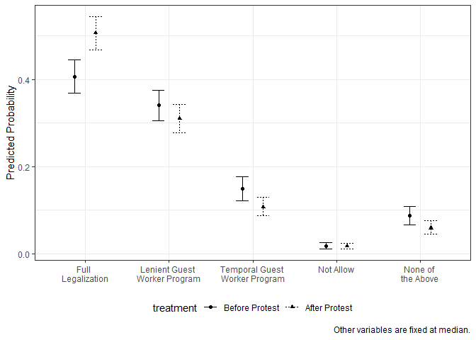
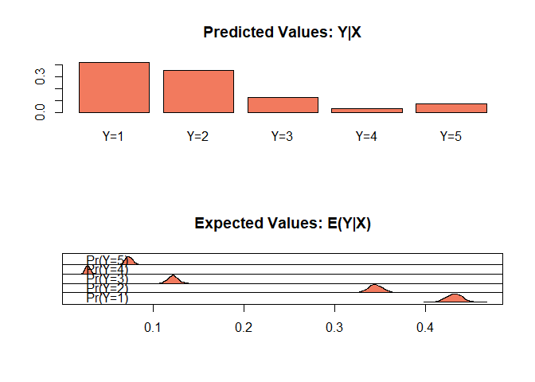
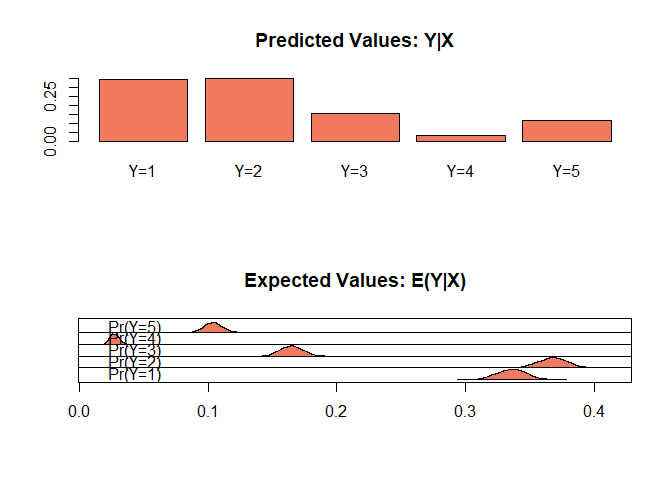

POL213 TA Session
================
Gento Kato
May 2, 2019

``` r
## Clear Workspace
rm(list = ls())

## Set Working Directory to the File location
## (If using RStudio, can be set automatically)
setwd(dirname(rstudioapi::getActiveDocumentContext()$path))
getwd()
```

    ## [1] "C:/GoogleDrive/Lectures/2019_04to06_UCD/POL213_TA/POL213_TA_resource"

``` r
## Required packages
library(readstata13) # For importing data
library(ggplot2) # Plotting
library(faraway) # for ilogit function
library(pscl) # For pseudo R squared (pR2)
library(DAMisc) # For pre function
library(MASS) # For mvrnorm
```

Study of Social Protest and Immigration Attitudes
=================================================

Check the paper [HERE](https://onlinelibrary.wiley.com/doi/full/10.1111/ajps.12159).

Their Replication Data are [HERE](https://dataverse.harvard.edu/dataset.xhtml?persistentId=doi:10.7910/DVN/27113).

``` r
# install.packages("dataverse") # Only Once
library(dataverse)
serverset <- "dataverse.harvard.edu"

(meta <- get_dataset("doi:10.7910/DVN/27113", server=serverset))

# Get Stata Do File
writeBin(get_file("ajps_replication.do","doi:10.7910/DVN/27113",
                  server=serverset), "ajps_replication.do")
# Get Data
writeBin(get_file("ajps2_replication.tab","doi:10.7910/DVN/27113",
                  server=serverset), "ajps2_replication.dta")
```

``` r
# Import Data
d <- read.dta13("ajps2_replication.dta", convert.factors = FALSE)
# Variables
summary(d)
```

    ##       age             edu           latcomm        knowledge    
    ##  Min.   :18.00   Min.   :0.000   Min.   :1.000   Min.   :0.000  
    ##  1st Qu.:28.00   1st Qu.:2.000   1st Qu.:3.000   1st Qu.:0.000  
    ##  Median :38.00   Median :4.000   Median :3.000   Median :1.000  
    ##  Mean   :40.16   Mean   :3.521   Mean   :3.202   Mean   :1.162  
    ##  3rd Qu.:50.00   3rd Qu.:5.000   3rd Qu.:4.000   3rd Qu.:2.000  
    ##  Max.   :97.00   Max.   :7.000   Max.   :4.000   Max.   :3.000  
    ##  NA's   :814     NA's   :349     NA's   :904     NA's   :349    
    ##      female       wt_nation_rev       catholic         pprhispx     
    ##  Min.   :0.0000   Min.   :0.3181   Min.   :0.0000   Min.   :  0.00  
    ##  1st Qu.:0.0000   1st Qu.:0.5125   1st Qu.:0.0000   1st Qu.: 14.70  
    ##  Median :1.0000   Median :0.6695   Median :1.0000   Median : 37.80  
    ##  Mean   :0.5458   Mean   :1.0034   Mean   :0.7161   Mean   : 42.89  
    ##  3rd Qu.:1.0000   3rd Qu.:1.1042   3rd Qu.:1.0000   3rd Qu.: 69.22  
    ##  Max.   :1.0000   Max.   :4.3450   Max.   :1.0000   Max.   :100.00  
    ##  NA's   :349      NA's   :349      NA's   :349      NA's   :352     
    ##     ppehhscx      national_origin     american           cuba       
    ##  Min.   :  0.00   Min.   :0.0000   Min.   :0.0000   Min.   :0.0000  
    ##  1st Qu.: 19.72   1st Qu.:0.0000   1st Qu.:0.0000   1st Qu.:0.0000  
    ##  Median : 22.87   Median :0.0000   Median :0.0000   Median :0.0000  
    ##  Mean   : 22.94   Mean   :0.3848   Mean   :0.2336   Mean   :0.0304  
    ##  3rd Qu.: 24.86   3rd Qu.:1.0000   3rd Qu.:0.0000   3rd Qu.:0.0000  
    ##  Max.   :100.00   Max.   :1.0000   Max.   :1.0000   Max.   :1.0000  
    ##  NA's   :471      NA's   :349      NA's   :349      NA's   :349     
    ##        pr               dr             south           central      
    ##  Min.   :0.0000   Min.   :0.0000   Min.   :0.0000   Min.   :0.0000  
    ##  1st Qu.:0.0000   1st Qu.:0.0000   1st Qu.:0.0000   1st Qu.:0.0000  
    ##  Median :0.0000   Median :0.0000   Median :0.0000   Median :0.0000  
    ##  Mean   :0.0968   Mean   :0.0335   Mean   :0.0339   Mean   :0.0938  
    ##  3rd Qu.:0.0000   3rd Qu.:0.0000   3rd Qu.:0.0000   3rd Qu.:0.0000  
    ##  Max.   :1.0000   Max.   :1.0000   Max.   :1.0000   Max.   :1.0000  
    ##  NA's   :349      NA's   :349      NA's   :349      NA's   :349     
    ##  incomeq_dummy1   incomeq_dummy3   incomeq_dummy4   incomeq_dummy5  
    ##  Min.   :0.0000   Min.   :0.0000   Min.   :0.0000   Min.   :0.0000  
    ##  1st Qu.:0.0000   1st Qu.:0.0000   1st Qu.:0.0000   1st Qu.:0.0000  
    ##  Median :0.0000   Median :0.0000   Median :0.0000   Median :0.0000  
    ##  Mean   :0.2075   Mean   :0.1388   Mean   :0.1635   Mean   :0.1651  
    ##  3rd Qu.:0.0000   3rd Qu.:0.0000   3rd Qu.:0.0000   3rd Qu.:0.0000  
    ##  Max.   :1.0000   Max.   :1.0000   Max.   :1.0000   Max.   :1.0000  
    ##  NA's   :349      NA's   :349      NA's   :349      NA's   :349     
    ##      perfin       samplestate1     samplestate2     samplestate3   
    ##  Min.   :1.000   Min.   :0.0000   Min.   :0.0000   Min.   :0.0000  
    ##  1st Qu.:2.000   1st Qu.:0.0000   1st Qu.:0.0000   1st Qu.:0.0000  
    ##  Median :2.000   Median :0.0000   Median :0.0000   Median :0.0000  
    ##  Mean   :2.032   Mean   :0.0488   Mean   :0.0487   Mean   :0.1466  
    ##  3rd Qu.:3.000   3rd Qu.:0.0000   3rd Qu.:0.0000   3rd Qu.:0.0000  
    ##  Max.   :3.000   Max.   :1.0000   Max.   :1.0000   Max.   :1.0000  
    ##  NA's   :561     NA's   :349      NA's   :349      NA's   :349     
    ##   samplestate4    samplestate5     samplestate6     samplestate7   
    ##  Min.   :0.000   Min.   :0.0000   Min.   :0.0000   Min.   :0.0000  
    ##  1st Qu.:0.000   1st Qu.:0.0000   1st Qu.:0.0000   1st Qu.:0.0000  
    ##  Median :0.000   Median :0.0000   Median :0.0000   Median :0.0000  
    ##  Mean   :0.049   Mean   :0.0539   Mean   :0.0487   Mean   :0.0487  
    ##  3rd Qu.:0.000   3rd Qu.:0.0000   3rd Qu.:0.0000   3rd Qu.:0.0000  
    ##  Max.   :1.000   Max.   :1.0000   Max.   :1.0000   Max.   :1.0000  
    ##  NA's   :349     NA's   :349      NA's   :349      NA's   :349     
    ##   samplestate8     samplestate9    samplestate10    samplestate11   
    ##  Min.   :0.0000   Min.   :0.0000   Min.   :0.0000   Min.   :0.0000  
    ##  1st Qu.:0.0000   1st Qu.:0.0000   1st Qu.:0.0000   1st Qu.:0.0000  
    ##  Median :0.0000   Median :0.0000   Median :0.0000   Median :0.0000  
    ##  Mean   :0.0731   Mean   :0.0202   Mean   :0.0487   Mean   :0.0491  
    ##  3rd Qu.:0.0000   3rd Qu.:0.0000   3rd Qu.:0.0000   3rd Qu.:0.0000  
    ##  Max.   :1.0000   Max.   :1.0000   Max.   :1.0000   Max.   :1.0000  
    ##  NA's   :349      NA's   :349      NA's   :349      NA's   :349     
    ##  samplestate12    samplestate13    samplestate14    samplestate15   
    ##  Min.   :0.0000   Min.   :0.0000   Min.   :0.0000   Min.   :0.0000  
    ##  1st Qu.:0.0000   1st Qu.:0.0000   1st Qu.:0.0000   1st Qu.:0.0000  
    ##  Median :0.0000   Median :0.0000   Median :0.0000   Median :0.0000  
    ##  Mean   :0.0487   Mean   :0.0491   Mean   :0.0974   Mean   :0.0988  
    ##  3rd Qu.:0.0000   3rd Qu.:0.0000   3rd Qu.:0.0000   3rd Qu.:0.0000  
    ##  Max.   :1.0000   Max.   :1.0000   Max.   :1.0000   Max.   :1.0000  
    ##  NA's   :349      NA's   :349      NA's   :349      NA's   :349     
    ##  samplestate16    protest_period   language_skills metro_county_code
    ##  Min.   :0.0000   Min.   :0.0000   Min.   :1.000   Min.   : 4003    
    ##  1st Qu.:0.0000   1st Qu.:0.0000   1st Qu.:1.000   1st Qu.:16980    
    ##  Median :0.0000   Median :1.0000   Median :2.000   Median :31100    
    ##  Mean   :0.0214   Mean   :0.6659   Mean   :2.029   Mean   :28981    
    ##  3rd Qu.:0.0000   3rd Qu.:1.0000   3rd Qu.:3.000   3rd Qu.:38060    
    ##  Max.   :1.0000   Max.   :1.0000   Max.   :4.000   Max.   :53073    
    ##  NA's   :349      NA's   :349      NA's   :369     NA's   :349      
    ##  metro_county_protest co_met_num_protest   generation   
    ##  Min.   :0.0000       Min.   : 0.000     Min.   :0.000  
    ##  1st Qu.:0.0000       1st Qu.: 0.000     1st Qu.:0.000  
    ##  Median :0.0000       Median : 0.000     Median :1.000  
    ##  Mean   :0.4189       Mean   : 2.137     Mean   :1.119  
    ##  3rd Qu.:1.0000       3rd Qu.: 4.000     3rd Qu.:2.000  
    ##  Max.   :1.0000       Max.   :13.000     Max.   :4.000  
    ##  NA's   :349          NA's   :349        NA's   :392    
    ##  protest_generation metco_generation comet_numprot_generation
    ##  Min.   :0.0000     Min.   :0.0000   Min.   : 0.000          
    ##  1st Qu.:0.0000     1st Qu.:0.0000   1st Qu.: 0.000          
    ##  Median :0.0000     Median :0.0000   Median : 0.000          
    ##  Mean   :0.8471     Mean   :0.5233   Mean   : 2.491          
    ##  3rd Qu.:1.0000     3rd Qu.:1.0000   3rd Qu.: 2.000          
    ##  Max.   :4.0000     Max.   :4.0000   Max.   :52.000          
    ##  NA's   :392        NA's   :392      NA's   :392             
    ##    immpolinew    community_participate attend_church  
    ##  Min.   :1.000   Min.   :1.000         Min.   :0.000  
    ##  1st Qu.:1.000   1st Qu.:2.000         1st Qu.:1.000  
    ##  Median :2.000   Median :2.000         Median :3.000  
    ##  Mean   :2.077   Mean   :1.802         Mean   :2.356  
    ##  3rd Qu.:3.000   3rd Qu.:2.000         3rd Qu.:3.000  
    ##  Max.   :5.000   Max.   :2.000         Max.   :4.000  
    ##  NA's   :349     NA's   :500           NA's   :456

``` r
# Description of Variables
paste(names(d), attr(d, "var.labels"), sep=": ")
```

    ##  [1] "age: Age"                                                                            
    ##  [2] "edu: Education"                                                                      
    ##  [3] "latcomm: Perceived commonalities"                                                    
    ##  [4] "knowledge: summed political knowledge, knowcong+knowwin+knowideo"                    
    ##  [5] "female: Female"                                                                      
    ##  [6] "wt_nation_rev: "                                                                     
    ##  [7] "catholic: "                                                                          
    ##  [8] "pprhispx: Pct. Hispanic population by GEOFIPS"                                       
    ##  [9] "ppehhscx: Pct. of 25+ year olds with high school diploma (or equivalency) by GEOFIPS"
    ## [10] "national_origin: ID with National Origin"                                            
    ## [11] "american: ID with Americans"                                                         
    ## [12] "cuba: Cuba"                                                                          
    ## [13] "pr: Puerto Rico"                                                                     
    ## [14] "dr: Dominican Republic"                                                              
    ## [15] "south: South America"                                                                
    ## [16] "central: Central America"                                                            
    ## [17] "incomeq_dummy1: Income: no report"                                                   
    ## [18] "incomeq_dummy3: Income: second quartile"                                             
    ## [19] "incomeq_dummy4: Income: third quartile"                                              
    ## [20] "incomeq_dummy5: Income: fourth quartile"                                             
    ## [21] "perfin: Financial situation"                                                         
    ## [22] "samplestate1: rstate==AR"                                                            
    ## [23] "samplestate2: rstate==AZ"                                                            
    ## [24] "samplestate3: rstate==CA"                                                            
    ## [25] "samplestate4: rstate==CO"                                                            
    ## [26] "samplestate5: rstate==FL"                                                            
    ## [27] "samplestate6: rstate==GA"                                                            
    ## [28] "samplestate7: rstate==IA"                                                            
    ## [29] "samplestate8: rstate==IL"                                                            
    ## [30] "samplestate9: rstate==MD"                                                            
    ## [31] "samplestate10: rstate==NC"                                                           
    ## [32] "samplestate11: rstate==NJ"                                                           
    ## [33] "samplestate12: rstate==NM"                                                           
    ## [34] "samplestate13: rstate==NV"                                                           
    ## [35] "samplestate14: rstate==NY"                                                           
    ## [36] "samplestate15: rstate==TX"                                                           
    ## [37] "samplestate16: rstate==VA"                                                           
    ## [38] "protest_period: "                                                                    
    ## [39] "language_skills: "                                                                   
    ## [40] "metro_county_code: "                                                                 
    ## [41] "metro_county_protest: "                                                              
    ## [42] "co_met_num_protest: "                                                                
    ## [43] "generation: "                                                                        
    ## [44] "protest_generation: "                                                                
    ## [45] "metco_generation: "                                                                  
    ## [46] "comet_numprot_generation: "                                                          
    ## [47] "immpolinew: "                                                                        
    ## [48] "community_participate: "                                                             
    ## [49] "attend_church: "

Descriptives
============

``` r
# DV
table(d$immpolinew)
```

    ## 
    ##    1    2    3    4    5 
    ## 3463 2601  976  394  778

``` r
# (1) immediate legalization of current undocumented immigrants, 
# (2) a guest worker program leading to legalization eventually, 
# (3) a guest worker program permitting immigrants to be in the country, but only temporarily, 
# (4) an effort to seal or close off the border to stop illegal immigration, and 
# (5) none of the above

# IV 
table(d$protest_period)
```

    ## 
    ##    0    1 
    ## 2744 5468

``` r
# coded 1 if the respondent is surveyed after the protests began and 0 otherwise

# Controls

summary(d$pprhispx)
```

    ##    Min. 1st Qu.  Median    Mean 3rd Qu.    Max.    NA's 
    ##    0.00   14.70   37.80   42.89   69.22  100.00     352

``` r
#Pct. Hispanic population by GEOFIPS

summary(d$ppehhscx)
```

    ##    Min. 1st Qu.  Median    Mean 3rd Qu.    Max.    NA's 
    ##    0.00   19.72   22.87   22.94   24.86  100.00     471

``` r
#Pct. of 25+ year olds with high school diploma (or equivalency) by GEOFIP

d$latcomm <- as.numeric(as.factor(d$latcomm))
table(d$latcomm)
```

    ## 
    ##    1    2    3    4 
    ##  373 1178 2636 3470

``` r
# Perceived Commonality with Latino
# 1 Nothing, 2 Little, 3 Some, 4 Lot

table(d$generation)
```

    ## 
    ##    0    1    2    3    4 
    ## 3626 2092  975  809  667

``` r
# ranges from 0 to 4, where 0 reflects noncitizen, 
# 1 reflects foreign窶臣orn citizen, 
# 2 reflects second generation, 
# 3 reflects third generation, and 
# 4 reflects fourth窶壬lus generation.

table(d$american, d$national_origin)
```

    ##    
    ##        0    1
    ##   0 3134 3160
    ##   1 1918    0

``` r
# Identify as American / National Origin
# Both 0 implies that identifying as Latino

table(d$language_skills)
```

    ## 
    ##    1    2    3    4 
    ## 3583 1438 2525  646

``` r
# Higher score indicates higher skill

table(d$knowledge)
```

    ## 
    ##    0    1    2    3 
    ## 2945 2283 1691 1293

``` r
# Higher score indicates higher knowledge

table(d$catholic)
```

    ## 
    ##    0    1 
    ## 2331 5881

``` r
# Catholic

table(d$attend_church)
```

    ## 
    ##    0    1    2    3    4 
    ##  981 1082 1476 3200 1366

``` r
# Church Attendance (Not Clear How It's Coded)

table(d$community_participate)
```

    ## 
    ##    1    2 
    ## 1598 6463

``` r
# a respondent is involved in a civic organization# 

table(d$cuba)
```

    ## 
    ##    0    1 
    ## 7962  250

``` r
# Cuba Origin

table(d$pr)
```

    ## 
    ##    0    1 
    ## 7417  795

``` r
# Puerto Rico Origin

table(d$dr)
```

    ## 
    ##    0    1 
    ## 7937  275

``` r
# Dominican Republic Origin

table(d$south)
```

    ## 
    ##    0    1 
    ## 7934  278

``` r
# South America Origin

table(d$central)
```

    ## 
    ##    0    1 
    ## 7442  770

``` r
# Central America Origin

table(d$age)
```

    ## 
    ##  18  19  20  21  22  23  24  25  26  27  28  29  30  31  32  33  34  35 
    ## 223 180 170 149 160 185 141 222 198 209 202 183 204 204 187 232 175 237 
    ##  36  37  38  39  40  41  42  43  44  45  46  47  48  49  50  51  52  53 
    ## 209 196 164 184 171 197 177 132 132 186 143 117 134 120 116 113 110 111 
    ##  54  55  56  57  58  59  60  61  62  63  64  65  66  67  68  69  70  71 
    ## 102 132 100  98  81  80 102  69  58  63  61  72  56  50  29  46  47  40 
    ##  72  73  74  75  76  77  78  79  80  81  82  83  84  85  86  87  89  90 
    ##  39  23  35  24  25  26  25  19  17  11   9   9   4   6   5   5   2   2 
    ##  94  97 
    ##   1   1

``` r
# Age

table(d$female)
```

    ## 
    ##    0    1 
    ## 3730 4482

``` r
# Female

d$edu <- as.numeric(as.factor(d$edu))
table(d$edu)
```

    ## 
    ##    1    2    3    4    5    6    7    8 
    ##  218 1660 1215  277 2024 1540  753  525

``` r
# Education 
# 1= None to 8=graduate or professional degree

# Income Variables
table(d$incomeq_dummy1) # No Report
```

    ## 
    ##    0    1 
    ## 6508 1704

``` r
table(d$incomeq_dummy3) # Second Quartile
```

    ## 
    ##    0    1 
    ## 7072 1140

``` r
table(d$incomeq_dummy4) # Third Quartile
```

    ## 
    ##    0    1 
    ## 6869 1343

``` r
table(d$incomeq_dummy5) # Fourth Quartile
```

    ## 
    ##    0    1 
    ## 6856 1356

``` r
# Firt Quartile is the Reference Category

table(d$perfin)
```

    ## 
    ##    1    2    3 
    ## 1950 3843 2207

``` r
# Financial Situation
# (1) gotten worse, (2) stays about the same, and (3) gotten better.

table(d$samplestate1) # AR
```

    ## 
    ##    0    1 
    ## 7811  401

``` r
table(d$samplestate2) # AZ
```

    ## 
    ##    0    1 
    ## 7812  400

``` r
table(d$samplestate3) # CA
```

    ## 
    ##    0    1 
    ## 7008 1204

``` r
table(d$samplestate4) # CO
```

    ## 
    ##    0    1 
    ## 7810  402

``` r
table(d$samplestate5) # FL
```

    ## 
    ##    0    1 
    ## 7769  443

``` r
table(d$samplestate6) # GA
```

    ## 
    ##    0    1 
    ## 7812  400

``` r
table(d$samplestate7) # IA 
```

    ## 
    ##    0    1 
    ## 7812  400

``` r
table(d$samplestate8) # IL
```

    ## 
    ##    0    1 
    ## 7612  600

``` r
table(d$samplestate9) # MD
```

    ## 
    ##    0    1 
    ## 8046  166

``` r
table(d$samplestate10) # NC
```

    ## 
    ##    0    1 
    ## 7812  400

``` r
table(d$samplestate11) # NJ
```

    ## 
    ##    0    1 
    ## 7809  403

``` r
table(d$samplestate12) # NM
```

    ## 
    ##    0    1 
    ## 7812  400

``` r
table(d$samplestate13) # NV
```

    ## 
    ##    0    1 
    ## 7809  403

``` r
table(d$samplestate14) # NY
```

    ## 
    ##    0    1 
    ## 7412  800

``` r
table(d$samplestate15) # TX
```

    ## 
    ##    0    1 
    ## 7401  811

``` r
table(d$samplestate16) # VA
```

    ## 
    ##    0    1 
    ## 8036  176

``` r
# Residing States

# Other Variables

# Weight Variable
summary(d$wt_nation_rev)
```

    ##    Min. 1st Qu.  Median    Mean 3rd Qu.    Max.    NA's 
    ##  0.3181  0.5125  0.6695  1.0034  1.1042  4.3450     349

``` r
# County Code
summary(d$metro_county_code)
```

    ##    Min. 1st Qu.  Median    Mean 3rd Qu.    Max.    NA's 
    ##    4003   16980   31100   28981   38060   53073     349

Use multinom function
=====================

``` r
library(nnet)
```

1.1. Use multinom function (in nnet package) to estimate multinomial logit model
--------------------------------------------------------------------------------

with immigration preference as DV and protest exposure as IV.

``` r
# Make DV a factor (to make pre function work)
d$immpolinew <- as.factor(d$immpolinew)

m1 <- multinom(immpolinew ~ protest_period, data=d, Hess=TRUE)
```

    ## # weights:  15 (8 variable)
    ## initial  value 13216.704137 
    ## iter  10 value 11178.821466
    ## final  value 11070.429235 
    ## converged

``` r
summary(m1)
```

    ## Call:
    ## multinom(formula = immpolinew ~ protest_period, data = d, Hess = TRUE)
    ## 
    ## Coefficients:
    ##   (Intercept) protest_period
    ## 2  -0.4191415     0.19799192
    ## 3  -1.1998843    -0.10445987
    ## 4  -2.5592557     0.54521063
    ## 5  -1.5040864     0.01675964
    ## 
    ## Std. Errors:
    ##   (Intercept) protest_period
    ## 2  0.04554779     0.05544707
    ## 3  0.05962646     0.07509659
    ## 4  0.10705988     0.12345070
    ## 5  0.06728117     0.08330732
    ## 
    ## Residual Deviance: 22140.86 
    ## AIC: 22156.86

1.1.1. Find Odds Ratio for the exposure variables estimated in 1.1.
-------------------------------------------------------------------

Make interpretation

``` r
exp(coef(m1))
```

    ##   (Intercept) protest_period
    ## 2   0.6576111      1.2189525
    ## 3   0.3012290      0.9008109
    ## 4   0.0773623      1.7249717
    ## 5   0.2222202      1.0169009

The odds ratio explanation of the first coefficient implies that those who are exposed to protest makes the choiceof 2 (lenient guest worker program) over 1 (full legalization) 1.2 times more likely than those who are not exposed.

1.1.2. Calculate Wald Statistics (z-score) for the coefficients in 1.1. and
---------------------------------------------------------------------------

generate p-values. Are the coefficients significantly different from zero?

``` r
z <- summary(m1)$coefficients / summary(m1)$standard.errors
round(z, 3)
```

    ##   (Intercept) protest_period
    ## 2      -9.202          3.571
    ## 3     -20.123         -1.391
    ## 4     -23.905          4.416
    ## 5     -22.355          0.201

``` r
p <- (1 - pnorm(abs(z), 0, 1))*2
round(p, 3)
```

    ##   (Intercept) protest_period
    ## 2           0          0.000
    ## 3           0          0.164
    ## 4           0          0.000
    ## 5           0          0.841

Only the first and fourth coefficients for exposure variable are significantly different from zero.

1.2. Obtain Fitted Values (Predicted Probabilities) from the model estimated in 1.1
-----------------------------------------------------------------------------------

``` r
yhat.m1 <- predict(m1, typ = "prob")
summary(yhat.m1)
```

    ##        1                2                3                4          
    ##  Min.   :0.4111   Min.   :0.2912   Min.   :0.1116   Min.   :0.03426  
    ##  1st Qu.:0.4111   1st Qu.:0.2912   1st Qu.:0.1116   1st Qu.:0.03426  
    ##  Median :0.4111   Median :0.3296   Median :0.1116   Median :0.05486  
    ##  Mean   :0.4217   Mean   :0.3167   Mean   :0.1188   Mean   :0.04798  
    ##  3rd Qu.:0.4428   3rd Qu.:0.3296   3rd Qu.:0.1334   3rd Qu.:0.05486  
    ##  Max.   :0.4428   Max.   :0.3296   Max.   :0.1334   Max.   :0.05486  
    ##        5          
    ##  Min.   :0.09290  
    ##  1st Qu.:0.09290  
    ##  Median :0.09290  
    ##  Mean   :0.09474  
    ##  3rd Qu.:0.09840  
    ##  Max.   :0.09840

1.3. Manually calculate predicted probabilities of each preference for
----------------------------------------------------------------------

those who are exposed to protest and those who are not.

``` r
# Not Exposed (all + coef(m1)[?,?]*0 parts can be omitted)
(p1_0 <- 1 / (1 + sum(exp(coef(m1)[,1] + coef(m1)[,2]*0))))
```

    ## [1] 0.4427869

``` r
(p2_0 <- exp(coef(m1)[1,1] + coef(m1)[1,2]*0) / 
    (1 + sum(exp(coef(m1)[,1] + coef(m1)[,2]*0))))
```

    ## [1] 0.2911816

``` r
(p3_0 <- exp(coef(m1)[2,1] + coef(m1)[2,2]*0) / 
    (1 + sum(exp(coef(m1)[,1] + coef(m1)[,2]*0))))
```

    ## [1] 0.1333803

``` r
(p4_0 <- exp(coef(m1)[3,1] + coef(m1)[3,2]*0) / 
    (1 + sum(exp(coef(m1)[,1] + coef(m1)[,2]*0))))
```

    ## [1] 0.03425501

``` r
(p5_0 <- exp(coef(m1)[4,1] + coef(m1)[4,2]*0) / 
    (1 + sum(exp(coef(m1)[,1] + coef(m1)[,2]*0))))
```

    ## [1] 0.0983962

``` r
# Check that probability sums to 1
p1_0 + p2_0 + p3_0 + p4_0 + p5_0
```

    ## [1] 1

``` r
# Exposed
(p1_1 <- 1 / (1 + sum(exp(coef(m1)[,1] + coef(m1)[,2]*1))))
```

    ## [1] 0.4111215

``` r
(p2_1 <- exp(coef(m1)[1,1] + coef(m1)[1,2]*1) / 
    (1 + sum(exp(coef(m1)[,1] + coef(m1)[,2]*1))))
```

    ## [1] 0.3295537

``` r
(p3_1 <- exp(coef(m1)[2,1] + coef(m1)[2,2]*1) / 
    (1 + sum(exp(coef(m1)[,1] + coef(m1)[,2]*1))))
```

    ## [1] 0.111558

``` r
(p4_1 <- exp(coef(m1)[3,1] + coef(m1)[3,2]*1) / 
    (1 + sum(exp(coef(m1)[,1] + coef(m1)[,2]*1))))
```

    ## [1] 0.05486325

``` r
(p5_1 <- exp(coef(m1)[4,1] + coef(m1)[4,2]*1) / 
    (1 + sum(exp(coef(m1)[,1] + coef(m1)[,2]*1))))
```

    ## [1] 0.09290357

``` r
# Check that probability sums to 1
p1_1 + p2_1 + p3_1 + p4_1 + p5_1
```

    ## [1] 1

1.4. Add as many control variables as you want to the model in 1.1 and
----------------------------------------------------------------------

estimate a new model. Does the addition of control variables change results?

``` r
m2 <- multinom(immpolinew ~ protest_period + pprhispx + ppehhscx + 
                 latcomm + generation + american + national_origin + 
                 language_skills + knowledge + catholic + community_participate + 
                 attend_church + cuba + pr + dr + south + central + 
                 age + female + edu + incomeq_dummy1 + incomeq_dummy3 + 
                 incomeq_dummy4 + incomeq_dummy5 + perfin,
               data=d, Hess=TRUE)
```

    ## # weights:  135 (104 variable)
    ## initial  value 10937.740053 
    ## iter  10 value 9233.237322
    ## iter  20 value 8618.616438
    ## iter  30 value 8539.939102
    ## iter  40 value 8345.033877
    ## iter  50 value 8218.167074
    ## iter  60 value 8147.078211
    ## iter  70 value 8127.096473
    ## iter  80 value 8118.894325
    ## iter  90 value 8115.289880
    ## iter 100 value 8114.717497
    ## final  value 8114.717497 
    ## stopped after 100 iterations

``` r
summary(m2)
```

    ## Call:
    ## multinom(formula = immpolinew ~ protest_period + pprhispx + ppehhscx + 
    ##     latcomm + generation + american + national_origin + language_skills + 
    ##     knowledge + catholic + community_participate + attend_church + 
    ##     cuba + pr + dr + south + central + age + female + edu + incomeq_dummy1 + 
    ##     incomeq_dummy3 + incomeq_dummy4 + incomeq_dummy5 + perfin, 
    ##     data = d, Hess = TRUE)
    ## 
    ## Coefficients:
    ##   (Intercept) protest_period     pprhispx     ppehhscx     latcomm
    ## 2   -1.980849     -0.3145734 -0.001819638  0.008719747 -0.07516146
    ## 3   -2.289829     -0.5574759  0.001447268 -0.000140095 -0.18221542
    ## 4   -6.496172     -0.2408084  0.000401087  0.031402998 -0.37218407
    ## 5   -1.928831     -0.6025018 -0.001739601  0.012819196 -0.20774430
    ##   generation  american national_origin language_skills   knowledge
    ## 2  0.2363121 0.2486612     -0.03682604       0.5490361  0.10443008
    ## 3  0.2256023 0.2935543     -0.07999753       0.5365686 -0.01617441
    ## 4  0.4705438 0.4440989     -0.19311043       0.9404192  0.18780952
    ## 5  0.2990625 0.2961504     -0.15062260       0.6186174 -0.21112773
    ##      catholic community_participate attend_church       cuba        pr
    ## 2 -0.10993977          -0.001407805  -0.049507405 0.14559429 0.4609621
    ## 3 -0.07369959           0.002386948  -0.007433073 0.03800353 0.5250377
    ## 4 -0.34504212           0.399505445  -0.098949522 0.98019574 1.2488778
    ## 5 -0.24790369          -0.044674751  -0.049991340 0.53504204 0.9506709
    ##           dr       south     central          age        female
    ## 2 0.27494085  0.09417254 -0.02229572 0.0009480826  0.0001025442
    ## 3 0.05120636 -0.10166234 -0.13560593 0.0088062014 -0.2294443370
    ## 4 1.42738898  1.15355247  0.62472357 0.0232499418 -0.1488301982
    ## 5 0.22649917  0.07386000  0.48735791 0.0022158239 -0.0635976637
    ##           edu incomeq_dummy1 incomeq_dummy3 incomeq_dummy4 incomeq_dummy5
    ## 2  0.09572544    -0.15580327     0.08369169     0.14889850      0.3505930
    ## 3  0.04001387    -0.06245362     0.06213934     0.20954262      0.1731829
    ## 4 -0.05959066    -0.09829582     0.02940786     0.04191706      0.4434065
    ## 5 -0.06718861     0.33025349    -0.19704103     0.07263051      0.1063028
    ##      perfin
    ## 2 0.1025742
    ## 3 0.1405235
    ## 4 0.2823628
    ## 5 0.1241964
    ## 
    ## Std. Errors:
    ##   (Intercept) protest_period    pprhispx    ppehhscx    latcomm generation
    ## 2   0.3360917     0.06947625 0.001047184 0.006672226 0.03703024 0.03641859
    ## 3   0.4402317     0.09048909 0.001371107 0.008930121 0.04745724 0.04684527
    ## 4   0.6800305     0.15028010 0.002160780 0.011925099 0.06795012 0.06589258
    ## 5   0.5115395     0.10703686 0.001643882 0.009904887 0.05508401 0.05408065
    ##     american national_origin language_skills  knowledge   catholic
    ## 2 0.09314403      0.06987319      0.04779868 0.03341480 0.07132972
    ## 3 0.11791126      0.09436149      0.06300874 0.04431605 0.09367507
    ## 4 0.15957774      0.16569058      0.09732622 0.06630097 0.13206745
    ## 5 0.13576373      0.11235397      0.07297662 0.05377820 0.10659267
    ##   community_participate attend_church      cuba        pr        dr
    ## 2            0.08412637    0.02604122 0.1882895 0.1209879 0.1715445
    ## 3            0.10985348    0.03431243 0.2553712 0.1501885 0.2488871
    ## 4            0.15581628    0.04810748 0.2977051 0.1834057 0.3134579
    ## 5            0.13090042    0.03925599 0.2882512 0.1626442 0.3002037
    ##       south   central         age     female        edu incomeq_dummy1
    ## 2 0.1668887 0.1106567 0.002321575 0.06468827 0.01979653     0.09610863
    ## 3 0.2418580 0.1525378 0.002955715 0.08499700 0.02623240     0.12652930
    ## 4 0.3229719 0.2665972 0.004113905 0.12802661 0.04254798     0.21552300
    ## 5 0.3046139 0.1580480 0.003463787 0.10031240 0.03134317     0.13349926
    ##   incomeq_dummy3 incomeq_dummy4 incomeq_dummy5     perfin
    ## 2     0.09604863     0.09557435      0.1097946 0.04417182
    ## 3     0.12896967     0.12413920      0.1452679 0.05842463
    ## 4     0.21999389     0.20040106      0.2041324 0.08974947
    ## 5     0.16404895     0.15076214      0.1740688 0.06871372
    ## 
    ## Residual Deviance: 16229.43 
    ## AIC: 16437.43

1.5. Find Pseudo R Squares, Proportional Reduction in Error (PRE) and
---------------------------------------------------------------------

infomration measures (i.e., AIC, BIC) for BOTH models estimated in 1.1 and 1.4. Compare results. Which model explains DV better?

``` r
# Pseudo-R2
m1_pR2 <- pR2(m1)
```

    ## fitting null model for pseudo-r2
    ## # weights:  10 (4 variable)
    ## initial  value 13216.704137 
    ## iter  10 value 11089.341938
    ## iter  10 value 11089.341930
    ## final  value 11089.341930 
    ## converged

``` r
m2_pR2 <- pR2(m2)
```

    ## fitting null model for pseudo-r2
    ## # weights:  10 (4 variable)
    ## initial  value 13216.704137 
    ## iter  10 value 11089.341938
    ## iter  10 value 11089.341930
    ## final  value 11089.341930 
    ## converged

``` r
rbind(m1=round(m1_pR2, 5),
      m2=round(m2_pR2, 5))
```

    ##           llh   llhNull         G2 McFadden    r2ML    r2CU
    ## m1 -11070.429 -11089.34   37.82539  0.00171 0.00460 0.00493
    ## m2  -8114.717 -11089.34 5949.24887  0.26824 0.58331 0.60651

``` r
# PRE (Getting Errors) 
# Taking Too Much Time, so reducing iteration here
pre(m1, sim=TRUE, R=100)
```

    ## mod1:  immpolinew ~ protest_period 
    ## mod2:  immpolinew ~ 1 
    ## 
    ## Analytical Results
    ##  PMC =  0.422 
    ##  PCP =  0.422 
    ##  PRE =  0.000 
    ## ePMC =  0.304 
    ## ePCP =  0.304 
    ## ePRE =  0.001 
    ## 
    ## Simulated Results
    ##      median lower  upper
    ##  PRE 0.000  0.000  0.000
    ## ePRE 0.001  -0.004 0.006

``` r
pre(m2, sim=TRUE, R=100)
```

    ## mod1:  immpolinew ~ protest_period + pprhispx + ppehhscx + latcomm + generation + american + national_origin + language_skills + knowledge + catholic + community_participate + attend_church + cuba + pr + dr + south + central + age + female + edu + incomeq_dummy1 + incomeq_dummy3 + incomeq_dummy4 + incomeq_dummy5 + perfin 
    ## mod2:  immpolinew ~ 1 
    ## 
    ## Analytical Results
    ##  PMC =  0.415 
    ##  PCP =  0.543 
    ##  PRE =  0.218 
    ## ePMC =  0.306 
    ## ePCP =  0.384 
    ## ePRE =  0.112 
    ## 
    ## Simulated Results
    ##      median lower upper
    ##  PRE 0.214  0.209 0.219
    ## ePRE 0.110  0.104 0.118

``` r
# Information Measures
AIC(m1)
```

    ## [1] 22156.86

``` r
AIC(m2)
```

    ## [1] 16437.43

``` r
BIC(m1)
```

    ## [1] 22212.97

``` r
BIC(m2)
```

    ## [1] 17147.14

Model 2 obviously performs better than the model 1.

1.6. Using model estimated in 1.4, create several profiles of interests and
---------------------------------------------------------------------------

simulate the Predicted Probability with Confidence Interval. Plot Results.

``` r
# Create Profiles
# 1. Treated
profile1 <- c(1, 1, median(d$pprhispx,na.rm=TRUE), 
              median(d$ppehhscx,na.rm=TRUE), 
              median(d$latcomm,na.rm=TRUE),
              median(d$generation,na.rm=TRUE), 0, 0, 
              median(d$language_skills,na.rm=TRUE), 
              median(d$knowledge,na.rm=TRUE), 
              median(d$catholic,na.rm=TRUE), 
              median(d$community_participate,na.rm=TRUE),
              median(d$attend_church,na.rm=TRUE), 0, 0, 0, 0, 0, 
              median(d$age,na.rm=TRUE), median(d$female,na.rm=TRUE),
              median(d$edu,na.rm=TRUE), 0, 0, 0, 0, median(d$perfin,na.rm=TRUE))
# Not Treated
profile0 <- c(1, 0, median(d$pprhispx,na.rm=TRUE), 
              median(d$ppehhscx,na.rm=TRUE), 
              median(d$latcomm,na.rm=TRUE),
              median(d$generation,na.rm=TRUE), 0, 0, 
              median(d$language_skills,na.rm=TRUE), 
              median(d$knowledge,na.rm=TRUE), 
              median(d$catholic,na.rm=TRUE), median(d$community_participate,na.rm=TRUE),
              median(d$attend_church,na.rm=TRUE), 0, 0, 0, 0, 0, 
              median(d$age,na.rm=TRUE), median(d$female,na.rm=TRUE),
              median(d$edu,na.rm=TRUE), 0, 0, 0, 0, median(d$perfin,na.rm=TRUE))

# Function for Prediction
predictmlogit <- function(m2, profile) {
  
  coeffs1 <- summary(m2)$coefficients
  coeffs <- cbind(t(coeffs1[1, ]), t(coeffs1[2, ]), 
                  t(coeffs1[3, ]), t(coeffs1[4, ]))
  covmat <- solve(m2$Hessian)
  
  ndraws <- 1000
  betadraw <- mvrnorm(ndraws, coeffs, covmat)
  
  nvars <- ncol(coeffs1)
  
  xb2 <- betadraw[ ,1:nvars]%*%profile
  xb3 <- betadraw[ ,(nvars+1):(2*nvars)]%*%profile
  xb4 <- betadraw[ ,(2*nvars+1):(3*nvars)]%*%profile
  xb5 <- betadraw[ ,(3*nvars+1):ncol(betadraw)]%*%profile
  
  prob1 <- exp(0) / (exp(0) + exp(xb2) + exp(xb3) + exp(xb4) + exp(xb5))
  prob2 <- exp(xb2) / (exp(0) + exp(xb2) + exp(xb3) + exp(xb4) + exp(xb5))
  prob3 <- exp(xb3) / (exp(0) + exp(xb2) + exp(xb3) + exp(xb4) + exp(xb5))
  prob4 <- exp(xb4) / (exp(0) + exp(xb2) + exp(xb3) + exp(xb4) + exp(xb5))
  prob5 <- exp(xb5) / (exp(0) + exp(xb2) + exp(xb3) + exp(xb4) + exp(xb5))
  
  means <- cbind(mean(prob1), mean(prob2), mean(prob3), 
                 mean(prob4), mean(prob5))
  sds <- cbind(apply(prob1, 2, sd), apply(prob2, 2, sd), apply(prob3, 2, sd), 
               apply(prob4, 2, sd), apply(prob5, 2, sd))
  lci <- cbind(quantile(prob1, probs=0.025),quantile(prob2, probs=0.025),
               quantile(prob3, probs=0.025),quantile(prob4, probs=0.025),
               quantile(prob5, probs=0.025))
  uci <- cbind(quantile(prob1, probs=0.975),quantile(prob2, probs=0.975),
               quantile(prob3, probs=0.975),quantile(prob4, probs=0.975),
               quantile(prob5, probs=0.975))
  zs <- means / sds
  ps <- 2 * (1 - pnorm(abs(zs)))
  presults <- t(rbind(means, sds, lci, uci, zs, ps))
  presults <- as.data.frame(presults)
  colnames(presults) <- c("mean","sd","lci","uci","z","p")
  presults$choice <- c("Full \nLegalization",
                       "Lenient Guest \nWorker Program",
                       "Temporal Guest \nWorker Program",
                       "Not Allow", "None of \nthe Above")
  presults$choice <- factor(presults$choice, levels=presults$choice)
  return(presults)
}  

# Make Prediction
(pred1 <- predictmlogit(m2, profile1))
```

    ##         mean          sd        lci        uci         z            p
    ## 1 0.50689678 0.018643505 0.46980219 0.54347087 27.188921 0.000000e+00
    ## 2 0.31004532 0.016742478 0.27766000 0.34393682 18.518485 0.000000e+00
    ## 3 0.10676141 0.010208880 0.08803630 0.12802757 10.457700 0.000000e+00
    ## 4 0.01699160 0.003294564 0.01116895 0.02429653  5.157464 2.503165e-07
    ## 5 0.05930489 0.007471118 0.04620743 0.07461733  7.937887 1.998401e-15
    ##                            choice
    ## 1             Full \nLegalization
    ## 2  Lenient Guest \nWorker Program
    ## 3 Temporal Guest \nWorker Program
    ## 4                       Not Allow
    ## 5             None of \nthe Above

``` r
(pred0 <- predictmlogit(m2, profile0))
```

    ##         mean          sd        lci        uci         z            p
    ## 1 0.40694998 0.019755087 0.36912601 0.44718623 20.599757 0.000000e+00
    ## 2 0.34034210 0.018674598 0.30516182 0.37831264 18.224869 0.000000e+00
    ## 3 0.14916790 0.014363069 0.12293702 0.17869666 10.385517 0.000000e+00
    ## 4 0.01725421 0.003501079 0.01155312 0.02475622  4.928257 8.296664e-07
    ## 5 0.08628581 0.010785520 0.06727169 0.10866558  8.000153 1.332268e-15
    ##                            choice
    ## 1             Full \nLegalization
    ## 2  Lenient Guest \nWorker Program
    ## 3 Temporal Guest \nWorker Program
    ## 4                       Not Allow
    ## 5             None of \nthe Above

``` r
# Plot Prediction
preddt <- rbind(pred1,pred0)
preddt$treatment <- rep(c("After Protest","Before Protest"), each=5)
preddt$treatment <- factor(preddt$treatment, levels=c("Before Protest",
                                                      "After Protest"))
# Plot
ggplot(preddt, aes(x=choice, y=mean)) + 
  geom_point(aes(shape=treatment), position=position_dodge(width=0.5)) + 
  geom_errorbar(aes(ymin=lci,ymax=uci, linetype=treatment), 
                position=position_dodge(width=0.5), width=0.3) + 
  theme_bw() + xlab(NULL) + ylab("Predicted Probability") + 
  labs(caption="Other variables are fixed at median.") + 
  theme(legend.position="bottom")
```



2. Use mlogit function
======================

``` r
library(mlogit)
```

2.1. Use mlogit function from mlogit package to estimate the same model
-----------------------------------------------------------------------

as in 1.4. Does it yield the same results?

``` r
# Create Long Data
d.mlogit <- mlogit.data(d, shape = "wide", choice = "immpolinew")
head(d.mlogit[,1:5],10)
```

    ##     age edu latcomm knowledge female
    ## 1.1  37   1       4         0      0
    ## 1.2  37   1       4         0      0
    ## 1.3  37   1       4         0      0
    ## 1.4  37   1       4         0      0
    ## 1.5  37   1       4         0      0
    ## 2.1  60   2       3         0      1
    ## 2.2  60   2       3         0      1
    ## 2.3  60   2       3         0      1
    ## 2.4  60   2       3         0      1
    ## 2.5  60   2       3         0      1

``` r
# Replicate Mlogit Model of Immigration Policy Preference
m3 <- mlogit(immpolinew ~ 0 | protest_period + pprhispx + ppehhscx + 
               latcomm + generation + american + national_origin + 
               language_skills + knowledge + catholic + community_participate + 
               attend_church + cuba + pr + dr + south + central + 
               age + female + edu + incomeq_dummy1 + incomeq_dummy3 + 
               incomeq_dummy4 + incomeq_dummy5 + perfin, data=d.mlogit)
summary(m3)
```

    ## 
    ## Call:
    ## mlogit(formula = immpolinew ~ 0 | protest_period + pprhispx + 
    ##     ppehhscx + latcomm + generation + american + national_origin + 
    ##     language_skills + knowledge + catholic + community_participate + 
    ##     attend_church + cuba + pr + dr + south + central + age + 
    ##     female + edu + incomeq_dummy1 + incomeq_dummy3 + incomeq_dummy4 + 
    ##     incomeq_dummy5 + perfin, data = d.mlogit, method = "nr", 
    ##     print.level = 0)
    ## 
    ## Frequencies of alternatives:
    ##        1        2        3        4        5 
    ## 0.415391 0.331519 0.122572 0.049588 0.080930 
    ## 
    ## nr method
    ## 6 iterations, 0h:0m:4s 
    ## g'(-H)^-1g = 0.000769 
    ## successive function values within tolerance limits 
    ## 
    ## Coefficients :
    ##                            Estimate  Std. Error z-value  Pr(>|z|)    
    ## 2:(intercept)           -1.9863e+00  3.3616e-01 -5.9088 3.445e-09 ***
    ## 3:(intercept)           -2.2883e+00  4.4012e-01 -5.1994 1.999e-07 ***
    ## 4:(intercept)           -6.5687e+00  6.8344e-01 -9.6113 < 2.2e-16 ***
    ## 5:(intercept)           -1.9449e+00  5.1068e-01 -3.8085 0.0001398 ***
    ## 2:protest_period        -3.1269e-01  6.9486e-02 -4.5000 6.795e-06 ***
    ## 3:protest_period        -5.5307e-01  9.0476e-02 -6.1130 9.780e-10 ***
    ## 4:protest_period        -2.3669e-01  1.5097e-01 -1.5678 0.1169394    
    ## 5:protest_period        -6.0133e-01  1.0681e-01 -5.6298 1.804e-08 ***
    ## 2:pprhispx              -1.8125e-03  1.0474e-03 -1.7304 0.0835503 .  
    ## 3:pprhispx               1.4592e-03  1.3709e-03  1.0645 0.2871164    
    ## 4:pprhispx               4.5364e-04  2.1690e-03  0.2091 0.8343351    
    ## 5:pprhispx              -1.6946e-03  1.6406e-03 -1.0329 0.3016342    
    ## 2:ppehhscx               8.7479e-03  6.6736e-03  1.3108 0.1899154    
    ## 3:ppehhscx              -8.6162e-05  8.9288e-03 -0.0096 0.9923006    
    ## 4:ppehhscx               3.1473e-02  1.1968e-02  2.6297 0.0085458 ** 
    ## 5:ppehhscx               1.3109e-02  9.8852e-03  1.3262 0.1847857    
    ## 2:latcomm               -7.5320e-02  3.7036e-02 -2.0337 0.0419838 *  
    ## 3:latcomm               -1.8249e-01  4.7444e-02 -3.8464 0.0001199 ***
    ## 4:latcomm               -3.7294e-01  6.8178e-02 -5.4701 4.499e-08 ***
    ## 5:latcomm               -2.0672e-01  5.4992e-02 -3.7590 0.0001706 ***
    ## 2:generation             2.3719e-01  3.6423e-02  6.5121 7.411e-11 ***
    ## 3:generation             2.2569e-01  4.6842e-02  4.8182 1.449e-06 ***
    ## 4:generation             4.7553e-01  6.6128e-02  7.1910 6.430e-13 ***
    ## 5:generation             2.9854e-01  5.4009e-02  5.5275 3.248e-08 ***
    ## 2:american               2.4962e-01  9.3162e-02  2.6794 0.0073763 ** 
    ## 3:american               2.9491e-01  1.1789e-01  2.5017 0.0123603 *  
    ## 4:american               4.4786e-01  1.6006e-01  2.7981 0.0051403 ** 
    ## 5:american               2.9773e-01  1.3553e-01  2.1967 0.0280398 *  
    ## 2:national_origin       -3.6143e-02  6.9886e-02 -0.5172 0.6050373    
    ## 3:national_origin       -8.0317e-02  9.4341e-02 -0.8513 0.3945773    
    ## 4:national_origin       -1.9071e-01  1.6659e-01 -1.1447 0.2523173    
    ## 5:national_origin       -1.5088e-01  1.1213e-01 -1.3456 0.1784263    
    ## 2:language_skills        5.4782e-01  4.7800e-02 11.4605 < 2.2e-16 ***
    ## 3:language_skills        5.3507e-01  6.2989e-02  8.4946 < 2.2e-16 ***
    ## 4:language_skills        9.4766e-01  9.7788e-02  9.6910 < 2.2e-16 ***
    ## 5:language_skills        6.1638e-01  7.2847e-02  8.4614 < 2.2e-16 ***
    ## 2:knowledge              1.0468e-01  3.3419e-02  3.1324 0.0017338 ** 
    ## 3:knowledge             -1.4907e-02  4.4303e-02 -0.3365 0.7365165    
    ## 4:knowledge              1.9090e-01  6.6556e-02  2.8684 0.0041262 ** 
    ## 5:knowledge             -2.1109e-01  5.3680e-02 -3.9323 8.412e-05 ***
    ## 2:catholic              -1.1103e-01  7.1343e-02 -1.5563 0.1196268    
    ## 3:catholic              -7.4801e-02  9.3653e-02 -0.7987 0.4244603    
    ## 4:catholic              -3.4880e-01  1.3247e-01 -2.6330 0.0084643 ** 
    ## 5:catholic              -2.4804e-01  1.0640e-01 -2.3311 0.0197473 *  
    ## 2:community_participate -1.2124e-03  8.4139e-02 -0.0144 0.9885037    
    ## 3:community_participate -7.6881e-05  1.0980e-01 -0.0007 0.9994414    
    ## 4:community_participate  4.0208e-01  1.5623e-01  2.5736 0.0100633 *  
    ## 5:community_participate -4.3162e-02  1.3071e-01 -0.3302 0.7412448    
    ## 2:attend_church         -4.9285e-02  2.6045e-02 -1.8923 0.0584496 .  
    ## 3:attend_church         -7.1906e-03  3.4306e-02 -0.2096 0.8339780    
    ## 4:attend_church         -9.7951e-02  4.8264e-02 -2.0295 0.0424087 *  
    ## 5:attend_church         -4.9940e-02  3.9185e-02 -1.2745 0.2025007    
    ## 2:cuba                   1.4254e-01  1.8832e-01  0.7569 0.4490998    
    ## 3:cuba                   3.2177e-02  2.5560e-01  0.1259 0.8998223    
    ## 4:cuba                   9.8237e-01  2.9885e-01  3.2872 0.0010120 ** 
    ## 5:cuba                   5.4549e-01  2.8646e-01  1.9042 0.0568804 .  
    ## 2:pr                     4.5955e-01  1.2099e-01  3.7981 0.0001458 ***
    ## 3:pr                     5.2722e-01  1.5007e-01  3.5131 0.0004428 ***
    ## 4:pr                     1.2514e+00  1.8397e-01  6.8024 1.029e-11 ***
    ## 5:pr                     9.5001e-01  1.6241e-01  5.8495 4.931e-09 ***
    ## 2:dr                     2.7838e-01  1.7148e-01  1.6234 0.1045052    
    ## 3:dr                     4.9134e-02  2.4907e-01  0.1973 0.8436189    
    ## 4:dr                     1.4465e+00  3.1430e-01  4.6022 4.180e-06 ***
    ## 5:dr                     2.1822e-01  3.0038e-01  0.7265 0.4675434    
    ## 2:south                  9.7843e-02  1.6688e-01  0.5863 0.5576710    
    ## 3:south                 -9.8875e-02  2.4182e-01 -0.4089 0.6826322    
    ## 4:south                  1.1737e+00  3.2410e-01  3.6213 0.0002931 ***
    ## 5:south                  7.2237e-02  3.0422e-01  0.2375 0.8123074    
    ## 2:central               -2.4483e-02  1.1074e-01 -0.2211 0.8250239    
    ## 3:central               -1.3290e-01  1.5240e-01 -0.8721 0.3831566    
    ## 4:central                6.3150e-01  2.6855e-01  2.3515 0.0186957 *  
    ## 5:central                4.9235e-01  1.5755e-01  3.1251 0.0017776 ** 
    ## 2:age                    9.6097e-04  2.3221e-03  0.4138 0.6789920    
    ## 3:age                    8.8243e-03  2.9552e-03  2.9861 0.0028258 ** 
    ## 4:age                    2.3568e-02  4.1266e-03  5.7113 1.121e-08 ***
    ## 5:age                    2.2922e-03  3.4577e-03  0.6629 0.5073883    
    ## 2:female                -1.0607e-03  6.4699e-02 -0.0164 0.9869198    
    ## 3:female                -2.2934e-01  8.4981e-02 -2.6988 0.0069598 ** 
    ## 4:female                -1.4484e-01  1.2846e-01 -1.1275 0.2595476    
    ## 5:female                -6.2416e-02  1.0013e-01 -0.6233 0.5330610    
    ## 2:edu                    9.5941e-02  1.9801e-02  4.8454 1.264e-06 ***
    ## 3:edu                    3.9805e-02  2.6227e-02  1.5177 0.1290917    
    ## 4:edu                   -6.1934e-02  4.2730e-02 -1.4494 0.1472177    
    ## 5:edu                   -6.5405e-02  3.1272e-02 -2.0915 0.0364840 *  
    ## 2:incomeq_dummy1        -1.5422e-01  9.6136e-02 -1.6042 0.1086769    
    ## 3:incomeq_dummy1        -6.4011e-02  1.2651e-01 -0.5060 0.6128688    
    ## 4:incomeq_dummy1        -8.9488e-02  2.1639e-01 -0.4136 0.6791969    
    ## 5:incomeq_dummy1         3.2689e-01  1.3325e-01  2.4532 0.0141593 *  
    ## 2:incomeq_dummy3         8.5018e-02  9.6064e-02  0.8850 0.3761468    
    ## 3:incomeq_dummy3         6.0668e-02  1.2891e-01  0.4706 0.6379121    
    ## 4:incomeq_dummy3         3.2971e-02  2.2115e-01  0.1491 0.8814860    
    ## 5:incomeq_dummy3        -2.0268e-01  1.6384e-01 -1.2371 0.2160638    
    ## 2:incomeq_dummy4         1.5146e-01  9.5589e-02  1.5845 0.1130764    
    ## 3:incomeq_dummy4         2.0727e-01  1.2413e-01  1.6699 0.0949480 .  
    ## 4:incomeq_dummy4         4.6811e-02  2.0131e-01  0.2325 0.8161231    
    ## 5:incomeq_dummy4         7.2618e-02  1.5039e-01  0.4828 0.6292027    
    ## 2:incomeq_dummy5         3.5115e-01  1.0980e-01  3.1983 0.0013826 ** 
    ## 3:incomeq_dummy5         1.6985e-01  1.4523e-01  1.1696 0.2421695    
    ## 4:incomeq_dummy5         4.4902e-01  2.0493e-01  2.1911 0.0284477 *  
    ## 5:incomeq_dummy5         1.0155e-01  1.7376e-01  0.5844 0.5589406    
    ## 2:perfin                 1.0353e-01  4.4181e-02  2.3433 0.0191153 *  
    ## 3:perfin                 1.4177e-01  5.8414e-02  2.4270 0.0152224 *  
    ## 4:perfin                 2.8542e-01  9.0086e-02  3.1683 0.0015335 ** 
    ## 5:perfin                 1.2444e-01  6.8588e-02  1.8144 0.0696211 .  
    ## ---
    ## Signif. codes:  0 '***' 0.001 '**' 0.01 '*' 0.05 '.' 0.1 ' ' 1
    ## 
    ## Log-Likelihood: -8114.7
    ## McFadden R^2:  0.10938 
    ## Likelihood ratio test : chisq = 1993.1 (p.value = < 2.22e-16)

``` r
# Coefficients Look Mostly the Same, but slightly different
comp <- cbind(as.numeric(coef(m2)), coef(m3), 
              abs(as.numeric(coef(m2))-coef(m3)))
colnames(comp) <- c("multinom","mlogit","difference")
round(comp,3)
```

    ##                         multinom mlogit difference
    ## 2:(intercept)             -1.981 -1.986      0.005
    ## 3:(intercept)             -2.290 -2.288      0.001
    ## 4:(intercept)             -6.496 -6.569      0.073
    ## 5:(intercept)             -1.929 -1.945      0.016
    ## 2:protest_period          -0.315 -0.313      0.002
    ## 3:protest_period          -0.557 -0.553      0.004
    ## 4:protest_period          -0.241 -0.237      0.004
    ## 5:protest_period          -0.603 -0.601      0.001
    ## 2:pprhispx                -0.002 -0.002      0.000
    ## 3:pprhispx                 0.001  0.001      0.000
    ## 4:pprhispx                 0.000  0.000      0.000
    ## 5:pprhispx                -0.002 -0.002      0.000
    ## 2:ppehhscx                 0.009  0.009      0.000
    ## 3:ppehhscx                 0.000  0.000      0.000
    ## 4:ppehhscx                 0.031  0.031      0.000
    ## 5:ppehhscx                 0.013  0.013      0.000
    ## 2:latcomm                 -0.075 -0.075      0.000
    ## 3:latcomm                 -0.182 -0.182      0.000
    ## 4:latcomm                 -0.372 -0.373      0.001
    ## 5:latcomm                 -0.208 -0.207      0.001
    ## 2:generation               0.236  0.237      0.001
    ## 3:generation               0.226  0.226      0.000
    ## 4:generation               0.471  0.476      0.005
    ## 5:generation               0.299  0.299      0.001
    ## 2:american                 0.249  0.250      0.001
    ## 3:american                 0.294  0.295      0.001
    ## 4:american                 0.444  0.448      0.004
    ## 5:american                 0.296  0.298      0.002
    ## 2:national_origin         -0.037 -0.036      0.001
    ## 3:national_origin         -0.080 -0.080      0.000
    ## 4:national_origin         -0.193 -0.191      0.002
    ## 5:national_origin         -0.151 -0.151      0.000
    ## 2:language_skills          0.549  0.548      0.001
    ## 3:language_skills          0.537  0.535      0.001
    ## 4:language_skills          0.940  0.948      0.007
    ## 5:language_skills          0.619  0.616      0.002
    ## 2:knowledge                0.104  0.105      0.000
    ## 3:knowledge               -0.016 -0.015      0.001
    ## 4:knowledge                0.188  0.191      0.003
    ## 5:knowledge               -0.211 -0.211      0.000
    ## 2:catholic                -0.110 -0.111      0.001
    ## 3:catholic                -0.074 -0.075      0.001
    ## 4:catholic                -0.345 -0.349      0.004
    ## 5:catholic                -0.248 -0.248      0.000
    ## 2:community_participate   -0.001 -0.001      0.000
    ## 3:community_participate    0.002  0.000      0.002
    ## 4:community_participate    0.400  0.402      0.003
    ## 5:community_participate   -0.045 -0.043      0.002
    ## 2:attend_church           -0.050 -0.049      0.000
    ## 3:attend_church           -0.007 -0.007      0.000
    ## 4:attend_church           -0.099 -0.098      0.001
    ## 5:attend_church           -0.050 -0.050      0.000
    ## 2:cuba                     0.146  0.143      0.003
    ## 3:cuba                     0.038  0.032      0.006
    ## 4:cuba                     0.980  0.982      0.002
    ## 5:cuba                     0.535  0.545      0.010
    ## 2:pr                       0.461  0.460      0.001
    ## 3:pr                       0.525  0.527      0.002
    ## 4:pr                       1.249  1.251      0.003
    ## 5:pr                       0.951  0.950      0.001
    ## 2:dr                       0.275  0.278      0.003
    ## 3:dr                       0.051  0.049      0.002
    ## 4:dr                       1.427  1.446      0.019
    ## 5:dr                       0.226  0.218      0.008
    ## 2:south                    0.094  0.098      0.004
    ## 3:south                   -0.102 -0.099      0.003
    ## 4:south                    1.154  1.174      0.020
    ## 5:south                    0.074  0.072      0.002
    ## 2:central                 -0.022 -0.024      0.002
    ## 3:central                 -0.136 -0.133      0.003
    ## 4:central                  0.625  0.632      0.007
    ## 5:central                  0.487  0.492      0.005
    ## 2:age                      0.001  0.001      0.000
    ## 3:age                      0.009  0.009      0.000
    ## 4:age                      0.023  0.024      0.000
    ## 5:age                      0.002  0.002      0.000
    ## 2:female                   0.000 -0.001      0.001
    ## 3:female                  -0.229 -0.229      0.000
    ## 4:female                  -0.149 -0.145      0.004
    ## 5:female                  -0.064 -0.062      0.001
    ## 2:edu                      0.096  0.096      0.000
    ## 3:edu                      0.040  0.040      0.000
    ## 4:edu                     -0.060 -0.062      0.002
    ## 5:edu                     -0.067 -0.065      0.002
    ## 2:incomeq_dummy1          -0.156 -0.154      0.002
    ## 3:incomeq_dummy1          -0.062 -0.064      0.002
    ## 4:incomeq_dummy1          -0.098 -0.089      0.009
    ## 5:incomeq_dummy1           0.330  0.327      0.003
    ## 2:incomeq_dummy3           0.084  0.085      0.001
    ## 3:incomeq_dummy3           0.062  0.061      0.001
    ## 4:incomeq_dummy3           0.029  0.033      0.004
    ## 5:incomeq_dummy3          -0.197 -0.203      0.006
    ## 2:incomeq_dummy4           0.149  0.151      0.003
    ## 3:incomeq_dummy4           0.210  0.207      0.002
    ## 4:incomeq_dummy4           0.042  0.047      0.005
    ## 5:incomeq_dummy4           0.073  0.073      0.000
    ## 2:incomeq_dummy5           0.351  0.351      0.001
    ## 3:incomeq_dummy5           0.173  0.170      0.003
    ## 4:incomeq_dummy5           0.443  0.449      0.006
    ## 5:incomeq_dummy5           0.106  0.102      0.005
    ## 2:perfin                   0.103  0.104      0.001
    ## 3:perfin                   0.141  0.142      0.001
    ## 4:perfin                   0.282  0.285      0.003
    ## 5:perfin                   0.124  0.124      0.000

2.2. Create some choice level variable in the dataset (i.e., some
-----------------------------------------------------------------

combination of individual level characteristics and choice characteristics). Run the new model with choice level variable.

``` r
# commonality high (3,4) * Immigration Yes (1,2,3) as 1 
# commonality low  (1,2) * Immigration No (4) as 1
# 0 Otherwise
commandimm.1 <- ifelse(d$latcomm%in%c(3,4),1,0)  
commandimm.2 <- ifelse(d$latcomm%in%c(3,4),1,0)
commandimm.3 <- ifelse(d$latcomm%in%c(3,4),1,0)
commandimm.4 <- ifelse(d$latcomm%in%c(1,2),1,0)
commandimm.5 <- rep(0, nrow(d))

d2 <- cbind(commandimm.1,commandimm.2,
            commandimm.3,commandimm.4,
            commandimm.5, d)

# Create Long Data
d2.mlogit <- mlogit.data(d2, shape = "wide", varying=1:5, choice = "immpolinew")
head(d2.mlogit$commandimm,10)
```

    ##  [1] 1 1 1 0 0 1 1 1 0 0

``` r
# Replicate Mlogit Model of Immigration Policy Preference
m4 <- mlogit(immpolinew ~ commandimm | protest_period + pprhispx + ppehhscx + 
               latcomm + generation + american + national_origin + 
               language_skills + knowledge + catholic + community_participate + 
               attend_church + cuba + pr + dr + south + central + 
               age + female + edu + incomeq_dummy1 + incomeq_dummy3 + 
               incomeq_dummy4 + incomeq_dummy5 + perfin, data=d2.mlogit)
summary(m4)
```

    ## 
    ## Call:
    ## mlogit(formula = immpolinew ~ commandimm | protest_period + pprhispx + 
    ##     ppehhscx + latcomm + generation + american + national_origin + 
    ##     language_skills + knowledge + catholic + community_participate + 
    ##     attend_church + cuba + pr + dr + south + central + age + 
    ##     female + edu + incomeq_dummy1 + incomeq_dummy3 + incomeq_dummy4 + 
    ##     incomeq_dummy5 + perfin, data = d2.mlogit, method = "nr", 
    ##     print.level = 0)
    ## 
    ## Frequencies of alternatives:
    ##        1        2        3        4        5 
    ## 0.415391 0.331519 0.122572 0.049588 0.080930 
    ## 
    ## nr method
    ## 6 iterations, 0h:0m:3s 
    ## g'(-H)^-1g = 0.000769 
    ## successive function values within tolerance limits 
    ## 
    ## Coefficients :
    ##                            Estimate  Std. Error z-value  Pr(>|z|)    
    ## 2:(intercept)           -1.9869e+00  3.3622e-01 -5.9096 3.430e-09 ***
    ## 3:(intercept)           -2.2873e+00  4.4019e-01 -5.1962 2.034e-07 ***
    ## 4:(intercept)           -6.8099e+00  7.2013e-01 -9.4564 < 2.2e-16 ***
    ## 5:(intercept)           -2.0053e+00  5.1360e-01 -3.9045 9.444e-05 ***
    ## commandimm               1.1819e-01  1.1086e-01  1.0661 0.2863721    
    ## 2:protest_period        -3.1265e-01  6.9486e-02 -4.4994 6.813e-06 ***
    ## 3:protest_period        -5.5304e-01  9.0475e-02 -6.1126 9.800e-10 ***
    ## 4:protest_period        -2.3638e-01  1.5104e-01 -1.5651 0.1175630    
    ## 5:protest_period        -6.0200e-01  1.0683e-01 -5.6350 1.750e-08 ***
    ## 2:pprhispx              -1.8111e-03  1.0474e-03 -1.7291 0.0837912 .  
    ## 3:pprhispx               1.4601e-03  1.3709e-03  1.0651 0.2868355    
    ## 4:pprhispx               4.7536e-04  2.1692e-03  0.2191 0.8265359    
    ## 5:pprhispx              -1.6809e-03  1.6405e-03 -1.0247 0.3055149    
    ## 2:ppehhscx               8.7472e-03  6.6750e-03  1.3105 0.1900421    
    ## 3:ppehhscx              -9.7943e-05  8.9306e-03 -0.0110 0.9912496    
    ## 4:ppehhscx               3.1596e-02  1.1950e-02  2.6440 0.0081932 ** 
    ## 5:ppehhscx               1.3142e-02  9.8827e-03  1.3298 0.1835867    
    ## 2:latcomm               -7.5354e-02  3.7070e-02 -2.0327 0.0420792 *  
    ## 3:latcomm               -1.8282e-01  4.7492e-02 -3.8495 0.0001184 ***
    ## 4:latcomm               -2.7678e-01  1.1298e-01 -2.4499 0.0142878 *  
    ## 5:latcomm               -1.6035e-01  7.0003e-02 -2.2907 0.0219820 *  
    ## 2:generation             2.3717e-01  3.6424e-02  6.5115 7.440e-11 ***
    ## 3:generation             2.2572e-01  4.6843e-02  4.8188 1.444e-06 ***
    ## 4:generation             4.7508e-01  6.6128e-02  7.1843 6.755e-13 ***
    ## 5:generation             2.9814e-01  5.4014e-02  5.5197 3.396e-08 ***
    ## 2:american               2.5009e-01  9.3159e-02  2.6845 0.0072633 ** 
    ## 3:american               2.9522e-01  1.1788e-01  2.5045 0.0122617 *  
    ## 4:american               4.4293e-01  1.6022e-01  2.7645 0.0057007 ** 
    ## 5:american               2.9597e-01  1.3557e-01  2.1832 0.0290218 *  
    ## 2:national_origin       -3.5976e-02  6.9887e-02 -0.5148 0.6067145    
    ## 3:national_origin       -8.0201e-02  9.4341e-02 -0.8501 0.3952632    
    ## 4:national_origin       -1.9474e-01  1.6667e-01 -1.1684 0.2426352    
    ## 5:national_origin       -1.5201e-01  1.1214e-01 -1.3556 0.1752236    
    ## 2:language_skills        5.4783e-01  4.7802e-02 11.4604 < 2.2e-16 ***
    ## 3:language_skills        5.3502e-01  6.2993e-02  8.4934 < 2.2e-16 ***
    ## 4:language_skills        9.5214e-01  9.7833e-02  9.7324 < 2.2e-16 ***
    ## 5:language_skills        6.1886e-01  7.2892e-02  8.4901 < 2.2e-16 ***
    ## 2:knowledge              1.0470e-01  3.3418e-02  3.1329 0.0017308 ** 
    ## 3:knowledge             -1.4923e-02  4.4300e-02 -0.3369 0.7362255    
    ## 4:knowledge              1.9137e-01  6.6597e-02  2.8736 0.0040583 ** 
    ## 5:knowledge             -2.1123e-01  5.3686e-02 -3.9345 8.338e-05 ***
    ## 2:catholic              -1.1096e-01  7.1345e-02 -1.5552 0.1198908    
    ## 3:catholic              -7.4706e-02  9.3656e-02 -0.7977 0.4250691    
    ## 4:catholic              -3.4903e-01  1.3248e-01 -2.6347 0.0084223 ** 
    ## 5:catholic              -2.4785e-01  1.0640e-01 -2.3295 0.0198336 *  
    ## 2:community_participate -9.3056e-04  8.4142e-02 -0.0111 0.9911760    
    ## 3:community_participate  4.3054e-05  1.0981e-01  0.0004 0.9996872    
    ## 4:community_participate  3.9983e-01  1.5625e-01  2.5590 0.0104980 *  
    ## 5:community_participate -4.3347e-02  1.3070e-01 -0.3317 0.7401530    
    ## 2:attend_church         -4.9367e-02  2.6046e-02 -1.8954 0.0580373 .  
    ## 3:attend_church         -7.2550e-03  3.4307e-02 -0.2115 0.8325173    
    ## 4:attend_church         -9.6657e-02  4.8274e-02 -2.0023 0.0452566 *  
    ## 5:attend_church         -4.9529e-02  3.9191e-02 -1.2638 0.2062996    
    ## 2:cuba                   1.4242e-01  1.8832e-01  0.7562 0.4495164    
    ## 3:cuba                   3.2390e-02  2.5559e-01  0.1267 0.8991577    
    ## 4:cuba                   9.8380e-01  2.9884e-01  3.2920 0.0009947 ***
    ## 5:cuba                   5.4508e-01  2.8650e-01  1.9025 0.0571005 .  
    ## 2:pr                     4.5895e-01  1.2099e-01  3.7931 0.0001488 ***
    ## 3:pr                     5.2694e-01  1.5007e-01  3.5114 0.0004458 ***
    ## 4:pr                     1.2570e+00  1.8404e-01  6.8297 8.507e-12 ***
    ## 5:pr                     9.5173e-01  1.6241e-01  5.8600 4.630e-09 ***
    ## 2:dr                     2.7926e-01  1.7148e-01  1.6285 0.1034236    
    ## 3:dr                     4.9731e-02  2.4908e-01  0.1997 0.8417447    
    ## 4:dr                     1.4408e+00  3.1452e-01  4.5811 4.626e-06 ***
    ## 5:dr                     2.1821e-01  3.0041e-01  0.7264 0.4676128    
    ## 2:south                  9.7718e-02  1.6689e-01  0.5855 0.5581900    
    ## 3:south                 -9.8626e-02  2.4182e-01 -0.4078 0.6833884    
    ## 4:south                  1.1790e+00  3.2403e-01  3.6384 0.0002743 ***
    ## 5:south                  7.3167e-02  3.0424e-01  0.2405 0.8099477    
    ## 2:central               -2.4464e-02  1.1074e-01 -0.2209 0.8251550    
    ## 3:central               -1.3278e-01  1.5240e-01 -0.8713 0.3835868    
    ## 4:central                6.2200e-01  2.6873e-01  2.3146 0.0206358 *  
    ## 5:central                4.8774e-01  1.5763e-01  3.0943 0.0019727 ** 
    ## 2:age                    9.5699e-04  2.3221e-03  0.4121 0.6802478    
    ## 3:age                    8.8221e-03  2.9552e-03  2.9853 0.0028332 ** 
    ## 4:age                    2.3536e-02  4.1256e-03  5.7049 1.164e-08 ***
    ## 5:age                    2.2673e-03  3.4578e-03  0.6557 0.5120102    
    ## 2:female                -9.4525e-04  6.4700e-02 -0.0146 0.9883435    
    ## 3:female                -2.2925e-01  8.4982e-02 -2.6976 0.0069846 ** 
    ## 4:female                -1.4499e-01  1.2847e-01 -1.1285 0.2590877    
    ## 5:female                -6.2489e-02  1.0013e-01 -0.6241 0.5325875    
    ## 2:edu                    9.5943e-02  1.9802e-02  4.8451 1.265e-06 ***
    ## 3:edu                    3.9793e-02  2.6229e-02  1.5171 0.1292331    
    ## 4:edu                   -6.1557e-02  4.2717e-02 -1.4410 0.1495740    
    ## 5:edu                   -6.4907e-02  3.1271e-02 -2.0756 0.0379313 *  
    ## 2:incomeq_dummy1        -1.5399e-01  9.6136e-02 -1.6018 0.1092048    
    ## 3:incomeq_dummy1        -6.3796e-02  1.2651e-01 -0.5043 0.6140596    
    ## 4:incomeq_dummy1        -9.6875e-02  2.1649e-01 -0.4475 0.6545280    
    ## 5:incomeq_dummy1         3.2531e-01  1.3327e-01  2.4410 0.0146456 *  
    ## 2:incomeq_dummy3         8.5288e-02  9.6066e-02  0.8878 0.3746445    
    ## 3:incomeq_dummy3         6.1017e-02  1.2891e-01  0.4733 0.6359812    
    ## 4:incomeq_dummy3         2.6440e-02  2.2129e-01  0.1195 0.9048952    
    ## 5:incomeq_dummy3        -2.0380e-01  1.6384e-01 -1.2439 0.2135538    
    ## 2:incomeq_dummy4         1.5166e-01  9.5589e-02  1.5865 0.1126152    
    ## 3:incomeq_dummy4         2.0746e-01  1.2413e-01  1.6713 0.0946547 .  
    ## 4:incomeq_dummy4         4.3367e-02  2.0136e-01  0.2154 0.8294795    
    ## 5:incomeq_dummy4         7.2085e-02  1.5040e-01  0.4793 0.6317318    
    ## 2:incomeq_dummy5         3.5129e-01  1.0980e-01  3.1994 0.0013769 ** 
    ## 3:incomeq_dummy5         1.6996e-01  1.4523e-01  1.1703 0.2418859    
    ## 4:incomeq_dummy5         4.4471e-01  2.0498e-01  2.1695 0.0300417 *  
    ## 5:incomeq_dummy5         1.0111e-01  1.7375e-01  0.5819 0.5606346    
    ## 2:perfin                 1.0355e-01  4.4184e-02  2.3435 0.0191034 *  
    ## 3:perfin                 1.4176e-01  5.8419e-02  2.4267 0.0152378 *  
    ## 4:perfin                 2.8451e-01  9.0039e-02  3.1598 0.0015786 ** 
    ## 5:perfin                 1.2480e-01  6.8570e-02  1.8201 0.0687411 .  
    ## ---
    ## Signif. codes:  0 '***' 0.001 '**' 0.01 '*' 0.05 '.' 0.1 ' ' 1
    ## 
    ## Log-Likelihood: -8114.1
    ## McFadden R^2:  0.10944 
    ## Likelihood ratio test : chisq = 1994.3 (p.value = < 2.22e-16)

3. Use Zelig function
=====================

``` r
library(Zelig) # zelig function
library(ZeligChoice) # zelig function to do multinomial logit
```

3.1. Use Zelig function to estimate the same model as in 1.4.
-------------------------------------------------------------

``` r
m5 <- zelig(as.factor(immpolinew) ~ protest_period + pprhispx + ppehhscx + 
               latcomm + generation + american + national_origin + 
               language_skills + knowledge + catholic + community_participate + 
               attend_church + cuba + pr + dr + south + central + 
               age + female + edu + incomeq_dummy1 + incomeq_dummy3 + 
               incomeq_dummy4 + incomeq_dummy5 + perfin, 
               model="mlogit", data=d)
```

    ## How to cite this model in Zelig:
    ##   Thomas W. Yee. 2007.
    ##   mlogit: Multinomial Logistic Regression for Dependent Variables with Unordered Categorical Values
    ##   in Christine Choirat, Christopher Gandrud, James Honaker, Kosuke Imai, Gary King, and Olivia Lau,
    ##   "Zelig: Everyone's Statistical Software," http://zeligproject.org/

``` r
# Reference Group is Level 5 (Not Level 1)
summary(m5)
```

    ## Model: 
    ## 
    ## Call:
    ## z5$zelig(formula = as.factor(immpolinew) ~ protest_period + pprhispx + 
    ##     ppehhscx + latcomm + generation + american + national_origin + 
    ##     language_skills + knowledge + catholic + community_participate + 
    ##     attend_church + cuba + pr + dr + south + central + age + 
    ##     female + edu + incomeq_dummy1 + incomeq_dummy3 + incomeq_dummy4 + 
    ##     incomeq_dummy5 + perfin, data = d)
    ## 
    ## 
    ## Pearson residuals:
    ##                       Min      1Q   Median       3Q    Max
    ## log(mu[,1]/mu[,5]) -4.869 -0.5695 -0.19777  0.70928  7.529
    ## log(mu[,2]/mu[,5]) -4.152 -0.5552 -0.26625  0.91327  2.693
    ## log(mu[,3]/mu[,5]) -3.423 -0.2685 -0.20368 -0.14179  4.223
    ## log(mu[,4]/mu[,5]) -2.454 -0.1609 -0.06972 -0.02748 19.826
    ## 
    ## Coefficients: 
    ##                           Estimate Std. Error z value Pr(>|z|)
    ## (Intercept):1            1.9449394  0.5106821   3.809 0.000140
    ## (Intercept):2           -0.0413890  0.5063320  -0.082 0.934851
    ## (Intercept):3           -0.3434067  0.5814711  -0.591 0.554800
    ## (Intercept):4           -4.6238135  0.7685775  -6.016 1.79e-09
    ## protest_period:1         0.6013335  0.1068126   5.630 1.80e-08
    ## protest_period:2         0.2886480  0.1078512   2.676 0.007443
    ## protest_period:3         0.0482604  0.1225835   0.394 0.693807
    ## protest_period:4         0.3646482  0.1690050   2.158 0.030958
    ## pprhispx:1               0.0016946  0.0016406   1.033 0.301634
    ## pprhispx:2              -0.0001178  0.0016530  -0.071 0.943170
    ## pprhispx:3               0.0031539  0.0018766   1.681 0.092835
    ## pprhispx:4               0.0021483  0.0024763   0.868 0.385652
    ## ppehhscx:1              -0.0131094  0.0098852  -1.326 0.184786
    ## ppehhscx:2              -0.0043615  0.0096298  -0.453 0.650613
    ## ppehhscx:3              -0.0131955  0.0113756  -1.160 0.246054
    ## ppehhscx:4               0.0183637  0.0134484   1.365 0.172099
    ## latcomm:1                0.2067177  0.0549925   3.759 0.000171
    ## latcomm:2                0.1313976  0.0551143   2.384 0.017121
    ## latcomm:3                0.0242295  0.0627460   0.386 0.699384
    ## latcomm:4               -0.1662224  0.0779307  -2.133 0.032929
    ## generation:1            -0.2985376  0.0540093  -5.528 3.25e-08
    ## generation:2            -0.0613481  0.0513312  -1.195 0.232032
    ## generation:3            -0.0728457  0.0591042  -1.232 0.217764
    ## generation:4             0.1769916  0.0742907   2.382 0.017199
    ## american:1              -0.2977279  0.1355324  -2.197 0.028040
    ## american:2              -0.0481128  0.1296406  -0.371 0.710545
    ## american:3              -0.0028165  0.1487572  -0.019 0.984894
    ## american:4               0.1501279  0.1810467   0.829 0.406979
    ## national_origin:1        0.1508781  0.1121257   1.346 0.178426
    ## national_origin:2        0.1147350  0.1151502   0.996 0.319058
    ## national_origin:3        0.0705612  0.1316171   0.536 0.591883
    ## national_origin:4       -0.0398302  0.1878140  -0.212 0.832050
    ## language_skills:1       -0.6163833  0.0728469  -8.461  < 2e-16
    ## language_skills:2       -0.0685666  0.0719223  -0.953 0.340417
    ## language_skills:3       -0.0813146  0.0825621  -0.985 0.324678
    ## language_skills:4        0.3312824  0.1097468   3.019 0.002539
    ## knowledge:1              0.2110868  0.0536796   3.932 8.41e-05
    ## knowledge:2              0.3157691  0.0528210   5.978 2.26e-09
    ## knowledge:3              0.1961801  0.0603307   3.252 0.001147
    ## knowledge:4              0.4019916  0.0766625   5.244 1.57e-07
    ## catholic:1               0.2480358  0.1064022   2.331 0.019747
    ## catholic:2               0.1370015  0.1051435   1.303 0.192577
    ## catholic:3               0.1732344  0.1216097   1.425 0.154299
    ## catholic:4              -0.1007632  0.1507335  -0.668 0.503824
    ## community_participate:1  0.0431622  0.1307131   0.330 0.741245
    ## community_participate:2  0.0419498  0.1251666   0.335 0.737510
    ## community_participate:3  0.0430853  0.1437379   0.300 0.764369
    ## community_participate:4  0.4452444  0.1784237   2.495 0.012580
    ## attend_church:1          0.0499395  0.0391849   1.274 0.202501
    ## attend_church:2          0.0006540  0.0387190   0.017 0.986523
    ## attend_church:3          0.0427489  0.0447725   0.955 0.339677
    ## attend_church:4         -0.0480113  0.0551224  -0.871 0.383758
    ## cuba:1                  -0.5454854  0.2864600  -1.904 0.056880
    ## cuba:2                  -0.4029457  0.2811971  -1.433 0.151868
    ## cuba:3                  -0.5133088  0.3308591  -1.551 0.120796
    ## cuba:4                   0.4368825  0.3596984   1.215 0.224526
    ## pr:1                    -0.9500069  0.1624085  -5.849 4.93e-09
    ## pr:2                    -0.4904576  0.1485695  -3.301 0.000963
    ## pr:3                    -0.4227898  0.1732545  -2.440 0.014676
    ## pr:4                     0.3014304  0.2003968   1.504 0.132538
    ## dr:1                    -0.2182197  0.3003787  -0.726 0.467543
    ## dr:2                     0.0601645  0.3044077   0.198 0.843323
    ## dr:3                    -0.1690857  0.3537414  -0.478 0.632656
    ## dr:4                     1.2282770  0.3985668   3.082 0.002058
    ## south:1                 -0.0722368  0.3042184  -0.237 0.812307
    ## south:2                  0.0256065  0.3041924   0.084 0.932914
    ## south:3                 -0.1711113  0.3508467  -0.488 0.625756
    ## south:4                  1.1014461  0.4077424   2.701 0.006906
    ## central:1               -0.4923461  0.1575470  -3.125 0.001778
    ## central:2               -0.5168289  0.1666736  -3.101 0.001930
    ## central:3               -0.6252504  0.1968962  -3.176 0.001496
    ## central:4                0.1391594  0.2938204   0.474 0.635771
    ## age:1                   -0.0022922  0.0034577  -0.663 0.507388
    ## age:2                   -0.0013312  0.0033941  -0.392 0.694903
    ## age:3                    0.0065321  0.0038617   1.692 0.090738
    ## age:4                    0.0212760  0.0047244   4.503 6.69e-06
    ## female:1                 0.0624163  0.1001320   0.623 0.533061
    ## female:2                 0.0613556  0.1001738   0.612 0.540213
    ## female:3                -0.1669275  0.1145734  -1.457 0.145131
    ## female:4                -0.0824192  0.1468509  -0.561 0.574631
    ## edu:1                    0.0654052  0.0312720   2.091 0.036484
    ## edu:2                    0.1613463  0.0317145   5.087 3.63e-07
    ## edu:3                    0.1052100  0.0360670   2.917 0.003533
    ## edu:4                    0.0034707  0.0484648   0.072 0.942909
    ## incomeq_dummy1:1        -0.3268933  0.1332520  -2.453 0.014159
    ## incomeq_dummy1:2        -0.4811116  0.1399079  -3.439 0.000584
    ## incomeq_dummy1:3        -0.3909040  0.1624293  -2.407 0.016101
    ## incomeq_dummy1:4        -0.4163810  0.2350626  -1.771 0.076500
    ## incomeq_dummy3:1         0.2026763  0.1638367   1.237 0.216064
    ## incomeq_dummy3:2         0.2876946  0.1667976   1.725 0.084561
    ## incomeq_dummy3:3         0.2633445  0.1878411   1.402 0.160929
    ## incomeq_dummy3:4         0.2356476  0.2558336   0.921 0.357000
    ## incomeq_dummy4:1        -0.0726177  0.1503942  -0.483 0.629203
    ## incomeq_dummy4:2         0.0788444  0.1496435   0.527 0.598276
    ## incomeq_dummy4:3         0.1346556  0.1694524   0.795 0.426816
    ## incomeq_dummy4:4        -0.0258059  0.2280990  -0.113 0.909924
    ## incomeq_dummy5:1        -0.1015484  0.1737605  -0.584 0.558941
    ## incomeq_dummy5:2         0.2496064  0.1661857   1.502 0.133104
    ## incomeq_dummy5:3         0.0683063  0.1912634   0.357 0.720993
    ## incomeq_dummy5:4         0.3474743  0.2359439   1.473 0.140832
    ## perfin:1                -0.1244434  0.0685877  -1.814 0.069621
    ## perfin:2                -0.0209157  0.0688061  -0.304 0.761143
    ## perfin:3                 0.0173296  0.0788768   0.220 0.826101
    ## perfin:4                 0.1609742  0.1026685   1.568 0.116904
    ## 
    ## Number of linear predictors:  4 
    ## 
    ## Names of linear predictors: 
    ## log(mu[,1]/mu[,5]), log(mu[,2]/mu[,5]), log(mu[,3]/mu[,5]), log(mu[,4]/mu[,5])
    ## 
    ## Residual deviance: 16229.33 on 27080 degrees of freedom
    ## 
    ## Log-likelihood: -8114.663 on 27080 degrees of freedom
    ## 
    ## Number of iterations: 6 
    ## 
    ## Warning: Hauck-Donner effect detected in the following estimate(s):
    ## '(Intercept):4'
    ## 
    ## Reference group is level  5  of the response
    ## Next step: Use 'setx' method

3.2. Export predicted probabilities for several profiles.
---------------------------------------------------------

``` r
# Other Variables are unspecified (Set to Default)

# Treated
x1 <- setx(m5, protest_period=1)
s1.out <- sim(m5, x = x1)
summary(s1.out)
```

    ## 
    ##  sim x :
    ##  -----
    ## ev
    ##               mean          sd        50%       2.5%      97.5%
    ## Pr(Y=1) 0.43105952 0.008987359 0.43097806 0.41263630 0.44885177
    ## Pr(Y=2) 0.34518572 0.008381212 0.34506149 0.32983633 0.36187961
    ## Pr(Y=3) 0.12231331 0.005573814 0.12213280 0.11175481 0.13371604
    ## Pr(Y=4) 0.02795607 0.002931719 0.02778009 0.02270922 0.03391711
    ## Pr(Y=5) 0.07348538 0.004459693 0.07345234 0.06509972 0.08216791
    ## pv
    ##          1     2     3     4     5
    ## [1,] 0.437 0.358 0.109 0.029 0.067

``` r
plot(s1.out)
```



``` r
# Untreated
x2 <- setx(m5, protest_period=0)
s2.out <- sim(m5, x = x2)
summary(s2.out)
```

    ## 
    ##  sim x :
    ##  -----
    ## ev
    ##              mean          sd        50%       2.5%      97.5%
    ## Pr(Y=1) 0.3354361 0.010756952 0.33591652 0.31455376 0.35656521
    ## Pr(Y=2) 0.3674910 0.012025447 0.36791569 0.34275010 0.39107181
    ## Pr(Y=3) 0.1652534 0.008561145 0.16530126 0.14859000 0.18129920
    ## Pr(Y=4) 0.0278605 0.003677109 0.02763887 0.02129593 0.03557556
    ## Pr(Y=5) 0.1039590 0.007127245 0.10374459 0.09118019 0.11788549
    ## pv
    ##          1     2     3     4     5
    ## [1,] 0.348 0.373 0.156 0.024 0.099

``` r
plot(s2.out)
```


