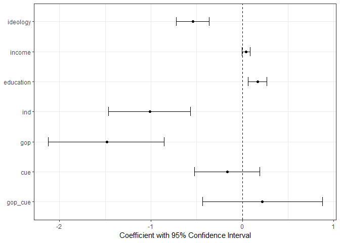
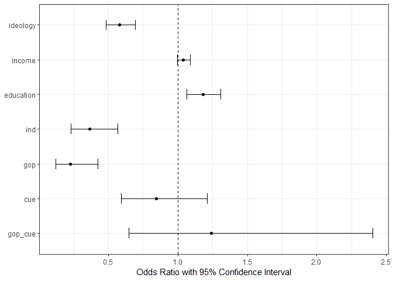
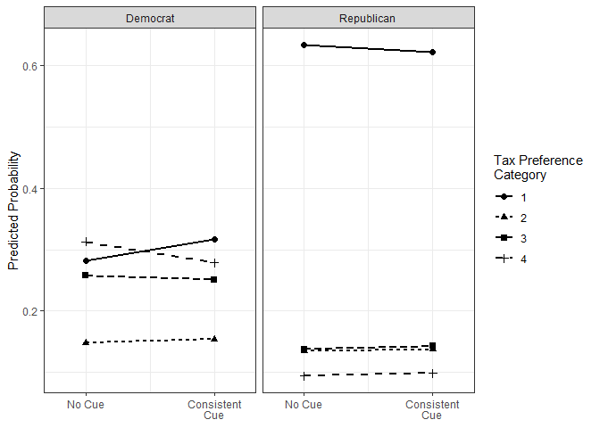
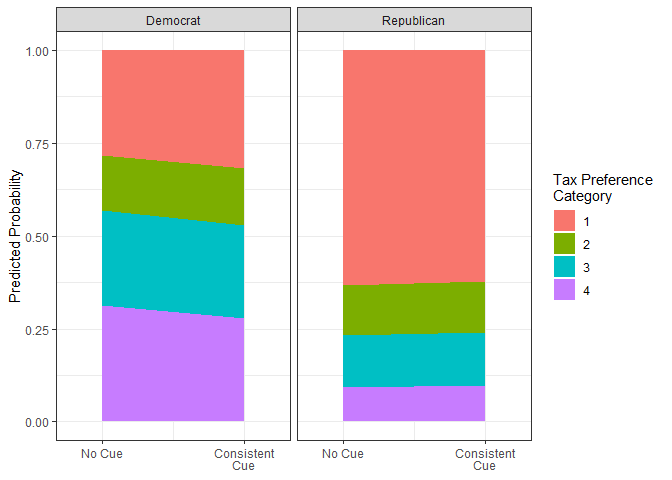

POL213 TA Session
================
Gento Kato
May 2, 2019

``` r
## Clear Workspace
rm(list = ls())

## Set Working Directory to the File location
## (If using RStudio, can be set automatically)
setwd(dirname(rstudioapi::getActiveDocumentContext()$path))
getwd()
```

    ## [1] "C:/GoogleDrive/Lectures/2019_04to06_UCD/POL213_TA/POL213_TA_resource"

``` r
## Required packages
library(readstata13) # For importing data
library(ggplot2) # Plotting
library(faraway) # for ilogit function
library(pscl) # For pseudo R squared (pR2)
library(DAMisc) # For pre function
library(MASS) # For mvrnorm
```

Annotated (and Slightly Modified) Class Codes
=============================================

Data Preparation
----------------

``` r
# Import Data
d <- read.table("ca_taxes_soda.txt", header=TRUE, sep="\t")
dim(d) # 9 variables, 795 cases
```

    ## [1] 795   9

``` r
# Some Additional Variables
d$soda_tax <- d$tax_soda
d$soda_tax2 <- as.factor(d$tax_soda) # Ordinal Variable
d$education <- d$educate

# Initiate Data for Analysis
## Keeping Following Variables
keepvars <- c("soda_tax", "soda_tax2", "ideology", "income", 
              "education", "cue", "ind", "gop", "gop_cue")
# Subset Variables and Create A New Dataset
ca_soda <- d[,keepvars]
```

Ordinal Logit
-------------

``` r
library(MASS) # For polr function

# Ordinal Logit
ologit.soda <- polr(soda_tax2 ~ ideology + income + education + 
                      ind + gop + cue + gop_cue, data = ca_soda, Hess = TRUE)
# Summary
(sum.ologit.soda <- summary(ologit.soda))
```

    ## Call:
    ## polr(formula = soda_tax2 ~ ideology + income + education + ind + 
    ##     gop + cue + gop_cue, data = ca_soda, Hess = TRUE)
    ## 
    ## Coefficients:
    ##              Value Std. Error t value
    ## ideology  -0.54158    0.09181 -5.8988
    ## income     0.03936    0.02275  1.7298
    ## education  0.16532    0.05292  3.1239
    ## ind       -1.01203    0.22919 -4.4157
    ## gop       -1.48344    0.32327 -4.5888
    ## cue       -0.16636    0.18307 -0.9087
    ## gop_cue    0.21577    0.33386  0.6463
    ## 
    ## Intercepts:
    ##     Value   Std. Error t value
    ## 1|2 -1.8272  0.3514    -5.1990
    ## 2|3 -1.1769  0.3477    -3.3843
    ## 3|4 -0.1066  0.3458    -0.3084
    ## 
    ## Residual Deviance: 1774.628 
    ## AIC: 1794.628

``` r
# Significance Test
table.ologit.soda <- coef(sum.ologit.soda)
p <- pnorm(abs(table.ologit.soda[, "t value"]), lower.tail = FALSE) * 2
(table.ologit.soda2 <- cbind(table.ologit.soda, "p value" = p))
```

    ##                 Value Std. Error    t value      p value
    ## ideology  -0.54158044 0.09181141 -5.8988358 3.660753e-09
    ## income     0.03935681 0.02275158  1.7298494 8.365719e-02
    ## education  0.16532449 0.05292205  3.1239244 1.784563e-03
    ## ind       -1.01203376 0.22919094 -4.4156796 1.006931e-05
    ## gop       -1.48344471 0.32327408 -4.5888143 4.457708e-06
    ## cue       -0.16636483 0.18307142 -0.9087427 3.634859e-01
    ## gop_cue    0.21577119 0.33386228  0.6462880 5.180929e-01
    ## 1|2       -1.82716037 0.35144344 -5.1990168 2.003454e-07
    ## 2|3       -1.17688298 0.34774491 -3.3843285 7.135259e-04
    ## 3|4       -0.10664648 0.34578198 -0.3084212 7.577619e-01

``` r
# The Easier Way
library(lmtest)
(cft <- coeftest(ologit.soda))
```

    ## 
    ## z test of coefficients:
    ## 
    ##            Estimate Std. Error z value  Pr(>|z|)    
    ## ideology  -0.541580   0.091811 -5.8988 3.661e-09 ***
    ## income     0.039357   0.022752  1.7298 0.0836572 .  
    ## education  0.165324   0.052922  3.1239 0.0017846 ** 
    ## ind       -1.012034   0.229191 -4.4157 1.007e-05 ***
    ## gop       -1.483445   0.323274 -4.5888 4.458e-06 ***
    ## cue       -0.166365   0.183071 -0.9087 0.3634859    
    ## gop_cue    0.215771   0.333862  0.6463 0.5180929    
    ## 1|2       -1.827160   0.351443 -5.1990 2.003e-07 ***
    ## 2|3       -1.176883   0.347745 -3.3843 0.0007135 ***
    ## 3|4       -0.106646   0.345782 -0.3084 0.7577619    
    ## ---
    ## Signif. codes:  0 '***' 0.001 '**' 0.01 '*' 0.05 '.' 0.1 ' ' 1

``` r
# Confidence Interval
(ci <- confint(ologit.soda))
```

    ## Waiting for profiling to be done...

    ##                  2.5 %      97.5 %
    ## ideology  -0.723167501 -0.36297115
    ## income    -0.005205857  0.08404382
    ## education  0.061798217  0.26938091
    ## ind       -1.466085468 -0.56629794
    ## gop       -2.126046993 -0.85674237
    ## cue       -0.526354952  0.19188442
    ## gop_cue   -0.434162661  0.87654044

``` r
# Plot 
## Data Frame with Coefficient Values
cdt <- as.data.frame(cbind(cft[,1],ci))
```

    ## Warning in cbind(cft[, 1], ci): number of rows of result is not a multiple
    ## of vector length (arg 1)

``` r
colnames(cdt) <- c("cf","lci","uci")
## Variable Names
cdt$vn <- factor(row.names(cdt), 
                 levels=rev(row.names(cdt)))
## Draw Plot
ggplot(cdt, aes(x=vn,y=cf,ymin=lci,ymax=uci)) + 
  geom_point() + geom_errorbar(width=0.3) +
  geom_hline(aes(yintercept=0), linetype=2) +
  xlab(NULL) + 
  ylab("Coefficient with 95% Confidence Interval") + 
  coord_flip() + # Flip Plot
  theme_bw()
```



``` r
# Odds Ratio
## Conversion
cdt$or <- exp(cdt$cf)
cdt$orlci <- exp(cdt$lci)
cdt$oruci <- exp(cdt$uci)
## Draw Plot
ggplot(cdt, aes(x=vn,y=or,ymin=orlci,ymax=oruci)) + 
  geom_point() + geom_errorbar(width=0.3) +
  geom_hline(aes(yintercept=1), linetype=2) +
  xlab(NULL) + 
  ylab("Odds Ratio with 95% Confidence Interval") + 
  coord_flip() + # Flip Plot
  theme_bw()
```



Predicted Probabilities
=======================

``` r
## Profiles
prof_baseD <- c(3, # ideology 
                6, # income 
                3, # education
                0, # ind (not)
                0, # gop (not) * means democrat
                0, # cue
                0) # gop_cue
names(prof_baseD) <- all.vars(ologit.soda$terms)[-1]
prof_cueD <- prof_baseR <- prof_cueR <- prof_baseD
prof_cueD[6] <- 1 # Receiving (dem) cues
prof_baseR[5] <- 1 # GOP member
prof_cueR[c(5,6,7)] <- 1 # Receiving R cues and GOP Member

## Function for Prediction
predologit <- function(model,profile) {
  
  # Parameters
  cf <- coef(model) # Coefficients
  z <- summary(model)$zeta # Thresholds
  
  xb <- sum(profile * cf) # Individual Estiamtes
  
  # Temporal Probabilities
  prtmp <- c(0,sapply(z, function(zi) 1 / (1 + exp(xb - zi))),1)

  # Predicted Probabilities
  pr <- rep(NA, length(z)+1) 
  for (i in seq(1,length(z)+1,1)) pr[i] <- prtmp[i+1] - prtmp[i]
  
  # Names
  names(pr) <- paste0("Pr.",seq(1,length(pr),1))

  return(pr)
  
}

# Make Prediction
pred_baseD <- predologit(ologit.soda,prof_baseD)
pred_cueD <- predologit(ologit.soda,prof_cueD)
pred_baseR <- predologit(ologit.soda,prof_baseR)
pred_cueR <- predologit(ologit.soda,prof_cueR)

# Plot Prediction
preddt <- rbind(cbind(pred_baseD,rbind(prof_baseD,prof_baseD,prof_baseD,prof_baseD)),
                cbind(pred_cueD,rbind(prof_cueD,prof_cueD,prof_cueD,prof_cueD)),
                cbind(pred_baseR,rbind(prof_baseR,prof_baseR,prof_baseR,prof_baseR)),
                cbind(pred_cueR,rbind(prof_cueR,prof_cueR,prof_cueR,prof_cueR)))
preddt <- as.data.frame(preddt)
colnames(preddt)[1] <- "pr"
preddt$cats <- as.factor(rep(seq(1,4,1),4))
## Label Party Membership
preddt$gop <- ifelse(preddt$gop==1,"Republican","Democrat")

# One By One
ggplot(preddt, aes(x=cue, y=pr)) + 
  geom_line(aes(linetype=cats), size=0.75) + 
  geom_point(aes(shape=cats), size=2) + 
  facet_grid(.~gop) +
  scale_x_continuous(limits=c(-0.25,1.25),
                     breaks=c(0,1),
                     labels=c("No Cue","Consistent\nCue")) +
  scale_shape_discrete(name="Tax Preference \nCategory") + 
  scale_linetype_discrete(name="Tax Preference \nCategory") + 
  ylab("Predicted Probability") + xlab(NULL) + 
  theme_bw()
```



``` r
# Cummulative
ggplot(preddt, aes(x=cue, y=pr)) + 
  geom_area(aes(fill=cats)) + 
  facet_grid(.~gop) +
  scale_x_continuous(limits=c(-0.25,1.25),
                     breaks=c(0,1),
                     labels=c("No Cue","Consistent\nCue")) +
  scale_fill_discrete(name="Tax Preference \nCategory") + 
  ylab("Predicted Probability") + xlab(NULL) + 
  theme_bw()
```


