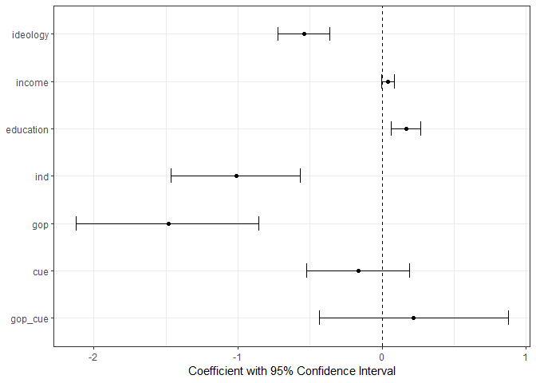
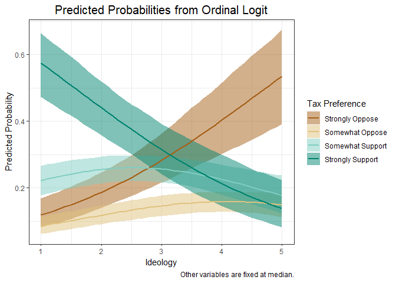
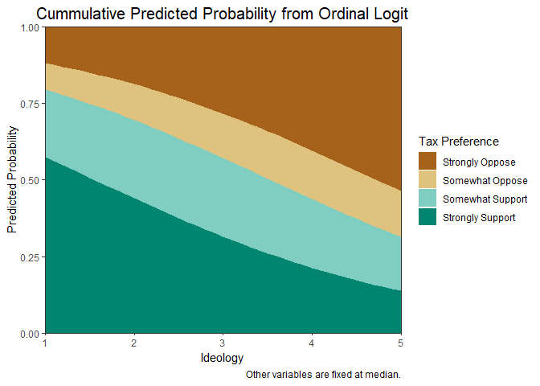
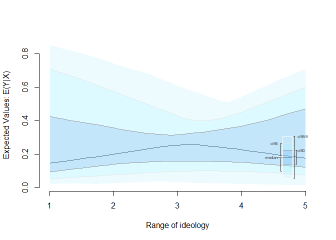
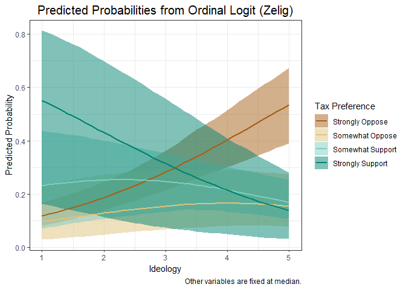
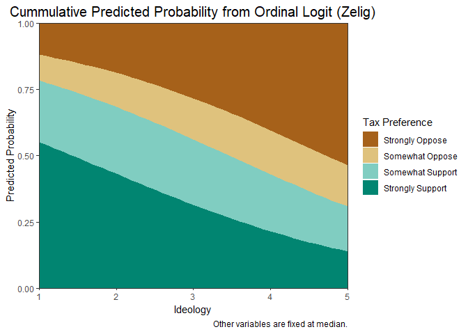

POL213 TA Session
================
Gento Kato
May 16, 2019

``` r
## Clear Workspace
rm(list = ls())

## Set Working Directory to the File location
## (If using RStudio, can be set automatically)
setwd(dirname(rstudioapi::getActiveDocumentContext()$path))
getwd()
```

    ## [1] "C:/GoogleDrive/Lectures/2019_04to06_UCD/POL213_TA/POL213_TA_resource"

``` r
## Required packages
library(ggplot2) # Plotting
library(faraway) # for ilogit function
library(pscl) # For pseudo R squared (pR2)
library(DAMisc) # For pre function
library(MASS) # For mvrnorm
```

Annotated (and Slightly Modified) Class Codes
=============================================

Data Preparation
----------------

``` r
# Import Data
d <- read.table("ca_taxes_soda.txt", header=TRUE, sep="\t")
dim(d) # 9 variables, 795 cases
```

    ## [1] 795   9

``` r
# Some Additional Variableseducate
d$soda_tax <- d$tax_soda
d$soda_tax2 <- as.factor(d$tax_soda) # Ordinal Variable
d$education <- d$educate

# Initiate Data for Analysis
## Keeping Following Variables
keepvars <- c("soda_tax", "soda_tax2", "ideology", "income", 
              "education", "cue", "ind", "gop", "gop_cue")
# Subset Variables and Create A New Dataset
ca_soda <- d[,keepvars]
```

Ordinal Logit (polr)
--------------------

``` r
# Ordinal Logit (polr)
require(MASS) # For polr function
ol1 <- polr(soda_tax2 ~ ideology + income + education + ind + gop + cue + gop_cue, 
            data = ca_soda, Hess = TRUE)
# Summary
(sum.ol1 <- summary(ol1))
```

    ## Call:
    ## polr(formula = soda_tax2 ~ ideology + income + education + ind + 
    ##     gop + cue + gop_cue, data = ca_soda, Hess = TRUE)
    ## 
    ## Coefficients:
    ##              Value Std. Error t value
    ## ideology  -0.54158    0.09181 -5.8988
    ## income     0.03936    0.02275  1.7298
    ## education  0.16532    0.05292  3.1239
    ## ind       -1.01203    0.22919 -4.4157
    ## gop       -1.48344    0.32327 -4.5888
    ## cue       -0.16636    0.18307 -0.9087
    ## gop_cue    0.21577    0.33386  0.6463
    ## 
    ## Intercepts:
    ##     Value   Std. Error t value
    ## 1|2 -1.8272  0.3514    -5.1990
    ## 2|3 -1.1769  0.3477    -3.3843
    ## 3|4 -0.1066  0.3458    -0.3084
    ## 
    ## Residual Deviance: 1774.628 
    ## AIC: 1794.628

``` r
# Significance Test
table.ol1 <- coef(sum.ol1)
p <- pnorm(abs(table.ol1[, "t value"]), lower.tail = FALSE) * 2
(table.ol1 <- cbind(table.ol1, "p value" = p))
```

    ##                 Value Std. Error    t value      p value
    ## ideology  -0.54158044 0.09181141 -5.8988358 3.660753e-09
    ## income     0.03935681 0.02275158  1.7298494 8.365719e-02
    ## education  0.16532449 0.05292205  3.1239244 1.784563e-03
    ## ind       -1.01203376 0.22919094 -4.4156796 1.006931e-05
    ## gop       -1.48344471 0.32327408 -4.5888143 4.457708e-06
    ## cue       -0.16636483 0.18307142 -0.9087427 3.634859e-01
    ## gop_cue    0.21577119 0.33386228  0.6462880 5.180929e-01
    ## 1|2       -1.82716037 0.35144344 -5.1990168 2.003454e-07
    ## 2|3       -1.17688298 0.34774491 -3.3843285 7.135259e-04
    ## 3|4       -0.10664648 0.34578198 -0.3084212 7.577619e-01

``` r
# The Easier Way
require(lmtest)
(cft <- coeftest(ol1))
```

    ## 
    ## z test of coefficients:
    ## 
    ##            Estimate Std. Error z value  Pr(>|z|)    
    ## ideology  -0.541580   0.091811 -5.8988 3.661e-09 ***
    ## income     0.039357   0.022752  1.7298 0.0836572 .  
    ## education  0.165324   0.052922  3.1239 0.0017846 ** 
    ## ind       -1.012034   0.229191 -4.4157 1.007e-05 ***
    ## gop       -1.483445   0.323274 -4.5888 4.458e-06 ***
    ## cue       -0.166365   0.183071 -0.9087 0.3634859    
    ## gop_cue    0.215771   0.333862  0.6463 0.5180929    
    ## 1|2       -1.827160   0.351443 -5.1990 2.003e-07 ***
    ## 2|3       -1.176883   0.347745 -3.3843 0.0007135 ***
    ## 3|4       -0.106646   0.345782 -0.3084 0.7577619    
    ## ---
    ## Signif. codes:  0 '***' 0.001 '**' 0.01 '*' 0.05 '.' 0.1 ' ' 1

``` r
# Confidence Interval
(ci <- confint(ol1))
```

    ## Waiting for profiling to be done...

    ##                  2.5 %      97.5 %
    ## ideology  -0.723167501 -0.36297115
    ## income    -0.005205857  0.08404382
    ## education  0.061798217  0.26938091
    ## ind       -1.466085468 -0.56629794
    ## gop       -2.126046993 -0.85674237
    ## cue       -0.526354952  0.19188442
    ## gop_cue   -0.434162661  0.87654044

``` r
# Another ologit model (zelig)
require(Zelig)
require(ZeligChoice)
ol2 <- zelig(soda_tax2 ~ ideology + income + education + ind + gop + cue + gop_cue,
             data=ca_soda, model="ologit")
```

    ## How to cite this model in Zelig:
    ##   William N. Venables, and Brian D. Ripley. 2011.
    ##   ologit: Ordinal Logit Regression for Ordered Categorical Dependent Variables
    ##   in Christine Choirat, Christopher Gandrud, James Honaker, Kosuke Imai, Gary King, and Olivia Lau,
    ##   "Zelig: Everyone's Statistical Software," http://zeligproject.org/

``` r
summary(ol2)
```

    ## Model: 
    ## Call:
    ## z5$zelig(formula = soda_tax2 ~ ideology + income + education + 
    ##     ind + gop + cue + gop_cue, data = ca_soda)
    ## 
    ## Coefficients:
    ##              Value Std. Error t value
    ## ideology  -0.54158    0.09181 -5.8988
    ## income     0.03936    0.02275  1.7298
    ## education  0.16532    0.05292  3.1239
    ## ind       -1.01203    0.22919 -4.4157
    ## gop       -1.48344    0.32327 -4.5888
    ## cue       -0.16636    0.18307 -0.9087
    ## gop_cue    0.21577    0.33386  0.6463
    ## 
    ## Intercepts:
    ##     Value   Std. Error t value
    ## 1|2 -1.8272  0.3514    -5.1990
    ## 2|3 -1.1769  0.3477    -3.3843
    ## 3|4 -0.1066  0.3458    -0.3084
    ## 
    ## Residual Deviance: 1774.628 
    ## AIC: 1794.628 
    ## Next step: Use 'setx' method

``` r
# Export Social-Scientific Table
require(texreg)
```

``` r
htmlreg(list(ol1,ol2), # models in list
        # names of model
        custom.model.names = c("polr", "zelig"),
        # include tao values in output
        include.thresholds = TRUE,
        # drop deviance from output
        include.deviance = FALSE,
        # Set digits to 3 points
        digits = 3,
        # Stars for p < 0.01 & p < 0.05
        stars = c(0.01, 0.05),
        # Place coefficients & SE in single row (effective when few models)
        single.row = TRUE,
        # Set custom names of coefficients (and thresholds)
        custom.coef.names = c("Ideology","Income","Education",
                              "Independent", "Republican",
                              "Cue Reception", "Republican Cue",
                              "Threshold: Strongly|Somewhat Oppose",
                              "Threshold: Somewhat Oppose|Support",
                              "Threshold: Somewhat|Strongly Support"),
        # Title of Table
        caption = c("Compare polr and zelig outputs of ordinal logit"),
        # Place title above the table
        caption.above =TRUE,
        # Add Some Notes under the table
        custom.note = c("%stars. Standard Errors in Parentheses."),
        # Save the Output to File (Word Format)
        file = "ologit_table.doc")
```

``` r
# Coefficient Plot (Extra) 
## Data Frame with Coefficient Values
cdt <- as.data.frame(cbind(cft[,1],ci))
colnames(cdt) <- c("cf","lci","uci")
## Variable Names
cdt$vn <- factor(row.names(cdt), 
                 levels=rev(row.names(cdt)))
## Draw Plot
ggplot(cdt, aes(x=vn,y=cf,ymin=lci,ymax=uci)) + 
  geom_point() + geom_errorbar(width=0.3) +
  geom_hline(aes(yintercept=0), linetype=2) +
  xlab(NULL) + 
  ylab("Coefficient with 95% Confidence Interval") + 
  coord_flip() + # Flip Plot
  theme_bw()
```



``` r
# Odds Ratio
## Conversion
cdt$or <- exp(cdt$cf)
cdt$orlci <- exp(cdt$lci)
cdt$oruci <- exp(cdt$uci)
cdtor <- cdt[,c("or","orlci","oruci")]
rownames(cdtor) <- c("Ideology","Income","Education",
                     "Independent", "Republican",
                     "Cue Reception", "Republican Cue")
colnames(cdtor) <- c("Odds Ratio", "Lower 95% CI", "Upper 95% CI")
cdtor
```

    ##                Odds Ratio Lower 95% CI Upper 95% CI
    ## Ideology        0.5818280    0.4852129    0.6956065
    ## Income          1.0401415    0.9948077    1.0876766
    ## Education       1.1797759    1.0637477    1.3091537
    ## Independent     0.3634790    0.2308273    0.5676229
    ## Republican      0.2268549    0.1193080    0.4245428
    ## Cue Reception   0.8467373    0.5907544    1.2115305
    ## Republican Cue  1.2408184    0.6478069    2.4025735

``` r
## Export Odds Ratio Table in Word Pastable Format
require(stargazer)
```

``` r
stargazer(cdtor, # Input (matrix or data.frame)
          # Control digits
          digits = 3,
          # Title
          title = "Odds Ratios from Ordinal Logit Model",
          # Export output "as is"
          summary = FALSE,
          # Export Type
          type = "html", out = "ologit_ortab.doc")
```

``` r
## Fit Statistics
pR2(ol1) # Make sure you know (roughly) what they are
```

    ##           llh       llhNull            G2      McFadden          r2ML 
    ##  -887.3138545 -1020.2968743   265.9660398     0.1303376     0.2843388 
    ##          r2CU 
    ##     0.3079867

``` r
# Adjusted Statistics (Adjusted McFadden for Ordinal Logit)
adjMcFadden_ol <- function(model) {
  # Null Model
  nullmod <- polr( model$model[,all.vars(model$terms)[1]] ~ 1, Hess = TRUE)
  # Null Model Log-Likelihood
  L.base <- logLik(nullmod)
  # Full Model Log-Likelihood
  L.full <- logLik(model)
  # Degrees of Freedom in Full Moddel
  P3 <- attr(L.full, "df")
  # Standard McFadden
  McFadden.R2 <- 1 - (L.full / L.base)
  # Adjusted McFadden
  McFadden.Adj.R2 <- 1 - ((L.full - P3) / L.base)
  # Format Output
  out <- c(McFadden.R2,McFadden.Adj.R2)
  names(out) <- c("McFadden","Adjusted McFadden")
  out
}
adjMcFadden_ol(ol1)
```

    ##          McFadden Adjusted McFadden 
    ##         0.1303376         0.1205365

Predicted Probabilities
=======================

``` r
## Profiles (No Intercept in Ordinal Logit)
prof_baseD <- c(3, # ideology 
                6, # income 
                3, # education
                0, # ind (not)
                0, # gop (not) * means democrat
                0, # cue
                0) # gop_cue
names(prof_baseD) <- all.vars(ol1$terms)[-1]
# prof_cueD <- prof_baseR <- prof_cueR <- prof_baseD
# prof_cueD[6] <- 1 # Receiving (dem) cues
# prof_baseR[5] <- 1 # GOP member
# prof_cueR[c(5,6,7)] <- 1 # Receiving R cues and GOP Member
# Vary only ideology
x <- seq(1,5, .1) # Moving Values
profide_D <- t(matrix(rep(prof_baseD,length(x)), ncol=length(x)))
profide_D[,1] <- x
head(profide_D)
```

    ##      [,1] [,2] [,3] [,4] [,5] [,6] [,7]
    ## [1,]  1.0    6    3    0    0    0    0
    ## [2,]  1.1    6    3    0    0    0    0
    ## [3,]  1.2    6    3    0    0    0    0
    ## [4,]  1.3    6    3    0    0    0    0
    ## [5,]  1.4    6    3    0    0    0    0
    ## [6,]  1.5    6    3    0    0    0    0

``` r
dim(profide_D)
```

    ## [1] 41  7

``` r
## Function for Predicted Probability
predologit <- function(model,profile) {
  
  # Coefficients
  coeffs <- c(coef(model), summary(model)$zeta)
  # Variance Covariance Matrix
  covmat <- vcov(model)
  # Number of Draws
  ndraws <- 1000
  # Draw
  require(MASS); set.seed(34)
  betadraw <- mvrnorm(ndraws, coeffs, covmat)
  
  # Profile * Coefficients
  nvars <- length(coef(model))
  xb <- profile %*% t(betadraw[,1:nvars])
  # Thresholds
  taos <- betadraw[,seq(nvars+1, length(coeffs), 1)]
  
  # Predicted Probabilities
  prlist <- list()
  for (i in 1:nrow(xb)) {
    tmp <- 
      cbind(rep(0,ndraws), 
          apply(taos, 2, function(taoi) 1/(1 + exp(xb[i,] - taoi))),
          rep(1, ndraws))
    pr <- matrix(NA, nrow=ndraws, ncol=ncol(taos)+1)
    for (j in seq(1,ncol(taos)+1,1)) pr[,j] <- tmp[,(j+1)] - tmp[,j]
    colnames(pr) <- paste0("Pr.",seq(1,ncol(pr),1))
    head(pr)
    prlist[[i]] <- pr
  }

  # Function to Summarize Result
  cirange <- c(0.5,0.025,0.975)
  sumres <- function(pr) {
    out <- cbind(colMeans(pr),
                 apply(pr, 2, function(k) sd(k)),
                 t(apply(pr, 2, function(k) quantile(k, probs=cirange))))
    colnames(out) <- c("mean","se","median","lowCI","upCI")
    out
  }
  
  # Export Summary of Prediction
  sumlist <- lapply(prlist, sumres)
  if (length(sumlist)==1) {
    sumlist <- sumlist[[1]]
  }

  return(sumlist)
  
}

# Make Prediction
predide_D <- predologit(ol1,profide_D)
predide_D <- as.data.frame(do.call("rbind",predide_D))
predide_D$cat <- rep(c("Strongly Oppose",
                       "Somewhat Oppose",
                       "Somewhat Support",
                       "Strongly Support"), 
                     length(seq(1,5, .1)))
predide_D$cat <- factor(predide_D$cat,
                        levels=unique(predide_D$cat))
predide_D$x <- rep(seq(1,5, .1), each=4)

# One By One with CI
ggplot(predide_D, aes(x=x, y=mean, ymin=lowCI, ymax=upCI)) + 
  geom_ribbon(aes(fill=cat), alpha=0.5) + 
  geom_line(aes(color=cat), size=0.75) + 
  scale_fill_brewer(name="Tax Preference", type="div") +
  scale_color_brewer(name="Tax Preference", type="div") +
  ylab("Predicted Probability") + 
  xlab("Ideology") + 
  ggtitle("Predicted Probabilities from Ordinal Logit") + 
  labs(caption="Other variables are fixed at median.") + 
  theme_bw() + 
  theme(plot.title = element_text(hjust=0.5, size=15))
```



``` r
# Cummulative (no CI possible)
ggplot(predide_D, aes(x=x, y=mean)) + 
  geom_area(aes(fill=cat)) + 
  scale_fill_brewer(name="Tax Preference", type="div") +
  ylab("Predicted Probability") + 
  xlab("Ideology") + 
  ggtitle("Cummulative Predicted Probability from Ordinal Logit") + 
  scale_x_continuous(expand=c(0,0)) + # No Expansion of axis
  scale_y_continuous(expand=c(0,0)) + # No Expansion of axis
  labs(caption="Other variables are fixed at median.") + 
  theme_bw() + 
  theme(plot.title = element_text(hjust=0.5, size=15))
```



Workshop: Use Zelig to replicate the predicted probability graphs.
==================================================================

Do not rely too much on default graphs.

``` r
# moving value of x
ol2.x <- setx(ol2, ideology = seq(1,5, .1), 
              income = 6, education = 3, 
              ind = 0, gop = 0, cue = 0, gop_cue = 0)

# Prediction
set.seed(34)
ol2.pred <- sim(ol2, x = ol2.x)

# Hard to see what you are looking at
plot(ol2.pred)
```



``` r
# Capture prediction output and create data
# (probably there is a better way. let me know if you know it)
## capture summary output
ol2.predsum <- capture.output(ol2.pred) 
## Extract Relevant Ouputs and Compile into matrix
ol2.predsum <- do.call("rbind", 
  str_split(ol2.predsum[grep("^[1-9] [0-9]",ol2.predsum)]," "))
## Make All variables Numeric
ol2.predsum <- apply(ol2.predsum, 2, as.numeric)
## Create Data.frame and add variables
ol2.predsum <- as.data.frame(ol2.predsum)
colnames(ol2.predsum) <- c("catn","mean","se","median","lowCI","upCI")
ol2.predsum$cat <- rep(c("Strongly Oppose",
                       "Somewhat Oppose",
                       "Somewhat Support",
                       "Strongly Support"), 
                     length(seq(1,5, .1)))
ol2.predsum$cat <- factor(ol2.predsum$cat,
                        levels=unique(ol2.predsum$cat))
ol2.predsum$x <- rep(seq(1,5, .1), each=4)

# One By One with CI (Confidence Intervals Look Very Different)
ggplot(ol2.predsum, aes(x=x, y=mean, ymin=lowCI, ymax=upCI)) + 
  geom_ribbon(aes(fill=cat), alpha=0.5) + 
  geom_line(aes(color=cat), size=0.75) + 
  scale_fill_brewer(name="Tax Preference", type="div") +
  scale_color_brewer(name="Tax Preference", type="div") +
  ylab("Predicted Probability") + 
  xlab("Ideology") + 
  ggtitle("Predicted Probabilities from Ordinal Logit (Zelig)") + 
  labs(caption="Other variables are fixed at median.") + 
  theme_bw() + 
  theme(plot.title = element_text(hjust=0.5, size=15))
```



``` r
# Cummulative (no CI possible)
ggplot(ol2.predsum, aes(x=x, y=mean)) + 
  geom_area(aes(fill=cat)) + 
  scale_fill_brewer(name="Tax Preference", type="div") +
  ylab("Predicted Probability") + 
  xlab("Ideology") + 
  ggtitle("Cummulative Predicted Probability from Ordinal Logit (Zelig)") + 
  scale_x_continuous(expand=c(0,0)) + # No Expansion of axis
  scale_y_continuous(expand=c(0,0)) + # No Expansion of axis
  labs(caption="Other variables are fixed at median.") + 
  theme_bw() + 
  theme(plot.title = element_text(hjust=0.5, size=15))
```



Generalized Ordered Logit
=========================

``` r
# Brant Test of Propotional Odds Assumption
require(brant)
brant(ol1)
```

    ## -------------------------------------------- 
    ## Test for X2  df  probability 
    ## -------------------------------------------- 
    ## Omnibus      17.09   14  0.25
    ## ideology 3.57    2   0.17
    ## income       5.53    2   0.06
    ## education    1.62    2   0.45
    ## ind      0.63    2   0.73
    ## gop      2.57    2   0.28
    ## cue      3.96    2   0.14
    ## gop_cue      1.03    2   0.6
    ## -------------------------------------------- 
    ## 
    ## H0: Parallel Regression Assumption holds

    ##                   X2 df probability
    ## Omnibus   17.0934308 14  0.25123311
    ## ideology   3.5696569  2  0.16782585
    ## income     5.5318829  2  0.06291684
    ## education  1.6158205  2  0.44578869
    ## ind        0.6270052  2  0.73088248
    ## gop        2.5657765  2  0.27723542
    ## cue        3.9567961  2  0.13829059
    ## gop_cue    1.0285982  2  0.59791953

``` r
# Income seem to potentially violating the parallel regression assumption.

# R codes for generalized ordered logit.
# (Note that this function uses slightly different procedure than Stata's gologit2)
require(VGAM)

# Replicate polr function Result
ol3a <- 
  vglm(as.ordered(soda_tax2) ~ 
         ideology + income + education + ind + gop + cue + gop_cue, 
       data = ca_soda,
       family = cumulative(link = "logit", parallel = TRUE, reverse=TRUE))

# Relaxing Proportional Odds Assumption
ol3b <- 
  vglm(as.ordered(soda_tax2) ~ ideology + income + education + ind + gop + cue + gop_cue, 
       data = ca_soda,
       family = cumulative(link = "logit", parallel = FALSE, reverse=TRUE))

# Modifying extract function of texreg to export table
extract.vglm <- function (model, 
                          include.aic = TRUE,
                          include.bic = TRUE,
                          include.loglik = TRUE, 
                          include.df = FALSE, 
                          include.nobs = TRUE,
                          beside = TRUE,
                          resp.names = NA,
                          ...) 
{
  s <- summary(model)
  gof <- numeric()
  gof.names <- character()
  gof.decimal <- logical()
  if (include.aic == TRUE) {
    gof <- c(gof, AIC(model))
    gof.names <- c(gof.names, "AIC")
    gof.decimal <- c(gof.decimal, TRUE)
  }
  if (include.bic == TRUE) {
    gof <- c(gof, BIC(model))
    gof.names <- c(gof.names, "BIC")
    gof.decimal <- c(gof.decimal, TRUE)
  }
  if (include.loglik == TRUE) {
    gof <- c(gof, VGAM::logLik.vlm(model))
    gof.names <- c(gof.names, "Log Likelihood")
    gof.decimal <- c(gof.decimal, TRUE)
  }
  if (include.df == TRUE) {
    gof <- c(gof, df <- s@df[2])
    gof.names <- c(gof.names, "DF")
    gof.decimal <- c(gof.decimal, FALSE)
  }
  if (include.nobs == TRUE) {
    gof <- c(gof, nobs(s))
    gof.names <- c(gof.names, "Num.\\ obs.")
    gof.decimal <- c(gof.decimal, FALSE)
  }
  
  besidereq <- nrow(s@coef3) > 
    length(s@extra$colnames.y) - 1 + length(all.vars(s@terms$terms)[-1])
  
  if (beside == TRUE & besidereq==TRUE) {
    trlist <- list()
    
    respcol <- s@extra$colnames.y
    if (is.na(resp.names)) resp.names <- respcol
    if (length(resp.names)!=length(respcol)) {
      warning("resp.names length does not match with number of response categories")
      resp.names <- respcol
    }
    
    for (i in 1:(length(respcol)-1)) {
      names <- rownames(coef(s))
      resploc <- grep(paste0(":",respcol[i],"$"),names)
      names <- gsub(paste0(":",respcol[i],"$"),"",names[resploc])
      co <- s@coef3[resploc, 1]
      se <- s@coef3[resploc, 2]
      pval <- s@coef3[resploc, 4]
      if (i==1) {
        tr <- createTexreg(coef.names = names, coef = co, se = se, 
                           pvalues = pval, gof.names = gof.names, 
                           gof = gof, gof.decimal = gof.decimal,
                           model.name = paste(resp.names[i],resp.names[i+1],sep="|"))
      } else {
        tr <- createTexreg(coef.names = names, coef = co, se = se, 
                           pvalues = pval, gof.names = character(), 
                           gof = numeric(), gof.decimal = logical(),
                           model.name = paste(resp.names[i],resp.names[i+1],sep="|"))
      }
      trlist <- c(trlist, tr)
    }
    if (length(trlist) == 1) {
      return(trlist[[1]])
    }
    else {
      return(trlist)
    }
  }
  else {
    names <- rownames(coef(s))
    co <- s@coef3[, 1]
    se <- s@coef3[, 2]
    pval <- s@coef3[, 4]
    tr <- createTexreg(coef.names = names, coef = co, se = se, 
                       pvalues = pval, gof.names = gof.names, gof = gof, gof.decimal = gof.decimal)
    return(tr)
  }
  
}
setMethod("extract", signature = className("vglm"), definition = extract.vglm)

# The only difference between vglm & polr is the sign of threshold 
goltab1 <- htmlreg(list(ol1,ol3a), 
                   include.thresholds=TRUE,
                   include.deviance = FALSE,
                   single.row=TRUE, 
                   custom.model.names = c("polr","vglm"),
                   custom.coef.names = c("Ideology","Income","Education",
                                         "Independent", "Republican",
                                         "Cue Reception", "Republican Cue",
                                         "Threshold: Strongly|Somewhat Oppose",
                                         "Threshold: Somewhat Oppose|Support",
                                         "Threshold: Somewhat|Strongly Support",
                                         "Threshold: Strongly|Somewhat Oppose",
                                         "Threshold: Somewhat Oppose|Support",
                                         "Threshold: Somewhat|Strongly Support"),
                   caption = "Comparing Ordered Logit from polr and vglm",
                   caption.above = TRUE)
```

``` r
goltab1
```

<!DOCTYPE HTML PUBLIC "-//W3C//DTD HTML 4.01 Transitional//EN" "http://www.w3.org/TR/html4/loose.dtd">
<table cellspacing="0" align="center" style="border: none;">
<caption align="top" style="margin-bottom:0.3em;">
Comparing Ordered Logit from polr and vglm
</caption>
<tr>
<th style="text-align: left; border-top: 2px solid black; border-bottom: 1px solid black; padding-right: 12px;">
<b></b>
</th>
<th style="text-align: left; border-top: 2px solid black; border-bottom: 1px solid black; padding-right: 12px;">
<b>polr</b>
</th>
<th style="text-align: left; border-top: 2px solid black; border-bottom: 1px solid black; padding-right: 12px;">
<b>vglm</b>
</th>
</tr>
<tr>
<td style="padding-right: 12px; border: none;">
Ideology
</td>
<td style="padding-right: 12px; border: none;">
-0.54 (0.09)<sup style="vertical-align: 0px;">\*\*\*</sup>
</td>
<td style="padding-right: 12px; border: none;">
-0.54 (0.09)<sup style="vertical-align: 0px;">\*\*\*</sup>
</td>
</tr>
<tr>
<td style="padding-right: 12px; border: none;">
Income
</td>
<td style="padding-right: 12px; border: none;">
0.04 (0.02)
</td>
<td style="padding-right: 12px; border: none;">
0.04 (0.02)
</td>
</tr>
<tr>
<td style="padding-right: 12px; border: none;">
Education
</td>
<td style="padding-right: 12px; border: none;">
0.17 (0.05)<sup style="vertical-align: 0px;">\*\*</sup>
</td>
<td style="padding-right: 12px; border: none;">
0.17 (0.05)<sup style="vertical-align: 0px;">\*\*</sup>
</td>
</tr>
<tr>
<td style="padding-right: 12px; border: none;">
Independent
</td>
<td style="padding-right: 12px; border: none;">
-1.01 (0.23)<sup style="vertical-align: 0px;">\*\*\*</sup>
</td>
<td style="padding-right: 12px; border: none;">
-1.01 (0.23)<sup style="vertical-align: 0px;">\*\*\*</sup>
</td>
</tr>
<tr>
<td style="padding-right: 12px; border: none;">
Republican
</td>
<td style="padding-right: 12px; border: none;">
-1.48 (0.32)<sup style="vertical-align: 0px;">\*\*\*</sup>
</td>
<td style="padding-right: 12px; border: none;">
-1.48 (0.32)<sup style="vertical-align: 0px;">\*\*\*</sup>
</td>
</tr>
<tr>
<td style="padding-right: 12px; border: none;">
Cue Reception
</td>
<td style="padding-right: 12px; border: none;">
-0.17 (0.18)
</td>
<td style="padding-right: 12px; border: none;">
-0.17 (0.18)
</td>
</tr>
<tr>
<td style="padding-right: 12px; border: none;">
Republican Cue
</td>
<td style="padding-right: 12px; border: none;">
0.22 (0.33)
</td>
<td style="padding-right: 12px; border: none;">
0.22 (0.34)
</td>
</tr>
<tr>
<td style="padding-right: 12px; border: none;">
Threshold: Strongly|Somewhat Oppose
</td>
<td style="padding-right: 12px; border: none;">
-1.83 (0.35)<sup style="vertical-align: 0px;">\*\*\*</sup>
</td>
<td style="padding-right: 12px; border: none;">
1.83 (0.35)<sup style="vertical-align: 0px;">\*\*\*</sup>
</td>
</tr>
<tr>
<td style="padding-right: 12px; border: none;">
Threshold: Somewhat Oppose|Support
</td>
<td style="padding-right: 12px; border: none;">
-1.18 (0.35)<sup style="vertical-align: 0px;">\*\*\*</sup>
</td>
<td style="padding-right: 12px; border: none;">
1.18 (0.34)<sup style="vertical-align: 0px;">\*\*\*</sup>
</td>
</tr>
<tr>
<td style="padding-right: 12px; border: none;">
Threshold: Somewhat|Strongly Support
</td>
<td style="padding-right: 12px; border: none;">
-0.11 (0.35)
</td>
<td style="padding-right: 12px; border: none;">
0.11 (0.34)
</td>
</tr>
<tr>
<td style="border-top: 1px solid black;">
AIC
</td>
<td style="border-top: 1px solid black;">
1794.63
</td>
<td style="border-top: 1px solid black;">
1794.63
</td>
</tr>
<tr>
<td style="padding-right: 12px; border: none;">
BIC
</td>
<td style="padding-right: 12px; border: none;">
1841.41
</td>
<td style="padding-right: 12px; border: none;">
1841.41
</td>
</tr>
<tr>
<td style="padding-right: 12px; border: none;">
Log Likelihood
</td>
<td style="padding-right: 12px; border: none;">
-887.31
</td>
<td style="padding-right: 12px; border: none;">
-887.31
</td>
</tr>
<tr>
<td style="border-bottom: 2px solid black;">
Num. obs.
</td>
<td style="border-bottom: 2px solid black;">
795
</td>
<td style="border-bottom: 2px solid black;">
795
</td>
</tr>
<tr>
<td style="padding-right: 12px; border: none;" colspan="4">
<span style="font-size:0.8em"><sup style="vertical-align: 0px;">***</sup>p &lt; 0.001, <sup style="vertical-align: 0px;">**</sup>p &lt; 0.01, <sup style="vertical-align: 0px;">*</sup>p &lt; 0.05</span>
</td>
</tr>
</table>
``` r
# After relaxing the proportional odds assumption, 
# income has statistically significant impact only on 3|4
# (The movement from Somewhat Support to Strongly Support)
goltab2 <- htmlreg(list(ol3b),
          single.row = TRUE,
          custom.coef.names = c("(Threshold)",
                  "Ideology","Income","Education",
                  "Independent", "Republican",
                  "Cue Reception", "Republican Cue"),
          custom.note = "%stars. \nResponse ranges from 1 = Strongly Oppose to 4 = Strongly Supoport.",
          caption = "Generalized Ordered (Cumulative) Logit from vglm",
          caption.above = TRUE)
```

``` r
goltab2
```

<!DOCTYPE HTML PUBLIC "-//W3C//DTD HTML 4.01 Transitional//EN" "http://www.w3.org/TR/html4/loose.dtd">
<table cellspacing="0" align="center" style="border: none;">
<caption align="top" style="margin-bottom:0.3em;">
Generalized Ordered (Cumulative) Logit from vglm
</caption>
<tr>
<th style="text-align: left; border-top: 2px solid black; border-bottom: 1px solid black; padding-right: 12px;">
<b></b>
</th>
<th style="text-align: left; border-top: 2px solid black; border-bottom: 1px solid black; padding-right: 12px;">
<b>1|2</b>
</th>
<th style="text-align: left; border-top: 2px solid black; border-bottom: 1px solid black; padding-right: 12px;">
<b>2|3</b>
</th>
<th style="text-align: left; border-top: 2px solid black; border-bottom: 1px solid black; padding-right: 12px;">
<b>3|4</b>
</th>
</tr>
<tr>
<td style="padding-right: 12px; border: none;">
(Threshold)
</td>
<td style="padding-right: 12px; border: none;">
2.30 (0.42)<sup style="vertical-align: 0px;">\*\*\*</sup>
</td>
<td style="padding-right: 12px; border: none;">
1.02 (0.39)<sup style="vertical-align: 0px;">\*\*</sup>
</td>
<td style="padding-right: 12px; border: none;">
-0.18 (0.41)
</td>
</tr>
<tr>
<td style="padding-right: 12px; border: none;">
Ideology
</td>
<td style="padding-right: 12px; border: none;">
-0.64 (0.11)<sup style="vertical-align: 0px;">\*\*\*</sup>
</td>
<td style="padding-right: 12px; border: none;">
-0.56 (0.10)<sup style="vertical-align: 0px;">\*\*\*</sup>
</td>
<td style="padding-right: 12px; border: none;">
-0.43 (0.11)<sup style="vertical-align: 0px;">\*\*\*</sup>
</td>
</tr>
<tr>
<td style="padding-right: 12px; border: none;">
Income
</td>
<td style="padding-right: 12px; border: none;">
0.01 (0.03)
</td>
<td style="padding-right: 12px; border: none;">
0.04 (0.03)
</td>
<td style="padding-right: 12px; border: none;">
0.07 (0.03)<sup style="vertical-align: 0px;">\*\*</sup>
</td>
</tr>
<tr>
<td style="padding-right: 12px; border: none;">
Education
</td>
<td style="padding-right: 12px; border: none;">
0.19 (0.06)<sup style="vertical-align: 0px;">\*\*</sup>
</td>
<td style="padding-right: 12px; border: none;">
0.19 (0.06)<sup style="vertical-align: 0px;">\*\*</sup>
</td>
<td style="padding-right: 12px; border: none;">
0.13 (0.07)
</td>
</tr>
<tr>
<td style="padding-right: 12px; border: none;">
Independent
</td>
<td style="padding-right: 12px; border: none;">
-0.97 (0.25)<sup style="vertical-align: 0px;">\*\*\*</sup>
</td>
<td style="padding-right: 12px; border: none;">
-1.11 (0.26)<sup style="vertical-align: 0px;">\*\*\*</sup>
</td>
<td style="padding-right: 12px; border: none;">
-0.91 (0.30)<sup style="vertical-align: 0px;">\*\*</sup>
</td>
</tr>
<tr>
<td style="padding-right: 12px; border: none;">
Republican
</td>
<td style="padding-right: 12px; border: none;">
-1.39 (0.36)<sup style="vertical-align: 0px;">\*\*\*</sup>
</td>
<td style="padding-right: 12px; border: none;">
-1.32 (0.38)<sup style="vertical-align: 0px;">\*\*\*</sup>
</td>
<td style="padding-right: 12px; border: none;">
-1.99 (0.53)<sup style="vertical-align: 0px;">\*\*\*</sup>
</td>
</tr>
<tr>
<td style="padding-right: 12px; border: none;">
Cue Reception
</td>
<td style="padding-right: 12px; border: none;">
-0.32 (0.24)
</td>
<td style="padding-right: 12px; border: none;">
0.03 (0.21)
</td>
<td style="padding-right: 12px; border: none;">
-0.22 (0.21)
</td>
</tr>
<tr>
<td style="padding-right: 12px; border: none;">
Republican Cue
</td>
<td style="padding-right: 12px; border: none;">
0.31 (0.37)
</td>
<td style="padding-right: 12px; border: none;">
0.07 (0.40)
</td>
<td style="padding-right: 12px; border: none;">
0.53 (0.57)
</td>
</tr>
<tr>
<td style="border-top: 1px solid black;">
AIC
</td>
<td style="border-top: 1px solid black;">
1807.26
</td>
<td style="border-top: 1px solid black;">
</td>
<td style="border-top: 1px solid black;">
</td>
</tr>
<tr>
<td style="padding-right: 12px; border: none;">
BIC
</td>
<td style="padding-right: 12px; border: none;">
1919.54
</td>
<td style="padding-right: 12px; border: none;">
</td>
<td style="padding-right: 12px; border: none;">
</td>
</tr>
<tr>
<td style="padding-right: 12px; border: none;">
Log Likelihood
</td>
<td style="padding-right: 12px; border: none;">
-879.63
</td>
<td style="padding-right: 12px; border: none;">
</td>
<td style="padding-right: 12px; border: none;">
</td>
</tr>
<tr>
<td style="border-bottom: 2px solid black;">
Num. obs.
</td>
<td style="border-bottom: 2px solid black;">
795
</td>
<td style="border-bottom: 2px solid black;">
</td>
<td style="border-bottom: 2px solid black;">
</td>
</tr>
<tr>
<td style="padding-right: 12px; border: none;" colspan="5">
<span style="font-size:0.8em"><sup style="vertical-align: 0px;">***</sup>p &lt; 0.001, <sup style="vertical-align: 0px;">**</sup>p &lt; 0.01, <sup style="vertical-align: 0px;">*</sup>p &lt; 0.05. Response ranges from 1 = Strongly Oppose to 4 = Strongly Supoport.</span>
</td>
</tr>
</table>
Examples for Poisson Regression and Negative Binomial Regression will be discussed next week.
