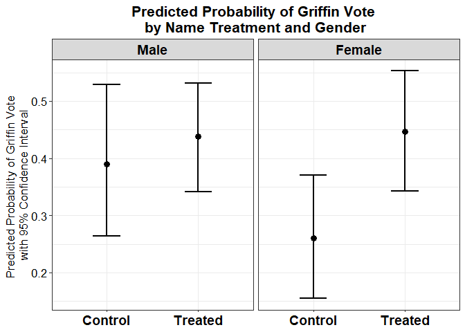
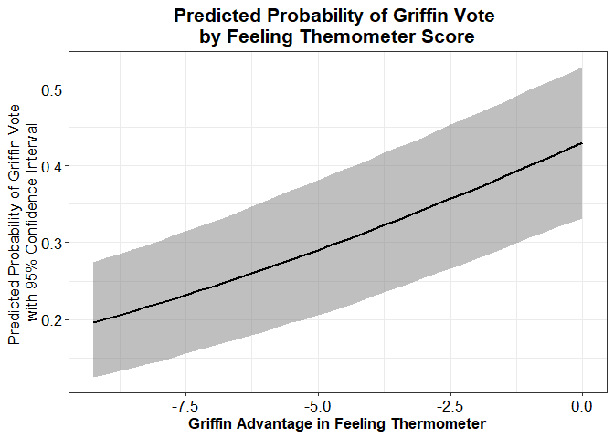

POL213 TA Session
================
Gento Kato
May 23, 2019

``` r
## Clear Workspace
rm(list = ls())

## Set Working Directory to the File location
## (If using RStudio, can be set automatically)
setwd(dirname(rstudioapi::getActiveDocumentContext()$path))
getwd()
```

    ## [1] "C:/GoogleDrive/Lectures/2019_04to06_UCD/POL213_TA/POL213_TA_resource"

``` r
## Required packages
library(ggplot2) # Plotting
library(faraway) # for ilogit function
library(pscl) # For pseudo R squared (pR2)
library(DAMisc) # For pre function
library(MASS) # For mvrnorm
library(readstata13)
```

Data Preparation (Experiment Data on Name Recognition)
------------------------------------------------------

For original article, See [HERE](https://onlinelibrary.wiley.com/doi/full/10.1111/ajps.12034)

``` r
# Import Data
d <- read.dta13("https://github.com/gentok/POL213_TA_Resource/raw/master/KamZechmeister_Study1.dta", 
                convert.factors = FALSE)
names(d)
```

    ##  [1] "cleansubject" "FTgriffin"    "FTwilliams"   "female"      
    ##  [5] "democrat"     "liberal"      "Asian"        "Black"       
    ##  [9] "Hispanic"     "age1"         "infoinst"     "namecond"    
    ## [13] "votegriffin"

``` r
# FT Griffin Advantage
d$FTgrifadv <- d$FTgriffin - d$FTwilliams
```

Run Logit Model
---------------

``` r
# Baseline Model
m1 <- glm(votegriffin ~ namecond + female + democrat + age1,
          data=d, family=binomial("logit"))
summary(m1)
```

    ## 
    ## Call:
    ## glm(formula = votegriffin ~ namecond + female + democrat + age1, 
    ##     family = binomial("logit"), data = d)
    ## 
    ## Deviance Residuals: 
    ##     Min       1Q   Median       3Q      Max  
    ## -1.1708  -1.0860  -0.8911   1.2579   1.5608  
    ## 
    ## Coefficients:
    ##             Estimate Std. Error z value Pr(>|z|)  
    ## (Intercept) -1.31176    1.50005  -0.874   0.3819  
    ## namecond     0.51313    0.21193   2.421   0.0155 *
    ## female      -0.14030    0.18513  -0.758   0.4485  
    ## democrat     0.10880    0.25731   0.423   0.6724  
    ## age1         0.03147    0.07406   0.425   0.6709  
    ## ---
    ## Signif. codes:  0 '***' 0.001 '**' 0.01 '*' 0.05 '.' 0.1 ' ' 1
    ## 
    ## (Dispersion parameter for binomial family taken to be 1)
    ## 
    ##     Null deviance: 672.46  on 493  degrees of freedom
    ## Residual deviance: 665.60  on 489  degrees of freedom
    ##   (16 observations deleted due to missingness)
    ## AIC: 675.6
    ## 
    ## Number of Fisher Scoring iterations: 4

``` r
# Interaction
m2 <- glm(votegriffin ~ namecond*female + democrat + age1,
          data=d, family=binomial("logit"))
summary(m2)
```

    ## 
    ## Call:
    ## glm(formula = votegriffin ~ namecond * female + democrat + age1, 
    ##     family = binomial("logit"), data = d)
    ## 
    ## Deviance Residuals: 
    ##     Min       1Q   Median       3Q      Max  
    ## -1.1470  -1.0912  -0.7989   1.2570   1.6781  
    ## 
    ## Coefficients:
    ##                 Estimate Std. Error z value Pr(>|z|)  
    ## (Intercept)     -1.08694    1.50925  -0.720   0.4714  
    ## namecond         0.20010    0.29073   0.688   0.4913  
    ## female          -0.63279    0.37171  -1.702   0.0887 .
    ## democrat         0.10630    0.25766   0.413   0.6799  
    ## age1             0.03192    0.07422   0.430   0.6671  
    ## namecond:female  0.65685    0.42741   1.537   0.1243  
    ## ---
    ## Signif. codes:  0 '***' 0.001 '**' 0.01 '*' 0.05 '.' 0.1 ' ' 1
    ## 
    ## (Dispersion parameter for binomial family taken to be 1)
    ## 
    ##     Null deviance: 672.46  on 493  degrees of freedom
    ## Residual deviance: 663.21  on 488  degrees of freedom
    ##   (16 observations deleted due to missingness)
    ## AIC: 675.21
    ## 
    ## Number of Fisher Scoring iterations: 4

``` r
# Some significant continous variable
m3 <- glm(votegriffin ~ FTgrifadv + democrat + age1, 
          data=d, family=binomial("logit")) 
summary(m3)
```

    ## 
    ## Call:
    ## glm(formula = votegriffin ~ FTgrifadv + democrat + age1, family = binomial("logit"), 
    ##     data = d)
    ## 
    ## Deviance Residuals: 
    ##     Min       1Q   Median       3Q      Max  
    ## -2.2143  -1.0044  -0.2084   0.8691   4.9977  
    ## 
    ## Coefficients:
    ##             Estimate Std. Error z value Pr(>|z|)    
    ## (Intercept) -1.83807    1.82811  -1.005    0.315    
    ## FTgrifadv    0.12390    0.01470   8.427   <2e-16 ***
    ## democrat     0.10823    0.31401   0.345    0.730    
    ## age1         0.07769    0.09194   0.845    0.398    
    ## ---
    ## Signif. codes:  0 '***' 0.001 '**' 0.01 '*' 0.05 '.' 0.1 ' ' 1
    ## 
    ## (Dispersion parameter for binomial family taken to be 1)
    ## 
    ##     Null deviance: 671.37  on 492  degrees of freedom
    ## Residual deviance: 480.92  on 489  degrees of freedom
    ##   (17 observations deleted due to missingness)
    ## AIC: 488.92
    ## 
    ## Number of Fisher Scoring iterations: 6

Coefficient Plot
----------------

Create Data Frames with Coefficient Values

``` r
(coef1 <- coef(m1)) # coefficient 
```

    ## (Intercept)    namecond      female    democrat        age1 
    ## -1.31175520  0.51313317 -0.14030440  0.10879807  0.03147236

``` r
(ci1 <- confint(m1, level=0.95)) # 95% confidence interval
```

    ## Waiting for profiling to be done...

    ##                  2.5 %    97.5 %
    ## (Intercept) -4.2642047 1.6265347
    ## namecond     0.1022384 0.9344562
    ## female      -0.5039014 0.2223796
    ## democrat    -0.3948480 0.6149439
    ## age1        -0.1138822 0.1769605

``` r
cdt1 <- as.data.frame(cbind(coef1, ci1)) # make it a data
colnames(cdt1) <- c("cf","lci","uci") # new names of data
cdt1$name <- "Baseline" # model name

(coef2 <- coef(m2)) # coefficient 
```

    ##     (Intercept)        namecond          female        democrat 
    ##     -1.08694127      0.20010087     -0.63279112      0.10629567 
    ##            age1 namecond:female 
    ##      0.03192175      0.65685184

``` r
(ci2 <- confint(m2, level=0.95)) # 95% confidence interval
```

    ## Waiting for profiling to be done...

    ##                      2.5 %    97.5 %
    ## (Intercept)     -4.0555095 1.8716372
    ## namecond        -0.3660095 0.7770202
    ## female          -1.3732813 0.0894243
    ## democrat        -0.3981180 0.6130615
    ## age1            -0.1137755 0.1777056
    ## namecond:female -0.1758926 1.5034098

``` r
cdt2 <- as.data.frame(cbind(coef2, ci2)) # make it a data
colnames(cdt2) <- c("cf","lci","uci") # new names of data
cdt2$name <- "Interaction" # model name
```

Set Variable Names

``` r
names(coef(m1)) # Check Original Names
```

    ## [1] "(Intercept)" "namecond"    "female"      "democrat"    "age1"

``` r
cdt1$vn <- c("(Intercept)","Name Treatment",
            "Gender (Female)","Democrat","Age")
names(coef(m2)) # Check Original Names
```

    ## [1] "(Intercept)"     "namecond"        "female"          "democrat"       
    ## [5] "age1"            "namecond:female"

``` r
cdt2$vn <- c("(Intercept)","Name Treatment",
             "Gender (Female)","Democrat","Age",
             "Treatment*Female")
```

Assign Order to Variable Names

``` r
levelset <- c("(Intercept)","Name Treatment",
              "Gender (Female)","Treatment*Female",
              "Democrat","Age")
cdt1$vn <- factor(cdt1$vn, levels = rev(levelset))
cdt2$vn <- factor(cdt2$vn, levels = rev(levelset))
```

-   The above code sets ordering of variable labels in the output <br>
-   Make sure to include all possible values appears in vn variable. <br>
-   level is reversed for the plotting purpose (because you flip plot later)

### Draw Plot (Model 1)

Optimized for Poster purposes

``` r
# Drop intercept from the output 
# (depending on your preference, you can drop ANY variables by its "vn" value)
cdt1x <- cdt1[!cdt1$vn %in% c("(Intercept)"),]

ggplot(cdt1x, aes(x=vn)) + 
   # data is cdt1x, y axis is variable name = vn (flip later)
  geom_point(aes(y=cf),size=3) + 
   # plot point estimate = cf
   # size to control point size
  geom_errorbar(aes(ymin=lci,ymax=uci),width=0.3, size = 1) + 
   # plot confidence interval (lower bound is lci, upper bound is uci)
   # size to control line width
   # width to control th height of vertical lines at the edges
  geom_hline(aes(yintercept=0), linetype=2, size=0.5) + 
   # horizontal line at 0
   # linetype to control form of line (2 is dashed)
   # size to control line width
  xlab(NULL) + 
   # no grand label for variables
  ylab("Coefficient with 95% Confidence Interval") + 
   # Label for x axis (for coefficient value)
  ggtitle("The Effect of Name Treatment on Griffin Vote") + 
   # Title (if not needed, use NULL)
  coord_flip() + 
   # Flip Plot 
  theme_bw() + 
  theme(plot.title = element_text(size=16, face="bold", hjust=0.5),
         # plot title setting (ggtitle argument)
        axis.title.x = element_text(size=13, face="plain", hjust=0.5),
         # x axis title setting 
        axis.text.y = element_text(size=13, face="bold", color="black", hjust=1),
         # y axis labels (variables)
        axis.text.x = element_text(size=13, face="plain", color="black",hjust=0.5)
         # x axis labels (coefficient values)
        )
```


### Draw Plot (Model 2)

Optimized for Paper purposes

``` r
# Drop intercept from the output 
# (depending on your preference, you can drop ANY variables by its "vn" value)
# (If You don't want to drop any variables, delete this line)
cdt2x <- cdt2[!cdt2$vn %in% c("(Intercept)"),]

ggplot(cdt2x, aes(x=vn)) + 
  # data is cdt2x, y axis is variable name = vn (flip later)
  geom_point(aes(y=cf),size=2) + 
  # plot point estimate = cf
  # size to control point size
  geom_errorbar(aes(ymin=lci,ymax=uci),width=0.3, size = 0.5) + 
  # plot confidence interval (lower bound is lci, upper bound is uci)
  # size to control line width
  # width to control th height of vertical lines at the edges
  geom_hline(aes(yintercept=0), linetype=2, size=0.5) + 
  # horizontal line at 0
  # linetype to control form of line (2 is dashed)
  # size to control line width
  xlab(NULL) + 
  # no grand label for variables
  ylab("Coefficient with 95% Confidence Interval") + 
  # Label for x axis (for coefficient value)
  ggtitle("The Effect of Name Treatment on Griffin Vote") + 
  # Title (if not needed, use NULL)
  coord_flip() + 
  # Flip Plot 
  theme_bw() + 
  theme(plot.title = element_text(size=13, face="bold", hjust=0.5),
        # plot title setting (ggtitle argument)
        axis.title.x = element_text(size=11, face="plain", hjust=0.5),
        # x axis title setting 
        axis.text.y = element_text(size=11, face="plain", color="black", hjust=1),
        # y axis labels (variables)
        axis.text.x = element_text(size=11, face="plain", color="black",hjust=0.5)
        # x axis labels (coefficient values)
  )
```


Draw Plot (Two Models Side by Side)

Optimized for Paper purposes

``` r
# Combine data of two models
cdt <- rbind(cdt1, cdt2)

# Drop intercept from the output 
# (depending on your preference, you can drop ANY variables by its "vn" value)
# (If You don't want to drop any variables, delete this line)
cdtx <- cdt[!cdt$vn %in% c("(Intercept)"),]

ggplot(cdtx, aes(x=vn)) + 
  # data is cdtx, y axis is variable name = vn (flip later)
  geom_point(aes(y=cf),size=2) + 
  # plot point estimate = cf
  # size to control point size
  geom_errorbar(aes(ymin=lci,ymax=uci),width=0.3, size = 0.5) + 
  # plot confidence interval (lower bound is lci, upper bound is uci)
  # size to control line width
  # width to control th height of vertical lines at the edges
  geom_hline(aes(yintercept=0), linetype=2, size=0.5) + 
  # horizontal line at 0
  # linetype to control form of line (2 is dashed)
  # size to control line width
  facet_grid(. ~ name) +
  # facetting by the model name (name is the model variable created in the data)
  xlab(NULL) + 
  # no grand label for variables
  ylab("Coefficient with 95% Confidence Interval") + 
  # Label for x axis (for coefficient value)
  ggtitle("The Effect of Name Treatment on Griffin Vote") + 
  # Title (if not needed, use NULL)
  coord_flip() + 
  # Flip Plot 
  theme_bw() + 
  theme(plot.title = element_text(size=13, face="bold", hjust=0.5),
        # plot title setting (ggtitle argument)
        axis.title.x = element_text(size=11, face="plain", hjust=0.5),
        # x axis title setting 
        axis.text.y = element_text(size=11, face="plain", color="black", hjust=1),
        # y axis labels (variables)
        axis.text.x = element_text(size=11, face="plain", color="black",hjust=0.5),
        # x axis labels (coefficient values)
        strip.text = element_text(size=11, face="bold", color="black", hjust=0.5)
        # facet strip texts
  )
```


### Draw Plot (Two Models in the same plot, with different linetype)

Optimized for Paper purposes

``` r
## use the same data (i.e., cdtx) as the previous plot.

ggplot(cdtx, aes(x=vn)) + 
  # data is cdtx, y axis is variable name = vn (flip later)
  geom_point(aes(y=cf,shape=name), size=2, 
             position=position_dodge(width=-0.5)) + 
  # plot point estimate = cf
  # point shape is differentiated by "name" == model name
  # size to control point size
  # position_dodge width to control space between two points in the same row.
  geom_errorbar(aes(ymin=lci,ymax=uci,linetype=name),width=0.3, size = 0.5,
                position=position_dodge(width=-0.5)) + 
  # plot confidence interval (lower bound is lci, upper bound is uci)
  # linetype is differentiated by "name" == model name
  # size to control line width
  # width to control th height of vertical lines at the edges
  # position_dodge width to control space between two lines in the same row.
  geom_hline(aes(yintercept=0), linetype=2, size=0.5) + 
  # horizontal line at 0
  # linetype to control form of line (2 is dashed)
  # size to control line width
  scale_shape_discrete(name="Model Name") + 
  # Legend Title for Point Shape
  scale_linetype_discrete(name="Model Name") + 
  # Legend Title for Line Type
  xlab(NULL) + 
  # no grand label for variables
  ylab("Coefficient with 95% Confidence Interval") + 
  # Label for x axis (for coefficient value)
  ggtitle("The Effect of Name Treatment on Griffin Vote") + 
  # Title (if not needed, use NULL)
  coord_flip() + 
  # Flip Plot 
  theme_bw() + 
  theme(plot.title = element_text(size=13, face="bold", hjust=0.5),
        # plot title setting (ggtitle argument)
        axis.title.x = element_text(size=11, face="plain", hjust=0.5),
        # x axis title setting 
        axis.text.y = element_text(size=11, face="plain", color="black", hjust=1),
        # y axis labels (variables)
        axis.text.x = element_text(size=11, face="plain", color="black",hjust=0.5),
        # x axis labels (coefficient values)
        strip.text = element_text(size=11, face="bold", color="black", hjust=0.5),
        # facet strip texts
        legend.title = element_text(size=11, face="plain", color="black",hjust=0.5),
        # legend title text
        legend.text = element_text(size=11, face="plain", color="black",hjust=0.5),
        # legend label text
        legend.position = "top"
        # legend position. You can use "top","bottom","right","left"/like c(0.1,0.1)
  )
```

    ## Warning: position_dodge requires non-overlapping x intervals


Odds Ratio Plot
---------------

Easy. Just convert each variable by exponentiating them.

### For Model 1 (Optimized for Poster)

``` r
# Use the same data cdt1x.

ggplot(cdt1x, aes(x=vn)) + 
  # data is cdt1x, y axis is variable name = vn (flip later)
  geom_point(aes(y=exp(cf)),size=3) + 
  # plot odds ratio point estimate = exp(cf)
  # size to control point size
  geom_errorbar(aes(ymin=exp(lci),ymax=exp(uci)),width=0.3, size = 1) + 
  # plot confidence interval (lower bound is exp(lci), upper bound is exp(uci))
  # size to control line width
  # width to control th height of vertical lines at the edges
  geom_hline(aes(yintercept=1), linetype=2, size=0.5) + 
  # horizontal line at 1
  # linetype to control form of line (2 is dashed)
  # size to control line width
  xlab(NULL) + 
  # no grand label for variables
  ylab("Odds Ratio with 95% Confidence Interval") + 
  # Label for x axis (for coefficient value)
  ggtitle("The Effect of Name Treatment on Griffin Vote") + 
  # Title (if not needed, use NULL)
  coord_flip() + 
  # Flip Plot 
  theme_bw() + 
  theme(plot.title = element_text(size=16, face="bold", hjust=0.5),
        # plot title setting (ggtitle argument)
        axis.title.x = element_text(size=13, face="plain", hjust=0.5),
        # x axis title setting 
        axis.text.y = element_text(size=13, face="bold", color="black", hjust=1),
        # y axis labels (variables)
        axis.text.x = element_text(size=13, face="plain", color="black",hjust=0.5)
        # x axis labels (coefficient values)
  )
```


Plotting First Differences of Predicted Probabilities
-----------------------------------------------------

use model 2 to compare experiment conditions by gender

### Creating Data

Using custom function (for logit)

``` r
# function
logisprob <- function(model,profile,ndraws=1000,cilevel=0.95) {
  # Draw Beta Coefficients
  betadraw <- mvrnorm(ndraws, coef(model), vcov(model))
  # Matrix multiply profile and coefficients
  profile_beta <- as.matrix(profile) %*% t(betadraw)
  # Calculate probability
  profile_prob <- exp(profile_beta) / (1 + exp(profile_beta))
  # Summarize
  meanprob <- rowMeans(profile_prob)
  sdprob <- apply(profile_prob, 1, sd)
  qtprob <- t(apply(profile_prob, 1, quantile, probs=c(0.5,(1-cilevel)/2,1 - (1-cilevel)/2)))
  res <- as.data.frame(cbind(meanprob,sdprob,qtprob))
  colnames(res) <- c("mean","se","median","lci","uci")
  # Return summary
  return(res)
}

# profiles
coef(m2) # check the list of coefficients
```

    ##     (Intercept)        namecond          female        democrat 
    ##     -1.08694127      0.20010087     -0.63279112      0.10629567 
    ##            age1 namecond:female 
    ##      0.03192175      0.65685184

``` r
# male, control (non-democrat, age=20)
profile1 <- c(1,0,0,0,20,0)
# male, treated (non-democrat, age=20)
profile2 <- c(1,1,0,0,20,0)
# female control (non-democrat, age=20)
profile3 <- c(1,0,1,0,20,0)
# female, treated (non-democrat, age=20)
profile4 <- c(1,1,1,0,20,1)
# combine all profiles
(profile1to4 <- rbind(profile1,profile2,profile3,profile4))
```

    ##          [,1] [,2] [,3] [,4] [,5] [,6]
    ## profile1    1    0    0    0   20    0
    ## profile2    1    1    0    0   20    0
    ## profile3    1    0    1    0   20    0
    ## profile4    1    1    1    0   20    1

``` r
# simulate
set.seed(34)
(predres <- logisprob(m2, profile1to4))
```

    ##               mean         se    median       lci       uci
    ## profile1 0.3901160 0.06600733 0.3899043 0.2635794 0.5288526
    ## profile2 0.4387072 0.04967099 0.4385689 0.3409309 0.5307094
    ## profile3 0.2602351 0.05648573 0.2587888 0.1549246 0.3703849
    ## profile4 0.4467991 0.05270578 0.4447273 0.3426820 0.5527031

Using zelig

``` r
require(Zelig)
m2z <- zelig(votegriffin ~ namecond*female + democrat + age1,
             data=d, model="logit")
```

    ## How to cite this model in Zelig:
    ##   R Core Team. 2007.
    ##   logit: Logistic Regression for Dichotomous Dependent Variables
    ##   in Christine Choirat, Christopher Gandrud, James Honaker, Kosuke Imai, Gary King, and Olivia Lau,
    ##   "Zelig: Everyone's Statistical Software," http://zeligproject.org/

``` r
summary(m2z)
```

    ## Model: 
    ## 
    ## Call:
    ## z5$zelig(formula = votegriffin ~ namecond * female + democrat + 
    ##     age1, data = d)
    ## 
    ## Deviance Residuals: 
    ##     Min       1Q   Median       3Q      Max  
    ## -1.1470  -1.0912  -0.7989   1.2570   1.6781  
    ## 
    ## Coefficients:
    ##                 Estimate Std. Error z value Pr(>|z|)
    ## (Intercept)     -1.08694    1.50925  -0.720   0.4714
    ## namecond         0.20010    0.29073   0.688   0.4913
    ## female          -0.63279    0.37171  -1.702   0.0887
    ## democrat         0.10630    0.25766   0.413   0.6799
    ## age1             0.03192    0.07422   0.430   0.6671
    ## namecond:female  0.65685    0.42741   1.537   0.1243
    ## 
    ## (Dispersion parameter for binomial family taken to be 1)
    ## 
    ##     Null deviance: 672.46  on 493  degrees of freedom
    ## Residual deviance: 663.21  on 488  degrees of freedom
    ##   (16 observations deleted due to missingness)
    ## AIC: 675.21
    ## 
    ## Number of Fisher Scoring iterations: 4
    ## 
    ## Next step: Use 'setx' method

``` r
# Create Profiles
profile1z <- setx(m2z, namecond=0, female=0, democrat=0, age1=20)
profile2z <- setx(m2z, namecond=1, female=0, democrat=0, age1=20)
profile3z <- setx(m2z, namecond=0, female=1, democrat=0, age1=20)
profile4z <- setx(m2z, namecond=1, female=1, democrat=0, age1=20)

# Prediction
set.seed(34)
pred1z <- sim(m2z, x = profile1z)
set.seed(34)
pred2z <- sim(m2z, x = profile2z)
set.seed(34)
pred3z <- sim(m2z, x = profile3z)
set.seed(34)
pred4z <- sim(m2z, x = profile4z)

# Extract Simulation Ouput
profile_prob <- rbind(as.numeric(pred1z$sim.out$x$ev[[1]]),
                      as.numeric(pred2z$sim.out$x$ev[[1]]),
                      as.numeric(pred3z$sim.out$x$ev[[1]]),
                      as.numeric(pred4z$sim.out$x$ev[[1]]))
# Summarize
meanprob <- rowMeans(profile_prob)
sdprob <- apply(profile_prob, 1, sd)
qtprob <- t(apply(profile_prob, 1, quantile, probs=c(0.5,0.025,0.975)))
predresz <- as.data.frame(cbind(meanprob,sdprob,qtprob))
colnames(predresz) <- c("mean","se","median","lci","uci")
predresz
```

    ##        mean         se    median       lci       uci
    ## 1 0.3901160 0.06600733 0.3899043 0.2635794 0.5288526
    ## 2 0.4387072 0.04967099 0.4385689 0.3409309 0.5307094
    ## 3 0.2602351 0.05648573 0.2587888 0.1549246 0.3703849
    ## 4 0.4467991 0.05270578 0.4447273 0.3426820 0.5527031

``` r
# Zelig results look the same as custom results
predresz-predres
```

    ##   mean se median           lci uci
    ## 1    0  0      0  0.000000e+00   0
    ## 2    0  0      0 -5.551115e-17   0
    ## 3    0  0      0  0.000000e+00   0
    ## 4    0  0      0 -5.551115e-17   0

### Bar Plot

``` r
# Use predres data
# add variables that describes each profile
# * first two profiles are male, next two profiles are female
predres$gender <- factor(c("Male","Male","Female","Female"),
                          levels=c("Male","Female"))
# * second and fourth profiles are treated, first and third profiles are not.
predres$treatment <- factor(c("Control","Treated","Control","Treated"),
                             levels=c("Control","Treated"))

# plot (optimized for poster)
ggplot(predres, aes(y=mean, x=treatment)) + 
  # data is predres, 
  # y axis is mean predicted probability = mean
  # x axis is treatment groups
  geom_bar(stat="identity", fill="gray40") + 
  # stat allows you to plot value as it is (not aggregating)
  geom_errorbar(aes(ymin=lci,ymax=uci),width=0.3, size = 0.75) + 
  # plot confidence interval (lower bound is lci, upper bound is uci)
  # size to control line width
  # width to control th height of vertical lines at the edges
  facet_grid(. ~ gender) +
  # facetting by gender
  xlab(NULL) + 
  # Label for x axis # Null if not needed
  ylab("Predicted Probability of Griffin Vote \nwith 95% Confidence Interval") + 
  # Label for y axis
  ggtitle("Predicted Probability of Griffin Vote \nby Name Treatment and Gender") + 
  # Title (if not needed, use NULL)
  theme_bw() + 
  theme(plot.title = element_text(size=16, face="bold", hjust=0.5),
        # plot title setting (ggtitle argument)
        axis.title.x = element_text(size=13, face="plain", hjust=0.5),
        # x axis title setting 
        axis.title.y = element_text(size=13, face="plain", hjust=0.5),
        # y axis title setting 
        axis.text.y = element_text(size=13, face="plain", color="black", hjust=1),
        # y axis labels (variables)
        axis.text.x = element_text(size=14, face="bold", color="black",hjust=0.5),
        # x axis labels (coefficient values)
        strip.text = element_text(size=14, face="bold", color="black", hjust=0.5)
        # facet strip texts
        )
```


### Point Plot (Notice that scale changes in the y axis)

``` r
# Use predresz (zelig) data
# add variables that describes each profile
# * first two profiles are male, next two profiles are female
predresz$gender <- factor(c("Male","Male","Female","Female"),
                         levels=c("Male","Female"))
# * second and fourth profiles are treated, first and third profiles are not.
predresz$treatment <- factor(c("Control","Treated","Control","Treated"),
                            levels=c("Control","Treated"))

# plot (optimized for poster)
ggplot(predresz, aes(y=mean, x=treatment)) + 
  # data is predres, 
  # y axis is mean predicted probability = mean
  # x axis is treatment groups
  geom_point(size=3) + 
  # size to control point size
  geom_errorbar(aes(ymin=lci,ymax=uci),width=0.3, size = 0.75) + 
  # plot confidence interval (lower bound is lci, upper bound is uci)
  # size to control line width
  # width to control th height of vertical lines at the edges
  facet_grid(. ~ gender) +
  # facetting by gender
  xlab(NULL) + 
  # Label for x axis # Null if not needed
  ylab("Predicted Probability of Griffin Vote \nwith 95% Confidence Interval") + 
  # Label for y axis
  ggtitle("Predicted Probability of Griffin Vote \nby Name Treatment and Gender") + 
  # Title (if not needed, use NULL)
  theme_bw() + 
  theme(plot.title = element_text(size=16, face="bold", hjust=0.5),
        # plot title setting (ggtitle argument)
        axis.title.x = element_text(size=13, face="plain", hjust=0.5),
        # x axis title setting 
        axis.title.y = element_text(size=13, face="plain", hjust=0.5),
        # y axis title setting 
        axis.text.y = element_text(size=13, face="plain", color="black", hjust=1),
        # y axis labels (variables)
        axis.text.x = element_text(size=14, face="bold", color="black",hjust=0.5),
        # x axis labels (coefficient values)
        strip.text = element_text(size=14, face="bold", color="black", hjust=0.5)
        # facet strip texts
  )
```



Plotting Predicted Probabilities by Continuous Variable
-------------------------------------------------------

### Creating Data

Use model 3

Use custom function (already created)

``` r
# profile
coef(m3) # check coefficients
```

    ## (Intercept)   FTgrifadv    democrat        age1 
    ## -1.83807261  0.12389979  0.10822762  0.07768711

``` r
# move FTgrifadv from its 25%tile to 75%tile
quantile(d$FTgrifadv, probs=c(0.25,0.75), na.rm = TRUE)
```

    ##   25%   75% 
    ## -9.25  0.00

``` r
# create profile (fixed to non-democrat, age 20)
(profile5 <- data.frame(X0=1,X1=seq(-9.25,0.00,by=0.25),X2=0,X3=20))
```

    ##    X0    X1 X2 X3
    ## 1   1 -9.25  0 20
    ## 2   1 -9.00  0 20
    ## 3   1 -8.75  0 20
    ## 4   1 -8.50  0 20
    ## 5   1 -8.25  0 20
    ## 6   1 -8.00  0 20
    ## 7   1 -7.75  0 20
    ## 8   1 -7.50  0 20
    ## 9   1 -7.25  0 20
    ## 10  1 -7.00  0 20
    ## 11  1 -6.75  0 20
    ## 12  1 -6.50  0 20
    ## 13  1 -6.25  0 20
    ## 14  1 -6.00  0 20
    ## 15  1 -5.75  0 20
    ## 16  1 -5.50  0 20
    ## 17  1 -5.25  0 20
    ## 18  1 -5.00  0 20
    ## 19  1 -4.75  0 20
    ## 20  1 -4.50  0 20
    ## 21  1 -4.25  0 20
    ## 22  1 -4.00  0 20
    ## 23  1 -3.75  0 20
    ## 24  1 -3.50  0 20
    ## 25  1 -3.25  0 20
    ## 26  1 -3.00  0 20
    ## 27  1 -2.75  0 20
    ## 28  1 -2.50  0 20
    ## 29  1 -2.25  0 20
    ## 30  1 -2.00  0 20
    ## 31  1 -1.75  0 20
    ## 32  1 -1.50  0 20
    ## 33  1 -1.25  0 20
    ## 34  1 -1.00  0 20
    ## 35  1 -0.75  0 20
    ## 36  1 -0.50  0 20
    ## 37  1 -0.25  0 20
    ## 38  1  0.00  0 20

``` r
# Make predicton
(predres5 <- logisprob(m3,profile5))
```

    ##         mean         se    median       lci       uci
    ## 1  0.1958430 0.03944642 0.1943288 0.1248335 0.2746706
    ## 2  0.2006726 0.03986944 0.1994487 0.1286783 0.2799970
    ## 3  0.2055927 0.04028964 0.2043981 0.1328835 0.2853861
    ## 4  0.2106035 0.04070684 0.2096585 0.1372090 0.2908371
    ## 5  0.2157052 0.04112084 0.2146960 0.1416704 0.2963489
    ## 6  0.2208979 0.04153147 0.2200076 0.1454662 0.3021535
    ## 7  0.2261814 0.04193853 0.2250960 0.1501106 0.3084004
    ## 8  0.2315557 0.04234188 0.2305880 0.1551564 0.3147182
    ## 9  0.2370204 0.04274132 0.2364141 0.1603550 0.3211054
    ## 10 0.2425753 0.04313670 0.2420091 0.1655158 0.3271730
    ## 11 0.2482200 0.04352787 0.2478892 0.1701899 0.3329870
    ## 12 0.2539538 0.04391466 0.2538471 0.1744272 0.3395739
    ## 13 0.2597762 0.04429693 0.2595334 0.1789783 0.3463571
    ## 14 0.2656864 0.04467454 0.2652870 0.1845762 0.3535755
    ## 15 0.2716835 0.04504735 0.2713133 0.1903089 0.3608917
    ## 16 0.2777666 0.04541521 0.2776137 0.1954976 0.3677497
    ## 17 0.2839345 0.04577801 0.2836451 0.2000116 0.3747018
    ## 18 0.2901861 0.04613561 0.2899224 0.2055961 0.3817111
    ## 19 0.2965200 0.04648789 0.2964096 0.2103400 0.3885402
    ## 20 0.3029348 0.04683473 0.3028734 0.2157551 0.3951990
    ## 21 0.3094289 0.04717600 0.3092790 0.2222004 0.4018793
    ## 22 0.3160007 0.04751159 0.3161215 0.2287963 0.4086153
    ## 23 0.3226484 0.04784139 0.3229302 0.2353288 0.4169058
    ## 24 0.3293699 0.04816526 0.3297620 0.2413625 0.4238447
    ## 25 0.3361634 0.04848310 0.3365673 0.2475530 0.4301842
    ## 26 0.3430266 0.04879478 0.3432459 0.2538023 0.4376152
    ## 27 0.3499573 0.04910018 0.3502117 0.2601547 0.4459472
    ## 28 0.3569531 0.04939917 0.3574171 0.2666094 0.4532899
    ## 29 0.3640115 0.04969162 0.3646390 0.2724181 0.4608114
    ## 30 0.3711300 0.04997739 0.3717992 0.2786104 0.4679702
    ## 31 0.3783057 0.05025634 0.3787930 0.2851881 0.4753690
    ## 32 0.3855359 0.05052832 0.3859192 0.2922587 0.4827431
    ## 33 0.3928178 0.05079317 0.3937378 0.2992900 0.4902801
    ## 34 0.4001482 0.05105074 0.4015129 0.3061938 0.4984765
    ## 35 0.4075242 0.05130084 0.4087723 0.3125830 0.5054029
    ## 36 0.4149424 0.05154330 0.4162719 0.3193694 0.5129773
    ## 37 0.4223998 0.05177792 0.4237496 0.3256003 0.5205258
    ## 38 0.4298930 0.05200452 0.4313576 0.3315063 0.5283535

### Line Plot

``` r
# Add variable that describes profile
# * the moving parameter ftgrifadv. add it to predres
predres5$FTgrifadv <- seq(-9.25,0.00,by=0.25)

# plot (optimized for poster)
ggplot(predres5, aes(y=mean, x=FTgrifadv)) + 
  # data is predres, 
  # y axis is mean predicted probability = mean
  # x axis is Griffin advantage in FT FTgrifadv
  geom_ribbon(aes(ymin=lci,ymax=uci),fill="gray50", alpha = 0.5) + 
  # plot confidence interval (lower bound is lci, upper bound is uci)
  # alpha to control transparency
  # fill to control filling color
  geom_line(size=1) + 
  # size to control line width
  xlab("Griffin Advantage in Feeling Thermometer") + 
  # Label for x axis # Null if not needed
  ylab("Predicted Probability of Griffin Vote \nwith 95% Confidence Interval") + 
  # Label for y axis
  ggtitle("Predicted Probability of Griffin Vote \nby Feeling Themometer Score") + 
  # Title (if not needed, use NULL)
  theme_bw() + 
  theme(plot.title = element_text(size=16, face="bold", hjust=0.5),
        # plot title setting (ggtitle argument)
        axis.title.x = element_text(size=13, face="bold", hjust=0.5),
        # x axis title setting 
        axis.title.y = element_text(size=13, face="plain", hjust=0.5),
        # y axis title setting 
        axis.text.y = element_text(size=13, face="plain", color="black", hjust=1),
        # y axis labels (variables)
        axis.text.x = element_text(size=13, face="plain", color="black",hjust=0.5)
        # x axis labels (coefficient values)
  )
```


