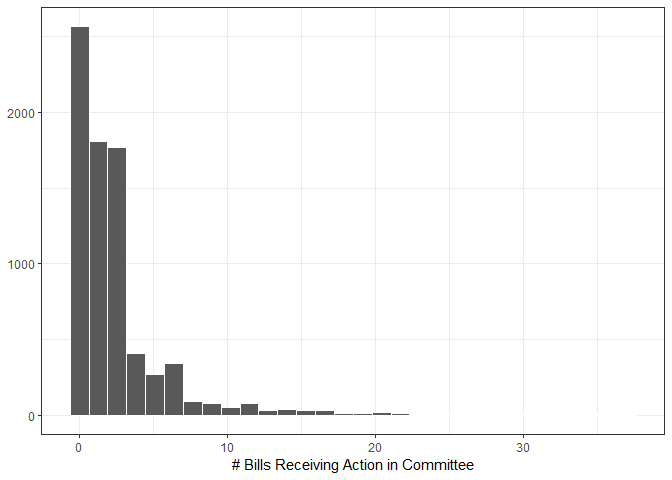
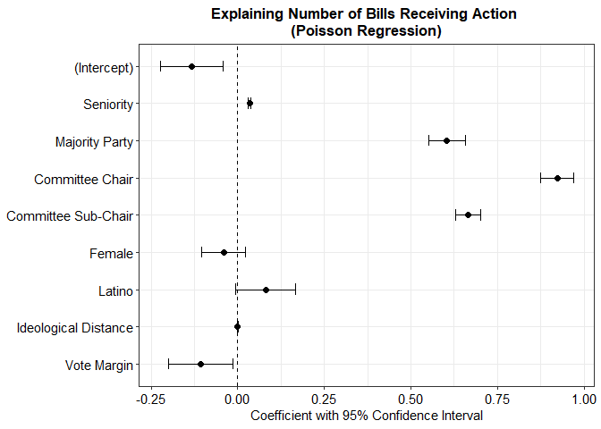
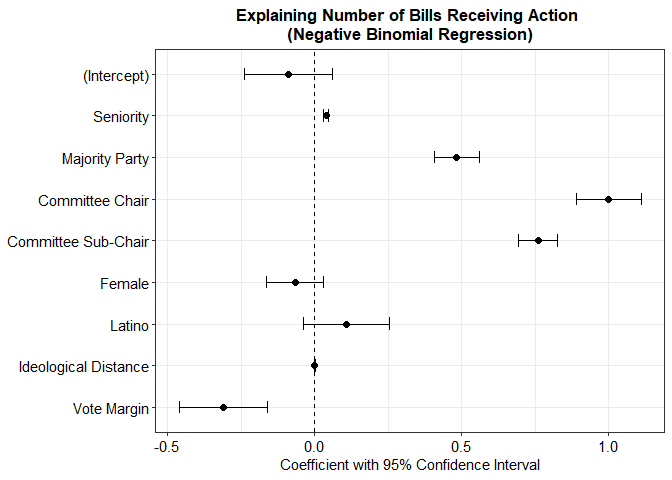
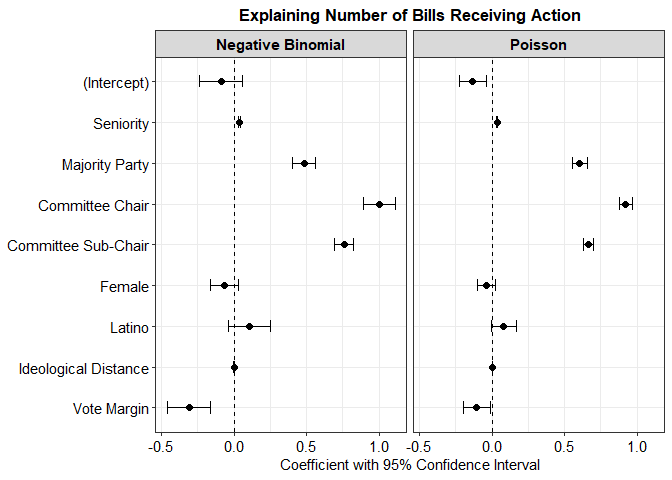
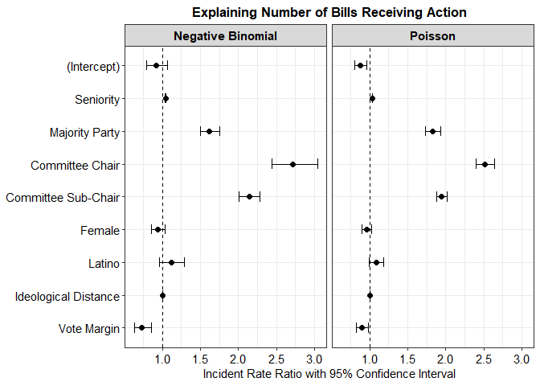
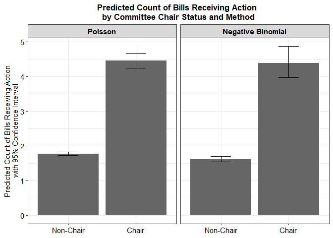
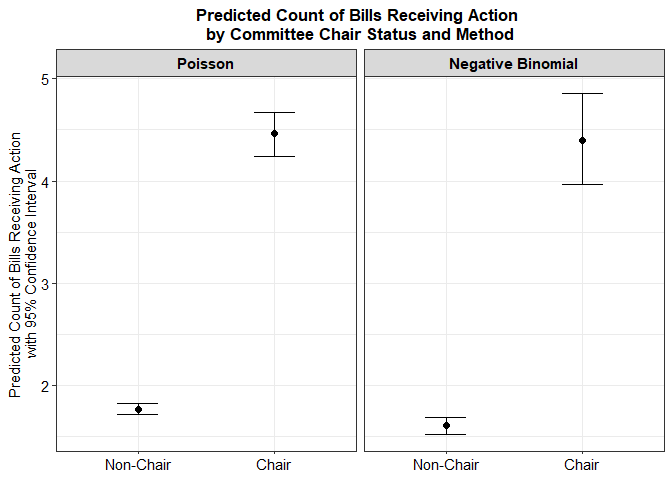

POL213 TA Session
================
Gento Kato
JUne 5, 2019

``` r
## Clear Workspace
rm(list = ls())

## Set Working Directory to the File location
## (If using RStudio, can be set automatically)
setwd(dirname(rstudioapi::getActiveDocumentContext()$path))
getwd()
```

    ## [1] "C:/GoogleDrive/Lectures/2019_04to06_UCD/POL213_TA/POL213_TA_resource"

``` r
## Required packages
library(ggplot2) # Plotting
library(faraway) # for ilogit function
library(pscl) # For pseudo R squared (pR2)
library(DAMisc) # For pre function
library(MASS) # For mvrnorm & glm.nb
```

Data Preparation (Bill Data Described in Session 7)
---------------------------------------------------

``` r
## Read in data
d <- read.table("bills_93_110.txt", header=TRUE, sep="\t")
# Subset Columns
d <- d[,c("all_bills","all_aic","seniority","majority","chair","subchr",
          "female","latino","meddist","votepct")]
# Rename Columns
colnames(d) <- c("bills", "action", "seniority", "majority", "chair", "subchair", 
                 "female", "latino", "distance", "margin")

## Histogram of DV
ggplot(d, aes(action)) + geom_histogram(color="white") + 
  theme_bw() + ylab(NULL) + 
  xlab("# Bills Receiving Action in Committee") 
```

    ## `stat_bin()` using `bins = 30`. Pick better value with `binwidth`.



``` r
## Set Model Formula
fm <- formula(action ~ seniority + majority + chair + subchair + 
                female + latino + margin + distance)

## Store Independent Variables Meaningful Labels (with Intercept)
vn <- c("(Intercept)", "Seniority", "Majority Party", 
        "Committee Chair", "Committee Sub-Chair",
        "Female","Latino","Ideological Distance","Vote Margin")
```

Run Poisson & Negative Binomial Model
-------------------------------------

``` r
# Poisson
m1 <- glm(fm, data=d, family=poisson)
summary(m1)
```

    ## 
    ## Call:
    ## glm(formula = fm, family = poisson, data = d)
    ## 
    ## Deviance Residuals: 
    ##     Min       1Q   Median       3Q      Max  
    ## -5.0248  -1.4177  -0.5502   0.4294   9.8658  
    ## 
    ## Coefficients:
    ##               Estimate Std. Error z value Pr(>|z|)    
    ## (Intercept) -1.335e-01  4.649e-02  -2.871  0.00409 ** 
    ## seniority    3.434e-02  2.045e-03  16.791  < 2e-16 ***
    ## majority     6.044e-01  2.680e-02  22.554  < 2e-16 ***
    ## chair        9.228e-01  2.419e-02  38.150  < 2e-16 ***
    ## subchair     6.655e-01  1.883e-02  35.345  < 2e-16 ***
    ## female      -4.030e-02  3.207e-02  -1.257  0.20880    
    ## latino       8.095e-02  4.385e-02   1.846  0.06488 .  
    ## margin      -2.084e-05  5.519e-04  -0.038  0.96989    
    ## distance    -1.068e-01  4.736e-02  -2.256  0.02405 *  
    ## ---
    ## Signif. codes:  0 '***' 0.001 '**' 0.01 '*' 0.05 '.' 0.1 ' ' 1
    ## 
    ## (Dispersion parameter for poisson family taken to be 1)
    ## 
    ##     Null deviance: 28287  on 7640  degrees of freedom
    ## Residual deviance: 18508  on 7632  degrees of freedom
    ## AIC: 32635
    ## 
    ## Number of Fisher Scoring iterations: 5

``` r
# Negative Binomial
m2 <- glm.nb(fm, data = d)
summary(m2)
```

    ## 
    ## Call:
    ## glm.nb(formula = fm, data = d, init.theta = 1.457138197, link = log)
    ## 
    ## Deviance Residuals: 
    ##     Min       1Q   Median       3Q      Max  
    ## -2.6377  -1.1930  -0.3318   0.2785   4.3249  
    ## 
    ## Coefficients:
    ##               Estimate Std. Error z value Pr(>|z|)    
    ## (Intercept) -0.0894273  0.0751903  -1.189    0.234    
    ## seniority    0.0393334  0.0037616  10.457  < 2e-16 ***
    ## majority     0.4830262  0.0395196  12.222  < 2e-16 ***
    ## chair        1.0003095  0.0547132  18.283  < 2e-16 ***
    ## subchair     0.7603203  0.0337618  22.520  < 2e-16 ***
    ## female      -0.0657570  0.0497208  -1.323    0.186    
    ## latino       0.1079821  0.0743259   1.453    0.146    
    ## margin       0.0004188  0.0009562   0.438    0.661    
    ## distance    -0.3105896  0.0764525  -4.063 4.85e-05 ***
    ## ---
    ## Signif. codes:  0 '***' 0.001 '**' 0.01 '*' 0.05 '.' 0.1 ' ' 1
    ## 
    ## (Dispersion parameter for Negative Binomial(1.4571) family taken to be 1)
    ## 
    ##     Null deviance: 11706.7  on 7640  degrees of freedom
    ## Residual deviance:  8134.5  on 7632  degrees of freedom
    ## AIC: 27829
    ## 
    ## Number of Fisher Scoring iterations: 1
    ## 
    ## 
    ##               Theta:  1.4571 
    ##           Std. Err.:  0.0461 
    ## 
    ##  2 x log-likelihood:  -27809.4390

Coefficient Table
-----------------

``` r
require(texreg)

# Exporting to R Console
screenreg(list(m1,m2), 
          digits = 3, single.row = TRUE,
          custom.coef.names = vn,
          custom.model.names = c("Poisson","Negative Binomial"))
```

    ## 
    ## ====================================================================
    ##                       Poisson                 Negative Binomial     
    ## --------------------------------------------------------------------
    ## (Intercept)               -0.133 (0.046) **       -0.089 (0.075)    
    ## Seniority                  0.034 (0.002) ***       0.039 (0.004) ***
    ## Majority Party             0.604 (0.027) ***       0.483 (0.040) ***
    ## Committee Chair            0.923 (0.024) ***       1.000 (0.055) ***
    ## Committee Sub-Chair        0.666 (0.019) ***       0.760 (0.034) ***
    ## Female                    -0.040 (0.032)          -0.066 (0.050)    
    ## Latino                     0.081 (0.044)           0.108 (0.074)    
    ## Ideological Distance      -0.000 (0.001)           0.000 (0.001)    
    ## Vote Margin               -0.107 (0.047) *        -0.311 (0.076) ***
    ## --------------------------------------------------------------------
    ## AIC                    32635.122               27829.439            
    ## BIC                    32697.593               27898.852            
    ## Log Likelihood        -16308.561              -13904.720            
    ## Deviance               18507.855                8134.546            
    ## Num. obs.               7641                    7641                
    ## ====================================================================
    ## *** p < 0.001, ** p < 0.01, * p < 0.05

``` r
# Write as Word Document
htmlreg(list(m1,m2), 
          digits = 3, single.row = TRUE,
          custom.coef.names = vn,
          custom.model.names = c("Poisson","Negative Binomial"),
        file = "countrestab.doc")
```

    ## The table was written to the file 'countrestab.doc'.

Model Fit
---------

-   Log-likelihood Ratio Test

``` r
# Null Models
m0p <- glm(action ~ 1, data = d, family = poisson)
m0nb <- glm.nb(action ~ 1, data = d)

require(lmtest)
lrtest(m1, m0p) # Poisson
```

    ## Likelihood ratio test
    ## 
    ## Model 1: action ~ seniority + majority + chair + subchair + female + latino + 
    ##     margin + distance
    ## Model 2: action ~ 1
    ##   #Df LogLik Df  Chisq Pr(>Chisq)    
    ## 1   9 -16309                         
    ## 2   1 -21198 -8 9779.4  < 2.2e-16 ***
    ## ---
    ## Signif. codes:  0 '***' 0.001 '**' 0.01 '*' 0.05 '.' 0.1 ' ' 1

``` r
lrtest(m2, m0nb) # Negative Binomial
```

    ## Likelihood ratio test
    ## 
    ## Model 1: action ~ seniority + majority + chair + subchair + female + latino + 
    ##     margin + distance
    ## Model 2: action ~ 1
    ##   #Df LogLik Df  Chisq Pr(>Chisq)    
    ## 1  10 -13905                         
    ## 2   2 -15284 -8 2758.4  < 2.2e-16 ***
    ## ---
    ## Signif. codes:  0 '***' 0.001 '**' 0.01 '*' 0.05 '.' 0.1 ' ' 1

-   Pseudo R^2

``` r
pR2(m1)
```

    ##           llh       llhNull            G2      McFadden          r2ML 
    ## -1.630856e+04 -2.119826e+04  9.779390e+03  2.306650e-01  7.219230e-01 
    ##          r2CU 
    ##  7.247445e-01

``` r
pR2(m2)
```

    ##           llh       llhNull            G2      McFadden          r2ML 
    ## -1.390472e+04 -1.528390e+04  2.758363e+03  9.023753e-02  3.030175e-01 
    ##          r2CU 
    ##  3.086682e-01

``` r
# Adjusted McFadden
1 - ((logLik(m1) - attr(logLik(m1),"df")) / logLik(m0p)) # Poisson
```

    ## 'log Lik.' 0.2302404 (df=9)

``` r
1 - ((logLik(m2) - attr(logLik(m2),"df")) / logLik(m0nb)) # Negative Binomial
```

    ## 'log Lik.' 0.08958325 (df=10)

-   Information criteria

``` r
AIC(m1)
```

    ## [1] 32635.12

``` r
AIC(m2)
```

    ## [1] 27829.44

``` r
BIC(m1)
```

    ## [1] 32697.59

``` r
BIC(m2)
```

    ## [1] 27898.85

Assession Over-dispersion
-------------------------

### Poisson

``` r
# Goodness of Fit Based Test 
# (Significant Result Indicates Over-dispersion)
round(1 - pchisq(deviance(m1), m1$df.residual),4)
```

    ## [1] 0

``` r
# Pearson chi-square and dispersion (Dispersion > 1 indicates over-dispersion)
(valchisq <- sum(residuals(m1, typ = "pearson")^2)) # Chi-squared
```

    ## [1] 21444.45

``` r
valchisq/m1$df.residual # Dispersion
```

    ## [1] 2.809808

``` r
# Use Hilbe's canned routine
require(COUNT)
P__disp(m1)
```

    ## pearson.chi2   dispersion 
    ## 21444.450861     2.809808

``` r
# Score test (Significant coefficient implies Over-dispersion)
mu <- predict(m1, type = "response")
z <- ((d$action - mu)^2 - d$action) / (mu * sqrt(2))
summary(zscore <- lm(z ~ 1))
```

    ## 
    ## Call:
    ## lm(formula = z ~ 1)
    ## 
    ## Residuals:
    ##     Min      1Q  Median      3Q     Max 
    ##  -2.143  -1.880  -0.695  -0.167 188.928 
    ## 
    ## Coefficients:
    ##             Estimate Std. Error t value Pr(>|t|)    
    ## (Intercept)  1.28846    0.07455   17.28   <2e-16 ***
    ## ---
    ## Signif. codes:  0 '***' 0.001 '**' 0.01 '*' 0.05 '.' 0.1 ' ' 1
    ## 
    ## Residual standard error: 6.517 on 7640 degrees of freedom

``` r
# Score Test
```

### Negative Binomial

Less over-dispersion, but still significantly over-dispersed.

``` r
# Goodness of Fit Based Test 
# (Significant Result Indicates Over-dispersion)
round(1 - pchisq(deviance(m2), m2$df.residual),4)
```

    ## [1] 0

``` r
# Pearson chi-square and dispersion (Dispersion > 1 indicates over-dispersion)
P__disp(m2)
```

    ## pearson.chi2   dispersion 
    ##  8601.059921     1.126973

``` r
# Score test (Significant coefficient implies Over-dispersion)
mu <- predict(m2, type = "response")
z <- ((d$action - mu)^2 - d$action) / (mu * sqrt(2))
summary(zscore <- lm(z ~ 1))
```

    ## 
    ## Call:
    ## lm(formula = z ~ 1)
    ## 
    ## Residuals:
    ##     Min      1Q  Median      3Q     Max 
    ##  -2.208  -1.847  -0.715  -0.244 190.441 
    ## 
    ## Coefficients:
    ##             Estimate Std. Error t value Pr(>|t|)    
    ## (Intercept)   1.2875     0.0738   17.45   <2e-16 ***
    ## ---
    ## Signif. codes:  0 '***' 0.001 '**' 0.01 '*' 0.05 '.' 0.1 ' ' 1
    ## 
    ## Residual standard error: 6.451 on 7640 degrees of freedom

Coefficient Plot
----------------

Create Data Frames with Coefficient Values

``` r
(coef1 <- coef(m1)) # coefficient 
```

    ##   (Intercept)     seniority      majority         chair      subchair 
    ## -1.334774e-01  3.434100e-02  6.044287e-01  9.227916e-01  6.655072e-01 
    ##        female        latino        margin      distance 
    ## -4.030261e-02  8.095250e-02 -2.083632e-05 -1.068498e-01

``` r
(ci1 <- confint(m1, level=0.95)) # 95% confidence interval
```

    ## Waiting for profiling to be done...

    ##                    2.5 %       97.5 %
    ## (Intercept) -0.224665716 -0.042406114
    ## seniority    0.030322573  0.038339841
    ## majority     0.551966336  0.657024815
    ## chair        0.875303849  0.970122750
    ## subchair     0.628642785  0.702453578
    ## female      -0.103706969  0.022004180
    ## latino      -0.006132729  0.165793275
    ## margin      -0.001104717  0.001058849
    ## distance    -0.199774415 -0.014141380

``` r
cdt1 <- as.data.frame(cbind(coef1, ci1)) # make it a data
colnames(cdt1) <- c("cf","lci","uci") # new names of data
cdt1$name <- "Poisson" # model name
cdt1$vn <- vn # variable names (defined above)
cdt1$vn <- factor(cdt1$vn, levels = rev(vn)) # Assign factor order

(coef2 <- coef(m2)) # coefficient 
```

    ##   (Intercept)     seniority      majority         chair      subchair 
    ## -0.0894273209  0.0393333964  0.4830262320  1.0003094635  0.7603203373 
    ##        female        latino        margin      distance 
    ## -0.0657569852  0.1079820650  0.0004188308 -0.3105895542

``` r
(ci2 <- confint(m2, level=0.95)) # 95% confidence interval
```

    ## Waiting for profiling to be done...

    ##                    2.5 %       97.5 %
    ## (Intercept) -0.239787301  0.060726842
    ## seniority    0.031618395  0.047072252
    ## majority     0.406033632  0.560121674
    ## chair        0.890102949  1.111793889
    ## subchair     0.694019462  0.826744004
    ## female      -0.162351311  0.030976229
    ## latino      -0.037122063  0.254129341
    ## margin      -0.001480235  0.002320057
    ## distance    -0.461242465 -0.159967376

``` r
cdt2 <- as.data.frame(cbind(coef2, ci2)) # make it a data
colnames(cdt2) <- c("cf","lci","uci") # new names of data
cdt2$name <- "Negative Binomial" # model name
cdt2$vn <- vn # variable names (defined above)
cdt2$vn <- factor(cdt2$vn, levels = rev(vn)) # assign factor order
```

### Draw Plot (Single Models)

``` r
# Poisson
ggplot(cdt1, aes(x=vn)) + 
   # data is cdt1, y axis is variable name = vn (flip later)
  geom_point(aes(y=cf),size=2) + 
   # plot point estimate = cf
   # size to control point size
  geom_errorbar(aes(ymin=lci,ymax=uci),width=0.3, size = 0.5) + 
   # plot confidence interval (lower bound is lci, upper bound is uci)
   # size to control line width
   # width to control th height of vertical lines at the edges
  geom_hline(aes(yintercept=0), linetype=2, size=0.5) + 
   # horizontal line at 0
   # linetype to control form of line (2 is dashed)
   # size to control line width
  xlab(NULL) + 
   # no grand label for variables
  ylab("Coefficient with 95% Confidence Interval") + 
   # Label for x axis (for coefficient value)
  ggtitle("Explaining Number of Bills Receiving Action \n(Poisson Regression)") + 
   # Title (if not needed, use NULL)
  coord_flip() + 
   # Flip Plot 
  theme_bw() + 
  theme(plot.title = element_text(size=13, face="bold", hjust=0.5),
        # plot title setting (ggtitle argument)
        axis.title.x = element_text(size=11, face="plain", hjust=0.5),
        # x axis title setting 
        axis.text.y = element_text(size=11, face="plain", color="black", hjust=1),
        # y axis labels (variables)
        axis.text.x = element_text(size=11, face="plain", color="black",hjust=0.5)
        # x axis labels (coefficient values)
  )
```



``` r
# Negative Binomial
ggplot(cdt2, aes(x=vn)) + 
  # data is cdt1, y axis is variable name = vn (flip later)
  geom_point(aes(y=cf),size=2) + 
  # plot point estimate = cf
  # size to control point size
  geom_errorbar(aes(ymin=lci,ymax=uci),width=0.3, size = 0.5) + 
  # plot confidence interval (lower bound is lci, upper bound is uci)
  # size to control line width
  # width to control th height of vertical lines at the edges
  geom_hline(aes(yintercept=0), linetype=2, size=0.5) + 
  # horizontal line at 0
  # linetype to control form of line (2 is dashed)
  # size to control line width
  xlab(NULL) + 
  # no grand label for variables
  ylab("Coefficient with 95% Confidence Interval") + 
  # Label for x axis (for coefficient value)
  ggtitle("Explaining Number of Bills Receiving Action \n(Negative Binomial Regression)") + 
  # Title (if not needed, use NULL)
  coord_flip() + 
  # Flip Plot 
  theme_bw() + 
  theme(plot.title = element_text(size=13, face="bold", hjust=0.5),
        # plot title setting (ggtitle argument)
        axis.title.x = element_text(size=11, face="plain", hjust=0.5),
        # x axis title setting 
        axis.text.y = element_text(size=11, face="plain", color="black", hjust=1),
        # y axis labels (variables)
        axis.text.x = element_text(size=11, face="plain", color="black",hjust=0.5)
        # x axis labels (coefficient values)
  )
```



### Draw Plot (Two Models Side by Side)

Optimized for Paper purposes

``` r
# Combine data of two models
cdt <- rbind(cdt1, cdt2)

ggplot(cdt, aes(x=vn)) + 
  # data is cdtx, y axis is variable name = vn (flip later)
  geom_point(aes(y=cf),size=2) + 
  # plot point estimate = cf
  # size to control point size
  geom_errorbar(aes(ymin=lci,ymax=uci),width=0.3, size = 0.5) + 
  # plot confidence interval (lower bound is lci, upper bound is uci)
  # size to control line width
  # width to control th height of vertical lines at the edges
  geom_hline(aes(yintercept=0), linetype=2, size=0.5) + 
  # horizontal line at 0
  # linetype to control form of line (2 is dashed)
  # size to control line width
  facet_grid(. ~ name) +
  # facetting by the model name (name is the model variable created in the data)
  xlab(NULL) + 
  # no grand label for variables
  ylab("Coefficient with 95% Confidence Interval") + 
  # Label for x axis (for coefficient value)
  ggtitle("Explaining Number of Bills Receiving Action") + 
  # Title (if not needed, use NULL)
  coord_flip() + 
  # Flip Plot 
  theme_bw() + 
  theme(plot.title = element_text(size=13, face="bold", hjust=0.5),
        # plot title setting (ggtitle argument)
        axis.title.x = element_text(size=11, face="plain", hjust=0.5),
        # x axis title setting 
        axis.text.y = element_text(size=11, face="plain", color="black", hjust=1),
        # y axis labels (variables)
        axis.text.x = element_text(size=11, face="plain", color="black",hjust=0.5),
        # x axis labels (coefficient values)
        strip.text = element_text(size=11, face="bold", color="black", hjust=0.5)
        # facet strip texts
  )
```



Incident Rate Ratio Plot
------------------------

``` r
# Create a data with exponentiated coefficients & cis 
cdt_irr <- cdt
cdt_irr$irr <- exp(cdt_irr$cf) # Incident Rate Ratio
cdt_irr$irrlci <- exp(cdt_irr$lci) # lower CI
cdt_irr$irruci <- exp(cdt_irr$uci) # upper CI

# Use the same data cdt.
ggplot(cdt_irr, aes(x=vn)) + 
  # data is cdtx, y axis is variable name = vn (flip later)
  geom_point(aes(y=irr),size=2) + 
  # plot point estimate = irr
  # size to control point size
  geom_errorbar(aes(ymin=irrlci,ymax=irruci),width=0.3, size = 0.5) + 
  # plot confidence interval (lower bound is lci, upper bound is uci)
  # size to control line width
  # width to control th height of vertical lines at the edges
  geom_hline(aes(yintercept=1), linetype=2, size=0.5) + 
  # horizontal line at 0
  # linetype to control form of line (2 is dashed)
  # size to control line width
  facet_grid(. ~ name) +
  # facetting by the model name (name is the model variable created in the data)
  xlab(NULL) + 
  # no grand label for variables
  ylab("Incident Rate Ratio with 95% Confidence Interval") + 
  # Label for x axis (for coefficient value)
  ggtitle("Explaining Number of Bills Receiving Action") + 
  # Title (if not needed, use NULL)
  coord_flip() + 
  # Flip Plot 
  theme_bw() + 
  theme(plot.title = element_text(size=13, face="bold", hjust=0.5),
        # plot title setting (ggtitle argument)
        axis.title.x = element_text(size=11, face="plain", hjust=0.5),
        # x axis title setting 
        axis.text.y = element_text(size=11, face="plain", color="black", hjust=1),
        # y axis labels (variables)
        axis.text.x = element_text(size=11, face="plain", color="black",hjust=0.5),
        # x axis labels (coefficient values)
        strip.text = element_text(size=11, face="bold", color="black", hjust=0.5)
        # facet strip texts
  )
```



Plotting First Differences of Predicted Probabilities
-----------------------------------------------------

CompareCommittee Chair Effect by Methods

### Creating Data

Using custom function (for logit)

``` r
# function
predcount <- function(model,profile,ndraws=1000,cilevel=0.95) {
  # Draw Beta Coefficients
  betadraw <- mvrnorm(ndraws, coef(model), vcov(model))
  # Matrix multiply profile and coefficients
  profile_beta <- as.matrix(profile) %*% t(betadraw)
  # Calculate probability
  profile_prob <- exp(profile_beta)
  # Summarize
  meanprob <- rowMeans(profile_prob)
  sdprob <- apply(profile_prob, 1, sd)
  qtprob <- t(apply(profile_prob, 1, quantile, probs=c(0.5,(1-cilevel)/2,1 - (1-cilevel)/2)))
  res <- as.data.frame(cbind(meanprob,sdprob,qtprob))
  colnames(res) <- c("mean","se","median","lci","uci")
  # Return summary
  return(res)
}

# profiles
coef(m1) # check the list of coefficients
```

    ##   (Intercept)     seniority      majority         chair      subchair 
    ## -1.334774e-01  3.434100e-02  6.044287e-01  9.227916e-01  6.655072e-01 
    ##        female        latino        margin      distance 
    ## -4.030261e-02  8.095250e-02 -2.083632e-05 -1.068498e-01

``` r
# Base profile (All Medians)
baseprof <- c(1,median(d$seniority),median(d$majority),median(d$chair),
              median(d$subchair),median(d$female),median(d$latino),
              median(d$margin),median(d$distance))
# Not Chair
profile1 <- baseprof; profile1[4] <- 0
# Chair 
profile2 <- baseprof; profile2[4] <- 1
# combine two profiles
(profile1to2 <- rbind(profile1,profile2))
```

    ##          [,1] [,2] [,3] [,4] [,5] [,6] [,7] [,8]  [,9]
    ## profile1    1    4    1    0    0    0    0   66 0.327
    ## profile2    1    4    1    1    0    0    0   66 0.327

``` r
# simulate
set.seed(34)
(predres1 <- predcount(m1, profile1to2)) # Poisson
```

    ##              mean        se   median      lci      uci
    ## profile1 1.771199 0.0275222 1.770748 1.719462 1.825432
    ## profile2 4.461538 0.1075119 4.459580 4.244246 4.671485

``` r
(predres2 <- predcount(m2, profile1to2)) # Negative Binomial  
```

    ##              mean         se   median      lci      uci
    ## profile1 1.610826 0.03834544 1.609522 1.537905 1.689876
    ## profile2 4.389420 0.22863927 4.373866 3.964195 4.875132

``` r
predres <- rbind(predres1, predres2) # Combine Both

# Add Profile Identifiers
predres$chair <- factor(rep(c("Non-Chair","Chair"),2),
                        levels=c("Non-Chair","Chair"))
predres$method <- factor(rep(c("Poisson","Negative Binomial"),each=2),
                         levels=c("Poisson","Negative Binomial"))
predres
```

    ##               mean         se   median      lci      uci     chair
    ## profile1  1.771199 0.02752220 1.770748 1.719462 1.825432 Non-Chair
    ## profile2  4.461538 0.10751187 4.459580 4.244246 4.671485     Chair
    ## profile11 1.610826 0.03834544 1.609522 1.537905 1.689876 Non-Chair
    ## profile21 4.389420 0.22863927 4.373866 3.964195 4.875132     Chair
    ##                      method
    ## profile1            Poisson
    ## profile2            Poisson
    ## profile11 Negative Binomial
    ## profile21 Negative Binomial

Using zelig

``` r
require(Zelig)
m1z <- zelig(fm, data=d, model="poisson")
```

    ## How to cite this model in Zelig:
    ##   R Core Team. 2007.
    ##   poisson: Poisson Regression for Event Count Dependent Variables
    ##   in Christine Choirat, Christopher Gandrud, James Honaker, Kosuke Imai, Gary King, and Olivia Lau,
    ##   "Zelig: Everyone's Statistical Software," http://zeligproject.org/

``` r
summary(m1z)
```

    ## Model: 
    ## 
    ## Call:
    ## z5$zelig(formula = fm, data = d)
    ## 
    ## Deviance Residuals: 
    ##     Min       1Q   Median       3Q      Max  
    ## -5.0248  -1.4177  -0.5502   0.4294   9.8658  
    ## 
    ## Coefficients:
    ##               Estimate Std. Error z value Pr(>|z|)
    ## (Intercept) -1.335e-01  4.649e-02  -2.871  0.00409
    ## seniority    3.434e-02  2.045e-03  16.791  < 2e-16
    ## majority     6.044e-01  2.680e-02  22.554  < 2e-16
    ## chair        9.228e-01  2.419e-02  38.150  < 2e-16
    ## subchair     6.655e-01  1.883e-02  35.345  < 2e-16
    ## female      -4.030e-02  3.207e-02  -1.257  0.20880
    ## latino       8.095e-02  4.385e-02   1.846  0.06488
    ## margin      -2.084e-05  5.519e-04  -0.038  0.96989
    ## distance    -1.068e-01  4.736e-02  -2.256  0.02405
    ## 
    ## (Dispersion parameter for poisson family taken to be 1)
    ## 
    ##     Null deviance: 28287  on 7640  degrees of freedom
    ## Residual deviance: 18508  on 7632  degrees of freedom
    ## AIC: 32635
    ## 
    ## Number of Fisher Scoring iterations: 5
    ## 
    ## Next step: Use 'setx' method

``` r
m2z <- zelig(fm, data=d, model="negbin")
```

    ## How to cite this model in Zelig:
    ##   William N. Venables, and Brian D. Ripley. 2008.
    ##   negbin: Negative Binomial Regression for Event Count Dependent Variables
    ##   in Christine Choirat, Christopher Gandrud, James Honaker, Kosuke Imai, Gary King, and Olivia Lau,
    ##   "Zelig: Everyone's Statistical Software," http://zeligproject.org/

``` r
summary(m2z)
```

    ## Model: 
    ## 
    ## Call:
    ## z5$zelig(formula = fm, data = d)
    ## 
    ## Deviance Residuals: 
    ##     Min       1Q   Median       3Q      Max  
    ## -2.6377  -1.1930  -0.3318   0.2785   4.3249  
    ## 
    ## Coefficients:
    ##               Estimate Std. Error z value Pr(>|z|)
    ## (Intercept) -0.0894273  0.0751903  -1.189    0.234
    ## seniority    0.0393334  0.0037616  10.457  < 2e-16
    ## majority     0.4830262  0.0395196  12.222  < 2e-16
    ## chair        1.0003095  0.0547132  18.283  < 2e-16
    ## subchair     0.7603203  0.0337618  22.520  < 2e-16
    ## female      -0.0657570  0.0497208  -1.323    0.186
    ## latino       0.1079821  0.0743259   1.453    0.146
    ## margin       0.0004188  0.0009562   0.438    0.661
    ## distance    -0.3105896  0.0764525  -4.063 4.85e-05
    ## 
    ## (Dispersion parameter for Negative Binomial(1.4571) family taken to be 1)
    ## 
    ##     Null deviance: 11706.7  on 7640  degrees of freedom
    ## Residual deviance:  8134.5  on 7632  degrees of freedom
    ## AIC: 27829
    ## 
    ## Number of Fisher Scoring iterations: 1
    ## 
    ## 
    ##               Theta:  1.4571 
    ##           Std. Err.:  0.0461 
    ## 
    ##  2 x log-likelihood:  -27809.4390 
    ## Next step: Use 'setx' method

``` r
# Create Profiles
profile1z1 <- setx(m1z, seniority=4, majority=1, chair=0, 
                   subchair=0, female=0, latino=0,
                   margin=66, distance=0.327)
profile1z2<- setx(m1z, seniority=4, majority=1, chair=1, 
                   subchair=0, female=0, latino=0,
                   margin=66, distance=0.327)
profile2z1 <- setx(m2z, seniority=4, majority=1, chair=0, 
                   subchair=0, female=0, latino=0,
                   margin=66, distance=0.327)
profile2z2 <- setx(m2z, seniority=4, majority=1, chair=1, 
                   subchair=0, female=0, latino=0,
                   margin=66, distance=0.327)

# Prediction
set.seed(34)
pred1z <- sim(m1z, x = profile1z1)
set.seed(34)
pred2z <- sim(m1z, x = profile1z2)
set.seed(34)
pred3z <- sim(m2z, x = profile2z1)
set.seed(34)
pred4z <- sim(m2z, x = profile2z2)

# Extract Simulation Ouput
profile_count <- rbind(as.numeric(pred1z$sim.out$x$ev[[1]]),
                      as.numeric(pred2z$sim.out$x$ev[[1]]),
                      as.numeric(pred3z$sim.out$x$ev[[1]]),
                      as.numeric(pred4z$sim.out$x$ev[[1]]))
# Summarize
meancount <- rowMeans(profile_count)
sdcount <- apply(profile_count, 1, sd)
qtcount <- t(apply(profile_count, 1, quantile, probs=c(0.5,0.025,0.975)))
predresz <- as.data.frame(cbind(meancount,sdcount,qtcount))
colnames(predresz) <- c("mean","se","median","lci","uci")
# Add Profile Identifiers
predresz$chair <- factor(rep(c("Non-Chair","Chair"),2),
                        levels=c("Non-Chair","Chair"))
predresz$method <- factor(rep(c("Poisson","Negative Binomial"),each=2),
                         levels=c("Poisson","Negative Binomial"))
predresz
```

    ##       mean         se   median      lci      uci     chair
    ## 1 1.771199 0.02752220 1.770748 1.719462 1.825432 Non-Chair
    ## 2 4.461538 0.10751187 4.459580 4.244246 4.671485     Chair
    ## 3 1.613082 0.04174113 1.612760 1.527516 1.693084 Non-Chair
    ## 4 4.398734 0.23135729 4.388405 3.969401 4.860153     Chair
    ##              method
    ## 1           Poisson
    ## 2           Poisson
    ## 3 Negative Binomial
    ## 4 Negative Binomial

``` r
# Zelig results look similar as custom results
round(predresz[,1:5]-predres[,1:5],5)
```

    ##      mean      se  median      lci      uci
    ## 1 0.00000 0.00000 0.00000  0.00000  0.00000
    ## 2 0.00000 0.00000 0.00000  0.00000  0.00000
    ## 3 0.00226 0.00340 0.00324 -0.01039  0.00321
    ## 4 0.00931 0.00272 0.01454  0.00521 -0.01498

### Bar Plot

Use predres data

``` r
# plot 
ggplot(predres, aes(y=mean, x=chair)) + 
  # data is predres, 
  # y axis is mean predicted probability = mean
  # x axis is Committee chair or not
  geom_bar(stat="identity", fill="gray40") + 
  # stat allows you to plot value as it is (not aggregating)
  geom_errorbar(aes(ymin=lci,ymax=uci),width=0.3, size = 0.5) + 
  # plot confidence interval (lower bound is lci, upper bound is uci)
  # size to control line width
  # width to control th height of vertical lines at the edges
  facet_grid(. ~ method) +
  # facetting by method
  xlab(NULL) + 
  # Label for x axis # Null if not needed
  ylab("Predicted Count of Bills Receiving Action \nwith 95% Confidence Interval") + 
  # Label for y axis
  ggtitle("Predicted Count of Bills Receiving Action \nby Committee Chair Status and Method") + 
  # Title (if not needed, use NULL)
  theme_bw() + 
  theme(plot.title = element_text(size=13, face="bold", hjust=0.5),
        # plot title setting (ggtitle argument)
        axis.title.x = element_text(size=11, face="plain", hjust=0.5),
        # x axis title setting 
        axis.text.y = element_text(size=11, face="plain", color="black", hjust=1),
        # y axis labels (variables)
        axis.text.x = element_text(size=11, face="plain", color="black",hjust=0.5),
        # x axis labels (coefficient values)
        strip.text = element_text(size=11, face="bold", color="black", hjust=0.5)
        # facet strip texts
  ) 
```



### Point Plot (Notice that scale changes in the y axis)

Use predresz (zelig prediction) data

``` r
# plot 
ggplot(predresz, aes(y=mean, x=chair)) + 
  # data is predres, 
  # y axis is mean predicted probability = mean
  # x axis is committee chair status
  geom_point(size=2) + 
  # size to control point size
  geom_errorbar(aes(ymin=lci,ymax=uci),width=0.3, size = 0.5) + 
  # plot confidence interval (lower bound is lci, upper bound is uci)
  # size to control line width
  # width to control th height of vertical lines at the edges
  facet_grid(. ~ method) +
  # facetting by method
  xlab(NULL) + 
  # Label for x axis # Null if not needed
  ylab("Predicted Count of Bills Receiving Action \nwith 95% Confidence Interval") + 
  # Label for y axis
  ggtitle("Predicted Count of Bills Receiving Action \nby Committee Chair Status and Method") + 
  # Title (if not needed, use NULL)
  theme_bw() + 
  theme(plot.title = element_text(size=13, face="bold", hjust=0.5),
        # plot title setting (ggtitle argument)
        axis.title.x = element_text(size=11, face="plain", hjust=0.5),
        # x axis title setting 
        axis.text.y = element_text(size=11, face="plain", color="black", hjust=1),
        # y axis labels (variables)
        axis.text.x = element_text(size=11, face="plain", color="black",hjust=0.5),
        # x axis labels (coefficient values)
        strip.text = element_text(size=11, face="bold", color="black", hjust=0.5)
        # facet strip texts
  ) 
```


